# 建立默契和初步探讨阶段

私教有许多有用信息可以和客户分享，但是在获得信任之前，客户会对这些信息不理睬。于是需要借鉴行为科学家的研究成果。

建立默契和初步探讨阶段首次出现在第三章，是沟通与教学技巧的第一和第二步，这一章将会再复习一下。

四个阶段分别是**建立默契关系-探讨/调查-计划-行动**。

<!--ts-->
   * [建立默契和初步探讨阶段](#建立默契和初步探讨阶段)
      * [复习](#复习)
      * [与人交往](#与人交往)
         * [三个标志成功关系的真谛](#三个标志成功关系的真谛)
         * [计划阶段](#计划阶段)
         * [倾听的不同程度](#倾听的不同程度)
         * [<strong>同理心</strong>](#同理心)
         * [访谈技巧](#访谈技巧)
         * [沟通风格](#沟通风格)
         * [一些例子问题](#一些例子问题)
      * [客户-私人教练的关系阶段](#客户-私人教练的关系阶段)
         * [P116 “准备得如何？”问卷](#p116-准备得如何问卷)
      * [<strong>健康风险评估</strong>[重要]](#健康风险评估重要)
         * [<strong>参与运动前筛查的目的</strong>](#参与运动前筛查的目的)
         * [PAR-Q 问卷](#par-q-问卷)
         * [P118 风险分级](#p118-风险分级)
         * [P119 风险等级的划分步骤](#p119-风险等级的划分步骤)
         * [表 6-1 ACSM 风险分级的动脉粥样硬化性心血管疾病风险因素(CVD风险因素表)](#表-6-1-acsm-风险分级的动脉粥样硬化性心血管疾病风险因素cvd风险因素表)
         * [风险分类](#风险分类)
         * [P122 <strong>风险因素体征和症状</strong>【重要】](#p122-风险因素体征和症状重要)
      * [<strong>协议书</strong>[重要]](#协议书重要)
         * [知情协议书](#知情协议书)
         * [弃权协议书](#弃权协议书)
         * [健康史调查问卷](#健康史调查问卷)
         * [运动经历和训练态度问卷](#运动经历和训练态度问卷)
         * [免责就医授权书](#免责就医授权书)
         * [健身评估表格](#健身评估表格)
      * [影响体育活动的健康状况](#影响体育活动的健康状况)
         * [<strong>与体力活动相关的损伤</strong>[重要]](#与体力活动相关的损伤重要)
         * [P129 心血管方面的问题](#p129-心血管方面的问题)
         * [呼吸问题](#呼吸问题)
         * [肌肉骨骼问题](#肌肉骨骼问题)
         * [新陈代谢](#新陈代谢)
         * [其他健康状况](#其他健康状况)
      * [药物](#药物)
         * [P133 表 6-2 药物对心率反映的影响](#p133-表-6-2-药物对心率反映的影响)
         * [P132 降压药](#p132-降压药)
         * [支气管扩张剂](#支气管扩张剂)
         * [感冒药](#感冒药)
      * [测序评估](#测序评估)
         * [评估的目的](#评估的目的)
         * [评估的项目](#评估的项目)
         * [应当立即终止评估的现象](#应当立即终止评估的现象)
         * [评估时的准备/环境](#评估时的准备环境)
      * [选择适当的评估项目](#选择适当的评估项目)
         * [考虑的因素](#考虑的因素)
         * [步骤](#步骤)
         * [常见的工具（不考）](#常见的工具不考)
      * [必要的心血管评估](#必要的心血管评估)
         * [心率[重要]](#心率重要)
         * [血压](#血压)
            * [血压分类表](#血压分类表)
         * [自感用力度（RPE）](#自感用力度rpe)
         * [运动感觉表EFI](#运动感觉表efi)
      * [小结](#小结)

<!-- Added by: oda, at:  -->

<!--te-->

## 复习

- 建立默契阶段
    - 教练经常会犯的错误是立即收集信息而忽略了发展默契关系。

## 与人交往

### 三个标志成功关系的真谛

- 同理心：将他人的生活当作自己的生活去体验的能力。
- 热诚温暖：不歧视对方，无条件给对方提供积极关怀或者尊重。
- 真挚：开诚布公。

### 计划阶段

- 设定目标
- 运动方案构思
- 激发动力
- 持久策略

### 倾听的不同程度

- 漠不关心
    - 心不在焉
- 有选择性地
    - 仅仅听取关键话语
- 被动
    - 通过一些同一姿势或者话语，给对方一种自己在听的印象
- 主动倾听——身临其境
    - 展示同理心，有思考

### **同理心**

- 始终关注并感应对方
    - 区分有意义和多与信息，不要花时间在非重点
    - 知道客户的情感模式会在谈话中变化
    - 意识到民族文化差异
- 区分基本内容（explicit）和隐含内容（implicit）的语言信息
    - 理性/认知信息更真实
    - 感性/情感信息由感觉，情感和行为组成。

### 访谈技巧

- **鼓励**客户分享额外信息
- **复述**客户的重要信息
- **探究**以收集更多信息
- **澄清/回想反思**以确认客户的隐含意思
- 直接**告知**
- **对质**客户，激将法
- **提问**，开放式或者封闭式
- 话题从客户**偏转**至其他的对象，建立替代榜样

### 沟通风格

- 说教式/填鸭：审判式口吻。最不利于建立默契。
- 教育式：信息性，简明扼要。
- 咨询式：支持性，通过协同合作解决问题；在执行和修正方案的时候，这是**最有效**的沟通方式。
- 指导式：启发性；在传递必备的安全知识和正确动作姿态的时候，有着**最好的教学效果**。

### 一些例子问题

- 可以告诉我你日常一周是怎么样的吗？
- 你日常活动中会做哪些体力活动？
- 你怎么度过不工作的时间？
- 你有没有参加定期运动，休闲的旅游或者体育比赛？
- 运动的时候你有任何疼痛吗？

这一类问题可以引导客户说出自己的很多信息。

- 上次你参加休闲活动是什么时候？强度咋样？
- 你参加这种活动的频率怎么样？每次花多久时间？
- 运动过程里疼吗？疼在哪里？疼多久？什么时候会消退？

这一类问题可以将话题引入评估环节。

## 客户-私人教练的关系阶段

TTM 理论（第四章）

在尝试设计或者实施计划前，确定每位客户或者潜在客户的准备程度。采取不适合他所处阶段的策略，可能导致个体不接收计划从而无法改变。

P116：教练可以通过激励性访谈来促进行为改变，增强客户的内在激励。

### P116 “准备得如何？”问卷

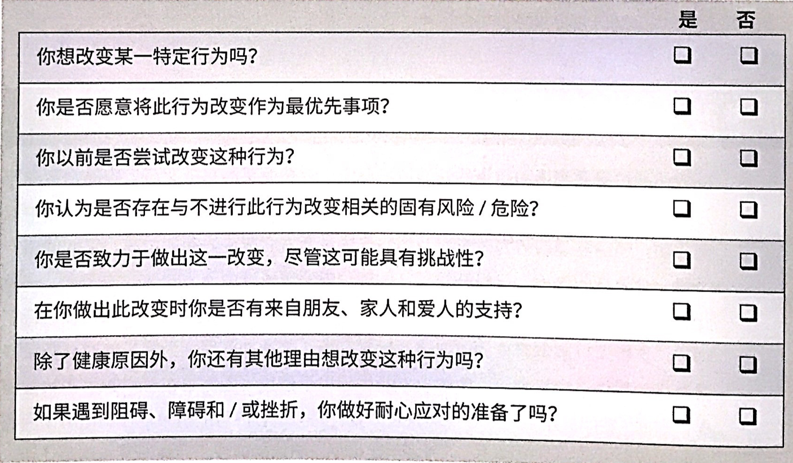

## **健康风险评估**[重要]

虽然运动带来益处，但是也有风险。

### **参与运动前筛查的目的**

- 识别疾病风险（心血管/肺部/代谢病）
- 识别带有医疗禁忌的个人
- 识别运动前应接受医学鉴定或临床运动实验的人
- 在医疗监督下执行运动方案

### PAR-Q 问卷

- 对于中低强度的运动，PAR-Q 是最低的安全前提筛查法
- 简单，快捷，实用，便于管理
- 但缺少细节

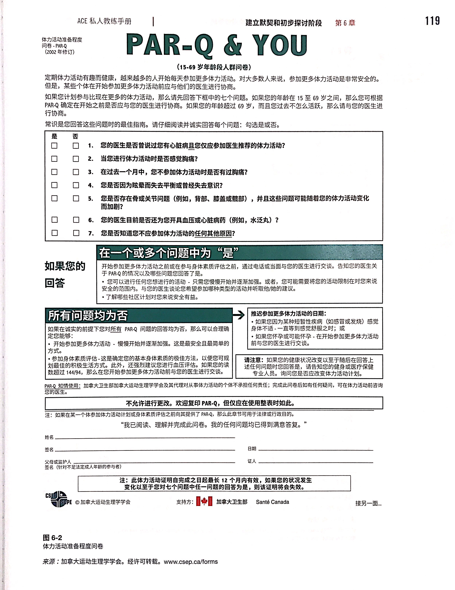

### P118 风险分级

- 是否存在心血管，呼吸道，新陈代谢疾病
- 是否存在心血管疾病的风险因素
- 是否存在心血管/呼吸道/新陈代谢方面的体征和症状

### P119 风险等级的划分步骤

- 识别冠状动脉疾病（CAD）的风险因素
- 根据 CAD 风险因素决定风险等级
- 确认是否需要医疗检测或者体检证明和医疗监督

### 表 6-1 ACSM 风险分级的动脉粥样硬化性心血管疾病风险因素(CVD风险因素表)

P120。怎么记：先记下来一共有八个加分项，这个比较好记：年龄-吸烟-久坐少动（自己），家族（亲属），肥胖-血脂-血糖-血压（肥胖+三高）。然后再对应这个记下详细的数值。

- 加分项
    - 年龄：
        - 男性>=45，
        - 女性>=55
    - 家族史：
        - 父亲或其他以及男性亲属在55岁以前有心肌梗死/冠状动脉血运重建/猝死；
        - 母亲/女-65岁
        - 一级亲属是一个人的父母、子女以及兄弟姐妹(同父母)
    - 吸烟：过去六个月内戒烟/二手烟环境
    - 久坐少动的生活方式：333
    - 肥胖：
        - BMI>=30kg/m^2。
        - 腰围：男性>102cm(40in)，
        - 女性>88cm(35in)
    - 高血压
        - 收缩压>=140
        - 舒张压>=90
        - 或者目前正服用降压药
    - 血脂异常
        - 低密度脂蛋白（LDL）胆固醇>=130mg/dL=3.37mmol/L；
        - 高密度脂蛋白胆固醇（HDL）<40mg/dL(1.04mmol/L)；
        - 正在服用降脂药；
        - 如果上述条件得不到：总血清胆固醇>=200mg/dL(5.18mmol/L)
    - 糖尿病前期
        - 空腹血浆葡萄糖：100-125mg/dL(5.55-6.95mmol/dL)
        - 葡萄糖耐量降低（IGT）
        - 口服葡萄糖耐量试验（OGTT）：口服75g 葡萄糖两个小时之后血糖值140-199mg/dL（7.77-11.04mmol/L）
- 减分项
    - HDL 胆固醇：>=60mg/dL（1.55mmol/L）

一项里同时满足两个指标也只算一分。

例题

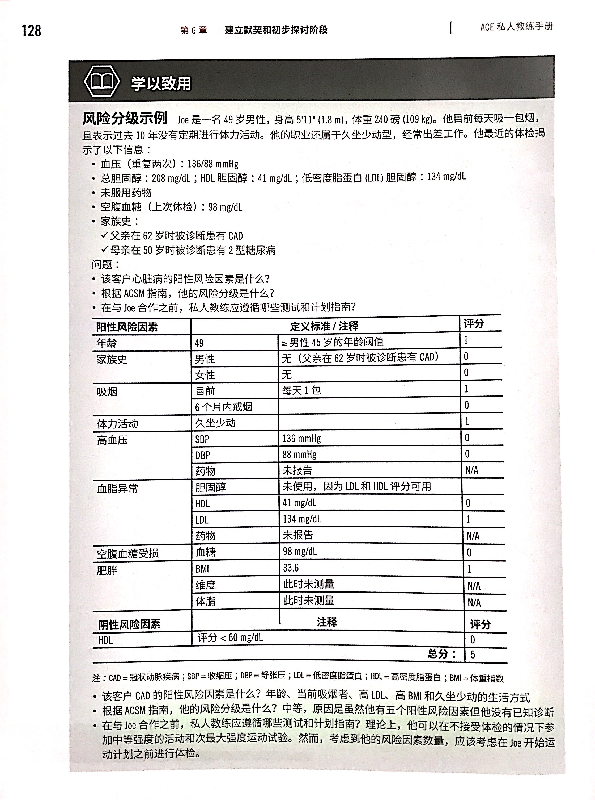

### 风险分类

CVD 风险因素表得了分之后进入这个图， P121。唯一需要记住的是**中等风险的人群需要在剧烈运动前体检**。

从表格得出的分数不会确定客户是高风险。只有确定有病或者症状才是高风险。

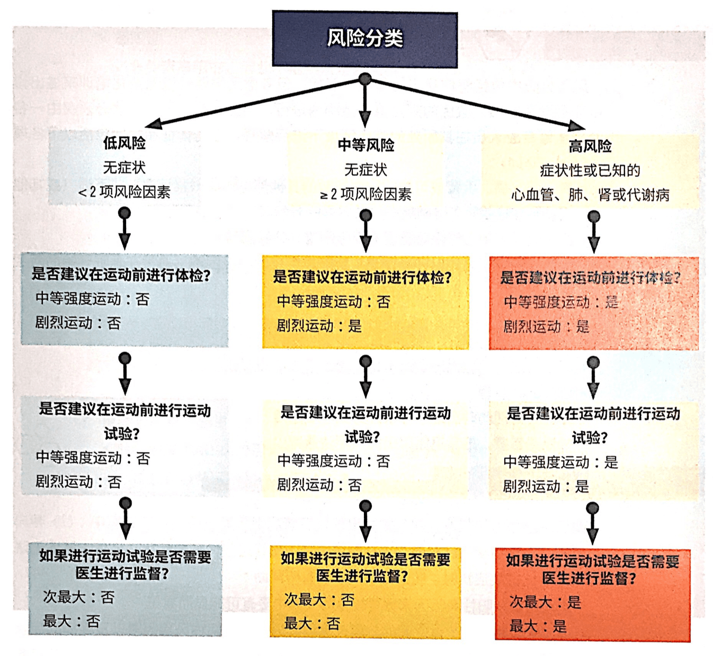

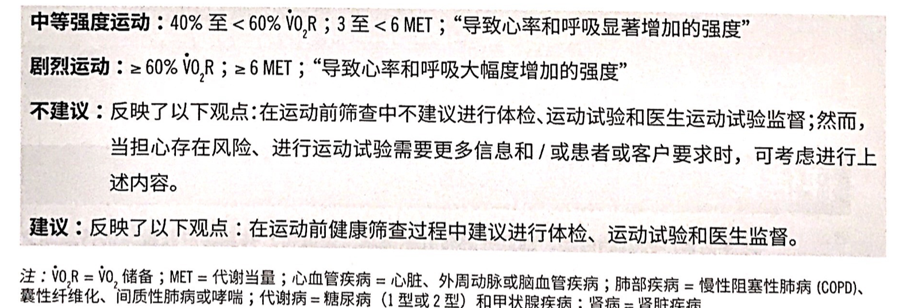

### P122 **风险因素体征和症状**【重要】

这些**必须专门培训的人士**诊断。

+ 因缺血导致的疼痛/紧迫感：胸部/颈部/下巴/手臂

+ 胸闷

    + 休息或少量体力消耗就呼吸急促

+ 端坐呼吸或阵发性夜间呼吸困难

    + *端坐呼吸*（orthopnea）指患者为了减轻呼吸困难被迫采取端坐位或半卧位的状态。

        

+ 踝水肿

+ 心悸或心跳加速

+ 间歇性跛行（血液供给不足导致的下肢疼痛）

+ 已有心脏噪音

+ 日常时不寻常的疲乏或者呼吸困难

+ 头晕或者晕厥（脑部供血减少）

    + 可能是颈椎病，颈动脉受到压迫。

如果客户

1. 有上述病的历史
2. 在教练监督下出现这些体征

就需要拿小本本记到客户档案里。这些症状在 CVD 分数高的人群中更可能出现。

## **协议书**[重要]

在进行健康风险评估之后，还需要一些协议书。

P123

### 知情协议书

- 表示客户知道与活动有关的风险
- 不能提供法律保护

### 弃权协议书

- 客户在有私教监督的运动中受伤，私教可以不负责任。
- 自愿放弃法律诉讼权利
- 然而私教如果因为过失导致客户受伤，还是背时活该打栽栽。

### 健康史调查问卷

比 CAD 风险因素更加详细，包括了

- 过往和当前运动和体力活动信息
- 药物和保健品
- 近期或当前的疾病或损伤，包括慢性或者急性疼痛
- 手术史，损伤史
- 家族病史
- 生活方式

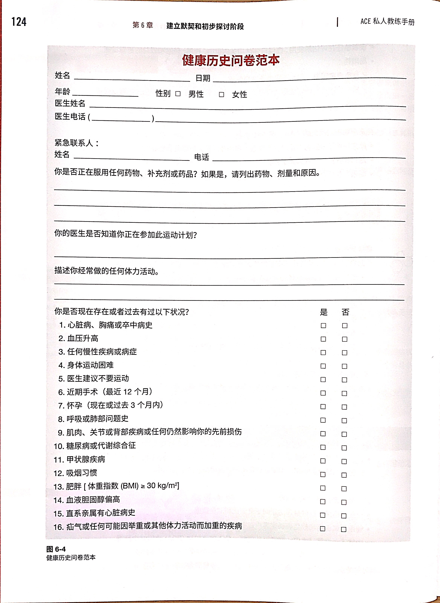

### 运动经历和训练态度问卷

别忘了，运动史是确定自我效能最有效的方法。并且在实施策略来改善激励和坚持度的时候，这些信息非常重要。

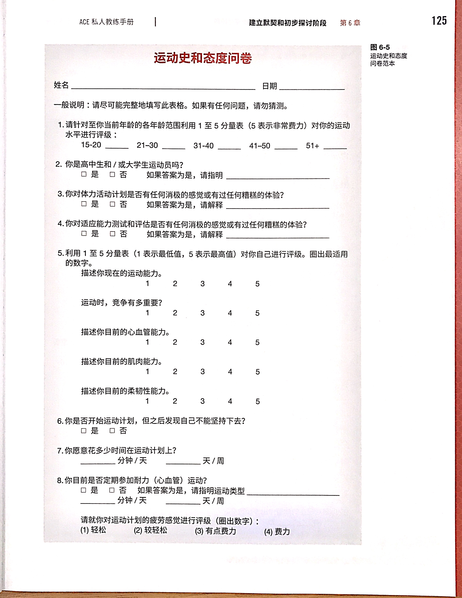

### 免责就医授权书

提供了医生的指导意见。任何偏离这个指南的做法，都需要获得私人医生的批准。

### 健身评估表格

见第七第八章。

## 影响体育活动的健康状况

P129：定期进行体力活动肯定有好处，也有一定风险。为了了解这些风险，需要知道客户的健康史。

### **与体力活动相关的损伤**[重要]

- 使得现有身体损伤恶化
- 新的身体损伤

### P129 心血管方面的问题

动脉粥样硬化，就记住是动脉硬化。CAD 就是冠状动脉硬化了（冠状动脉是供给心脏血液的动脉）。

为什么CAD对运动危害很大：运动强度越大，心肌对血液和氧的需求越大；如果冠状动脉硬化，则血液和氧气供给都不足。这样可能会绞痛（不一定是心绞痛），心肌梗死或者心脏病发作。

- 风险因素。[CVD](#表 6-1 ACSM 风险分级的动脉粥样硬化性心血管疾病风险因素(CVD风险因素表))。
- 高血压。容易中风（卒中）。SBP 收缩压和 DBP 舒张压越高，越可能中风。

老规矩，如果有人有 CAD 或者胸痛史，开始运动计划前必须有医生的批准的指南。

### 呼吸问题

有氧运动期间会不断增加氧的需求，呼吸系统有问题会妨碍身体供氧能力。

常见的呼吸问题：支气管炎，肺气肿，哮喘，慢性阻塞性肺病（COPD）。

需要医生。

### 肌肉骨骼问题

参与体力活动的人最经常承受的损伤类型是**过劳性损伤**，通常是因为训练技巧或者躯体力学不佳。例如跑者膝伤，游泳者肩伤，网球运动者肘部发炎/外胫夹/髂胫束综合征（ITBS）。

针对过劳性损伤，教练应该使用**交叉训练策略**。

对于教练无资质处理的疾病，老规矩，转介绍给医疗保健专业人员。

近期接受过骨科手术的客户不一定能够执行计划，需要医生的康复计划。

### 新陈代谢

代谢病会干扰能量的利用，例如糖尿病和甲状腺疾病（甲状腺亢奋或衰退）——运动前需要医生批准。

**如果正在接受胰岛素治疗，需要转介绍给医生。**（十四章）

### 其他健康状况

- 疝气
    - 疝气，即人体内某个脏器或组织离开其正常解剖位置，通过先天或后天形成的薄弱点、缺损或孔隙进入另一部位。
    - 如果计划内包含**举重**，尤其应该考虑。疝气是举重的**相对禁忌症**。
- 妊娠（十四章）
    - 不应追求最大的健身目标，而是保持良好的身体素质水平。
    - 怀孕到分娩后三个月期间，必须要医生批准才可以运动。
- 疾病或者传染
    - 轻微疾病（如感冒）期间，可以进行中等强度的运动。严重的不行，因为对抗感染是最基本的生理需求之一，需要消耗能量。
    - 咨询医生。

## 药物

药物可以改变身体组成，可能会影响客户进行运动或者对运动做出响应的能力。

首先应该获取客户所用药物对应的正确类别，然后根据这个类别查表。

### P133 表 6-2 药物对心率反映的影响

- β-肾上腺素受体阻滞剂会让静息/运动/最大运动 HR 都下降。
    - 其他药物对最大 HR 的影响是不变。
- 利尿剂/抗组胺药/镇静剂不起作用。
    - 镇静剂可能会降低静息 HR。
- 钙通道阻滞剂（CCB）和其他降压药：上/不变/下降都可能

+ 酒精/感冒药/减肥药/咖啡因/尼古丁会让静息和运动 HR 不变或上升。

### P132 降压药

降压药的原因

- 降低心脏收缩力
- 扩张血管
- 在大脑：减少交感神经流出
- 肾脏：排出更多液体减少血容量

- β-受体阻滞剂：让心脏跳得更慢
- 钙通道阻滞剂：扩张血管
- 血管紧张素转化酶（ACE） 抑制剂：扩张血管
- 血管紧张素-II 受体拮抗肌（阻断剂）：名副其实
- 利尿剂：肾脏排出更多液体减少血容量

### 支气管扩张剂

使肺部气道放松或者打开，从而更好地进行气体交换。

可以使得受限于支气管痉挛的人群运动能力增加。

### 感冒药

- 刺激血管收缩，血压上升，心率增加

## 测序评估

### 评估的目的

- 确认是否需要转介绍，**明确健康或者损伤的风险**
- 为了之后的**个性化健身计划**收集数据
- 将客户数据与对应年龄和性别的规范对比，让他**了解自己的健康**风险状况。
- 通过客户制定**现实的目标**来激励客户。

### 评估的项目

- 静息生命体征（心率，血压，身高体重）
- 静态姿势和柔韧性筛查
- 关节柔韧性和肌肉长度
- 平衡和核心功能
- 心肺适应能力
- 身体组成
- 肌耐力和肌力
- 运动技能（敏捷性、协调性、爆发力、反应性和速度）

参考[第五章的表格](ACE-chap05.md/#评估时间表)。第七章是评估静态姿势，基本动作筛查，关节柔韧性（肌肉长度），平衡和核心（起那四个。第八章是生理评估。

### 应当立即终止评估的现象

+ 心绞痛
+ 运动强度增加但是，但是收缩压SBP降低超过 10mmHg
+ 血压过度升高
    + 收缩压 SBP > 250 mmHg
    + 舒张压 DBP > 115mmHg
+ 疲乏，气短，呼吸困难，喘息
+ 运动失调，眩晕，心慌，昏厥，皮肤湿冷
+ 神经系统症状
+ 抽筋，跛行
+ 体力或语言上非常疲乏
+ 客户要求停止

### 评估时的准备/环境

+ 测试前给客户测试流程说明书，其中要概述评估的前置要求（服装，饮食，兴奋剂）
+ 给客户签署知情同意书
+ 有效整理所有的文件
+ 沟通的时候要平静和自信地解释测试的顺序和说明
+ 器械已校准且正常运转
+ 理想情况下，室温应该是68-72华氏度（20-22℃），相对湿度低于60%。测试环境要安静并且私密，这样可以减轻测试的焦虑。

## 选择适当的评估项目

### 考虑的因素

- 考虑客户的目标

    + 评估主要因素之一是客户自己的目标。可以询问的常见问题如下：
        + 在客户自己选择的活动中获得成功需要什么技能和能力？
            + 可以和教练员沟通，观看顶级运动员的比赛。
        + 目前客户缺乏哪些技能和能力？
        + 客户在所选运动中有无该运动的普遍损伤和劣势？
            + 例如，足球中足内翻的扭伤很常见，如果客户足弓较高或者踝关节旋后，则更可能发生这种损伤。
            + 可以和这种活动的医务人员沟通。
        + 这项活动需要怎么样的供能系统？
        + 这种活动成功需要哪些综合动作模式和动作平面？
- 考虑客户的身体限制
    - 不会给客户带来压力的前提下，进行有效的测试。

+ 考虑测试的环境（20~22℃）
    + 设备经常维护，设备适不适合测试项目，充分照明，适当温度
    + 急救措施
    + 隐私问题和分析也可能对测试结果有负面影响
+ 考虑设备可用性
+ 考虑客户的年龄
    + 例如，高血压的老年人不适合进行最大力量测试。

### 步骤

- 考虑客户设计现实的目标，激励客户
- 教育客户了解自己目前的身体状况和健康风险
- 收集客户基本信息
- 明确健康和损伤风险

### 常见的工具（不考）

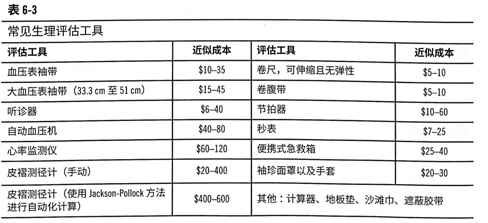

## 必要的心血管评估

### 心率[重要]

大多数人的脉搏率和心率相同（桡动脉，颈动脉）。在头部伸展的时候，在颈动脉检测会比较容易，所以 CPR 的时候打开通气道也有这个作用。

心率较低可能意味着每搏输出量（SV） 较高，反之亦然。

为什么要了解心率？

- 可以监控客户是否训练过度。 如果客户的 RHR连续数天超过正常水平5bpm，那就应该降低负荷/强度。

为了测准心率的注意事项

- [药物和补剂会影响心率](#P133 表 6-2 药物对心率反映的影响)，所以测量 RHR 十二小时之前应停用。
- 站立、坐姿的 HR 会高于仰卧或者俯卧位。
- 吸收和消化需要能量，所以心率会升高。
- 周围的环境会影响，噪音、温度可能给身体造成额外压力，身体在承受压力的时候会增加心率。
- **拓展**：当脉搏跳动第一下的时候，计数一而不是计数零。

静息心率，RHR（Rest Heart Rate）的一些知识。

- <60bpm：较慢
- 60-100bpm：正常
- 100bpm 以上：过快

女性的 RHR 较高，可能因为心室较小、血总容量较低、血红蛋白水平较低。男性平均60-70，女性平均72-80。

- 静息心率的测量
    - 休息几分钟
    - 然后指尖触诊或者听诊器听诊来间接测量，时间为30-60秒。
    - 听诊器放在客户胸骨左侧乳头线正上方或正下方
    - 最准确的 RHR 早晨起床前，可由客户自行测量。

- 运动心率的测量
    - 计数10-15秒，乘以6或者4

### 血压

血压定义为血液对血管壁施加的压力。只需要记住[血压分类表](#血压分类表)。

SBP（收缩压）是心室收缩将血液泵入循环产生的压力，是一个心动周期中最大的压力。DBP（舒张压）是心动周期的充盈阶段的时候，血液保留在动脉中或者心脏跳动之间的压力，是最低的。

测量的标准部位是肱动脉，因为这个位置和心脏水平并且易于操作。听血压的原理是听柯氏音（血液沿着血管壁流动的时，由振动产生的声音）来间接测量。血管畅通的时候没有这个声音，所以需要血压表袖带来压迫让血管畸形才会有。

具体的测量步骤在P141-142，并不需要掌握。

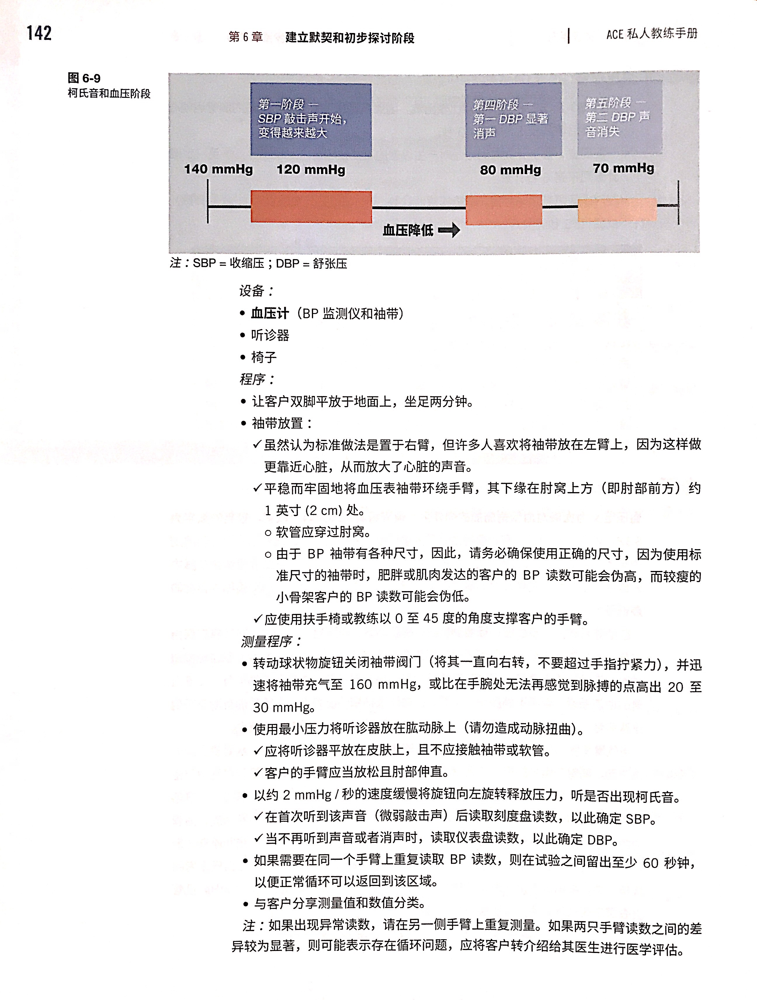

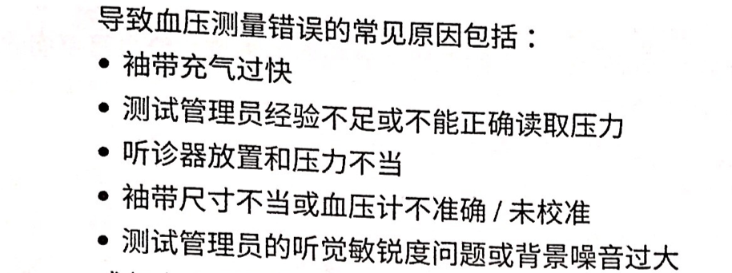

#### 血压分类表

| 类别           | SBP     |      | DBP   |
| -------------- | ------- | ---- | ----- |
| **正常**       | <120    | 且   | <80   |
| **高血压前期** | 120-139 | 或   | 80-89 |
| 高血压         |         |      |       |
| **一期**       | 140-159 | 或   | 90-99 |
| **二期**       | >=160   | 或   | >=100 |

**注意**：SBP 和 DBP 属于不同类别的时候，应该选择危险度更高的来决定。

运动的时候很难测血压，除非在骑固定式自行车。其他的话可以在运动前后测量，但主要是为了检测过低的血压。

**笔记**：高血压前期并不需要服用药物，可以通过抗阻训练降低风险。

### 自感用力度（RPE）

Rate of Perceived Exertion，感知到的努力程度。左边叫做 **Borg 15分量表**，右边叫**改良的0-10类别比例量表**。Borg 对应心率。

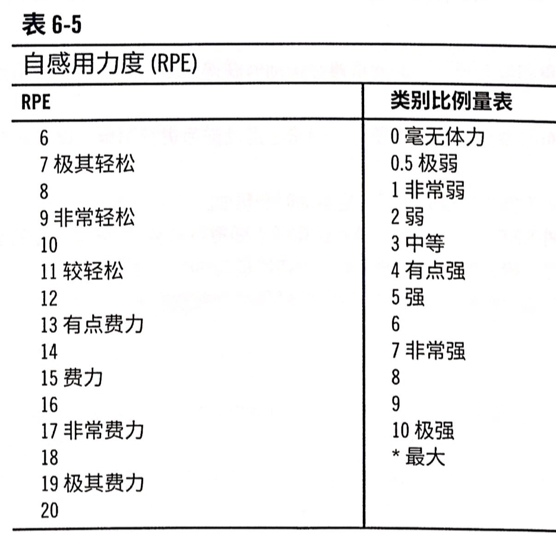

**注意**：

- 男性往往低估，女性往往高估
- RPE 用得越多越熟练，最终会倾向与平均值（什么的平均值）。
- 久坐少动很严重的人会觉得使用 RPE 很困难，因为任何运动都很难。

不一定是痛苦的承受力，承受痛苦可以看做“努力承受痛苦的能力”，所以无法忍耐痛苦可以理解成“努力想达到但是达不到”。

### 运动感觉表EFI

这个表的目的是定量评估客户的精神状态、感觉和思考方式，因为这些因素会左右人们如何做出决定。 

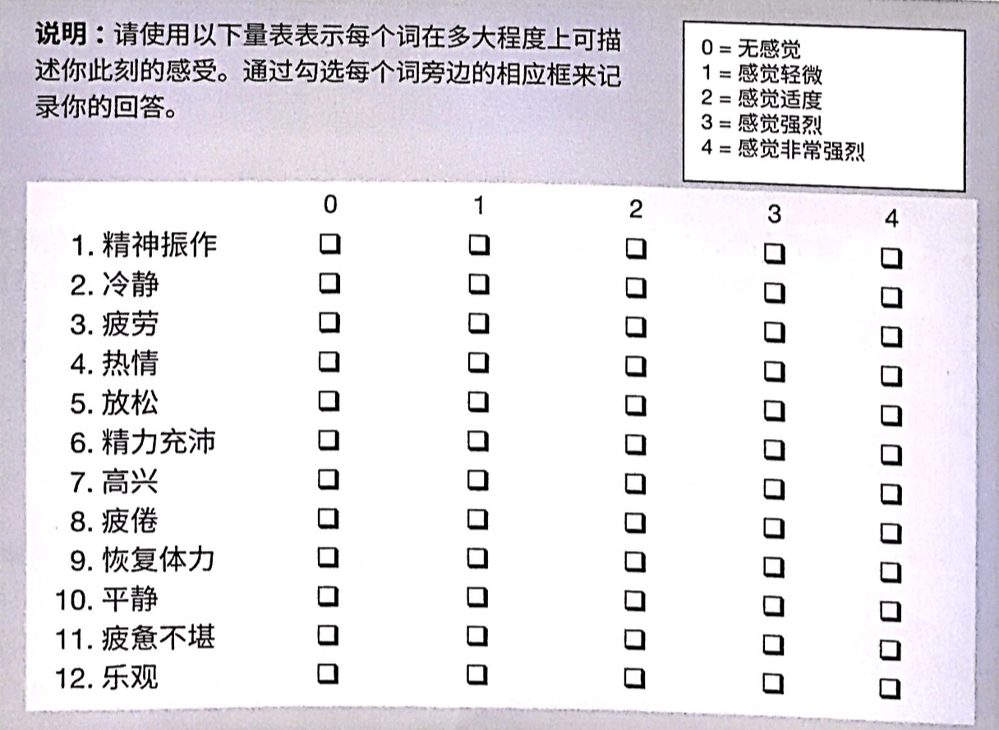

- 积极参与：4，7，12
- 活力四射：1，6，9
- 身心平静：2，5，10
- 身体疲惫：3，8，11

跟踪4-6周的四个分量表之和的分数，确定总趋势。最好的趋势是随着时间的推移，让对运动的情绪产生积极的变化。在此期间需要强调的是，低强度的锻炼也可以对健康和幸福感产生积极的影响。

## 小结

**私人教练的作用是促进客户的变化，与其建立默契、收集关键信息、制定健身目标并且实施计划。**
