# 功能性评估：姿势，动作，核心，平衡，柔韧性（2）

<!--ts-->
   * [功能性评估：姿势，动作，核心，平衡，柔韧性（2）](#功能性评估姿势动作核心平衡柔韧性2)
      * [动作筛查](#动作筛查)
         * [目的](#目的)
         * [一般流程](#一般流程)
         * [屈髋提起动作筛查](#屈髋提起动作筛查)
            * [深蹲的检查顺序](#深蹲的检查顺序)
            * [P170 深蹲的三种主导](#p170-深蹲的三种主导)
         * [跨栏步动作筛查](#跨栏步动作筛查)
            * [跨栏步筛查的顺序](#跨栏步筛查的顺序)
         * [俯卧撑稳定性筛查](#俯卧撑稳定性筛查)
         * [胸椎灵活性筛查](#胸椎灵活性筛查)
      * [柔韧性与肌肉长度测试](#柔韧性与肌肉长度测试)
         * [表7-13 健康成人的平均活动范围](#表7-13-健康成人的平均活动范围)
         * [测试项目](#测试项目)
            * [下肢测试](#下肢测试)
               * [托马斯试验：屈髋/股直肌长度](#托马斯试验屈髋股直肌长度)
               * [被动直腿抬高（PSL）](#被动直腿抬高psl)
            * [P181 肩关节灵活性](#p181-肩关节灵活性)
               * [肩关节屈曲-伸展试验](#肩关节屈曲-伸展试验)
               * [肱骨在肩关节的内外旋](#肱骨在肩关节的内外旋)
               * [Apley摸背试验](#apley摸背试验)
         * [测试表格](#测试表格)

<!-- Added by: oda, at:  -->

<!--te-->

## 动作筛查

**[重要]**：为什么要筛查这五个动作？因为平日生活本质上是这五个主要运动的组合。例如将东西放在地上，是一个`拉`的对抗重力作用。

所有的筛查都不能提示客户有什么注意事项，只教动作。

### 目的

其实和静态差不多

- 判断肌肉失衡
- 识别不良姿势对神经控制的影响
- 识别可矫正和不可矫正的动作代偿 

### 一般流程

- 确定现象运动受限还是代偿及其原因
- 评估这个现象对整个动力链的影响

### 屈髋提起动作筛查

深蹲的动作模式。

目的：**检查对称下肢的稳定性灵活性以及上肢的稳定性**。

设备：两个等长圆棒。

#### 深蹲的检查顺序

P169的表7-9。前面观和侧面观分别有三个和五个项目，那就让客户重复做屈髋提起的动作，然后到正面和侧面按顺序从下到上观察。先列出观察点

前面观

- 足部无旋前、旋后、外翻、内翻
- 双膝与第二趾一条线
- 整个身体的对称性

矢状面观

- 脚跟着地
- 臀肌主导（不能股四头肌主导）
- 胫骨和躯干平行（4），腘绳肌不靠在小腿上
- 胸椎和腰椎凹凸程度不变
- 头部姿势不变。

#### P170 深蹲的三种主导

+ 腰部主导
    + 缺乏核心和臀部力量，因此腰椎伸展代偿平衡，导致受力过大。
    + 久坐的人因为髋屈肌长时间缩短，也可能这样。
+ 股四头主导（先屈膝）
    + 前十字韧带负荷过大
    + 臀大肌不承受离心负荷，也不在向上阶段产生很多力
+ 臀肌主导（佳，先屈髋）
    + 臀大肌的离心负荷达到最大值，向上阶段也产生显著的力
    + 减轻腰椎负荷
    + 减轻膝盖压力
    + 激活腘绳肌

### 跨栏步动作筛查

目的：**在能够维持髋部和躯干稳定的同时，检查一侧肢体的灵活性与对侧肢体的稳定性**。

流程注意：线的高度是胫骨的一半。双脚并拢，脚趾对着线，然后再分开一步宽（直接分开吧……）。圆棒横放于肩上，握住使之平行地面。指示客户：`抬一条腿使其缓缓高过直线上方，屈曲髋部让他跨过直线，用那条腿的脚跟踩地面，最后回复开始姿势`。

同样要观察他的自然动作而不是有意识纠正之后的。

[**笔记**]：眼睛平视，手没有要求。容易出现的问题是站着的腿会有膝内扣/骨盆侧倾代偿。

圆棒是用来检测是否有脊柱侧弯的放大器。

#### 跨栏步筛查的顺序

观察点

额状面

- 足部稳定
- 支撑腿膝关节
- 有没有大于5.1cm 的髋内收
    - [骨盆侧倾](#髋关节内收)代偿。
- 躯干稳定性
    - 圆棒的作用
- 抬高腿的情况
    - 踝关节是否缺乏背屈，
    - 膝关节或者踝关节是否偏离矢状面，
    - 同侧髋部是否上提

矢状面

- 观察躯干和支撑腿的稳定性
- 观察髋关节的灵活性
    - 在没有代偿的情况下大腿可以抬起来70度

考试可能有：检查出 XX 现象，不适合做 XX 动作。

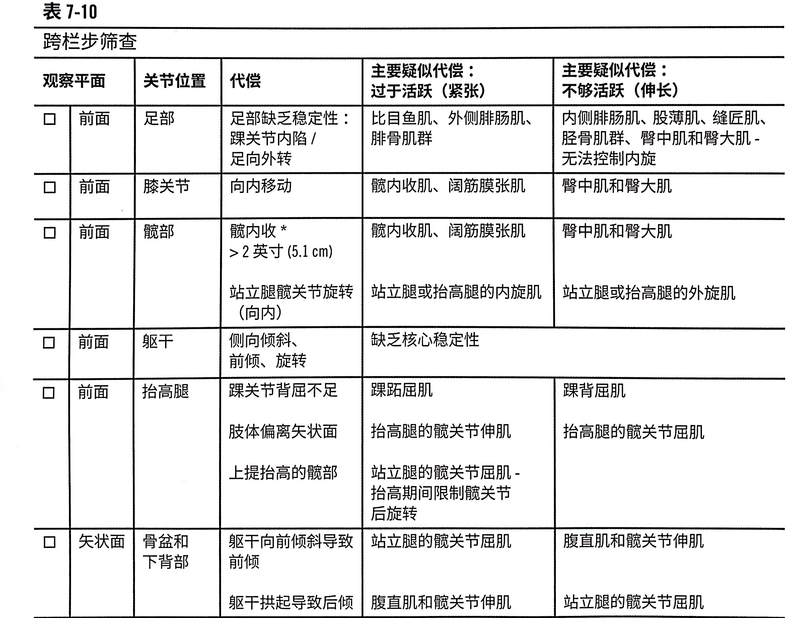

### 俯卧撑稳定性筛查

目的：**检测推肩过程中肩胛胸廓关节和核心控制的稳定性**。

要求客户多做几次**完整**俯卧撑，手臂要完全伸直，并且要在缓慢受控的过程中进行。

[**笔记**]：女性可以做屈膝俯卧撑。

观察点

- 最低处和最高处有没有翼状肩胛（肩胛翘起来）
- 腰部过度伸展（塌下去）

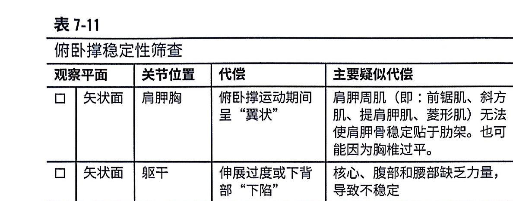

### 胸椎灵活性筛查

目的：检测**胸椎的灵活性**。由于腰椎只能旋转15度，通常认为腰椎是稳定关节。

流程：客户坐在座椅前缘，双脚并拢踩在地面上，背部离开靠背。

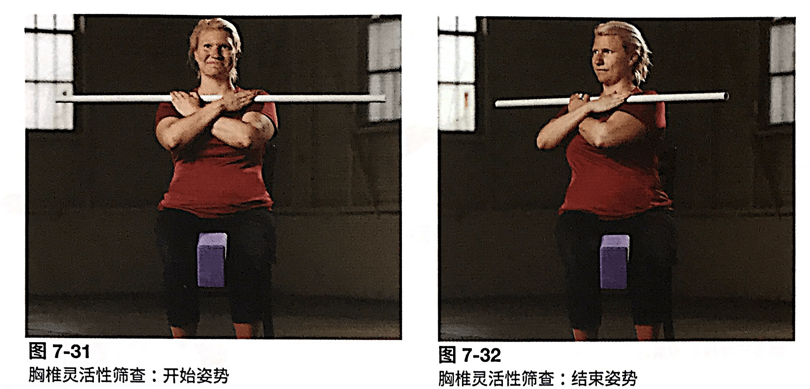

客户有可能出现的代偿有

- 躯干侧屈
- 腰椎在其他平面运动（脊柱前凸）

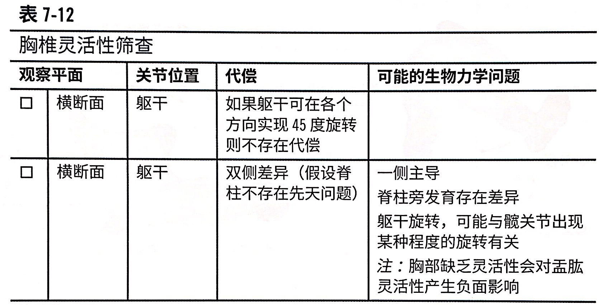

## 柔韧性与肌肉长度测试

### 表7-13 健康成人的平均活动范围

P177 那肯定是记不住的。

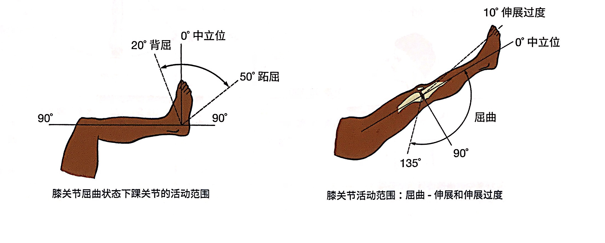

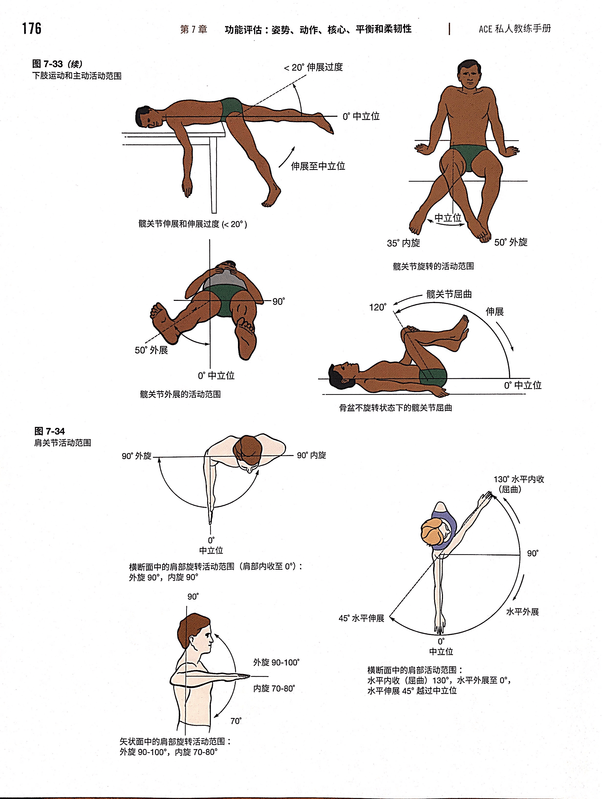

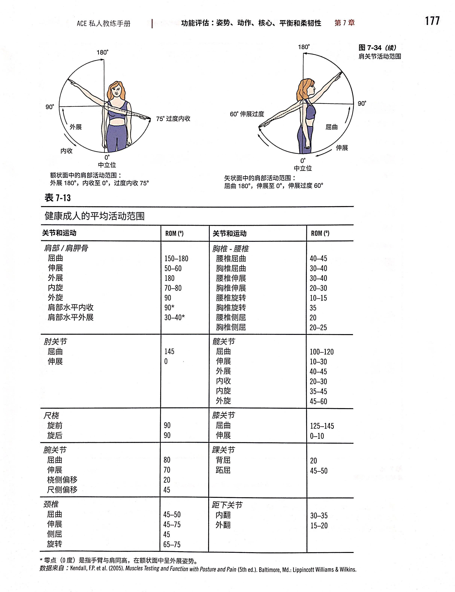

### 测试项目

下肢两个测试，上肢肩部三个测试。

#### 下肢测试

##### 托马斯试验：屈髋/股直肌长度

目的：测试髋屈肌的长度。

屈髋肌群包含髂肌和腰肌；股直肌是股四头肌其中一块。

**注意：如果有下背痛，在医生许可前不能进行托马斯**。

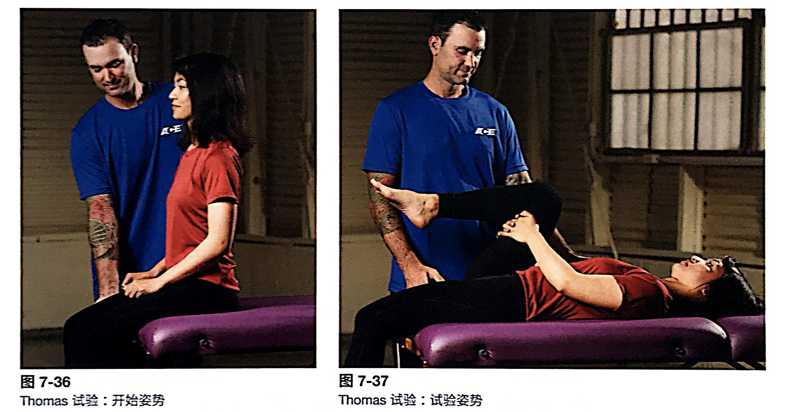

观察点

- 下方腿的大腿后侧接触台面
- 下方腿的膝关节屈曲达到80度
- 膝关节是否内外旋

##### 被动直腿抬高（PSL）

评估**腘绳肌**的长度。

流程：一只手放在腰椎下面，一只手放在将要抬起的那条小腿的下方。教练缓缓抬起腿，客户的膝关节放松。

注意点：建议客户轻轻伸直脚背；如果是足背屈，会使腓肠肌紧张，在踝关节背屈的情况下限制伸膝。

直到：

- 放在下背部的手受到很大的压力（骨盆后倾）
- 另一条腿明显抬起

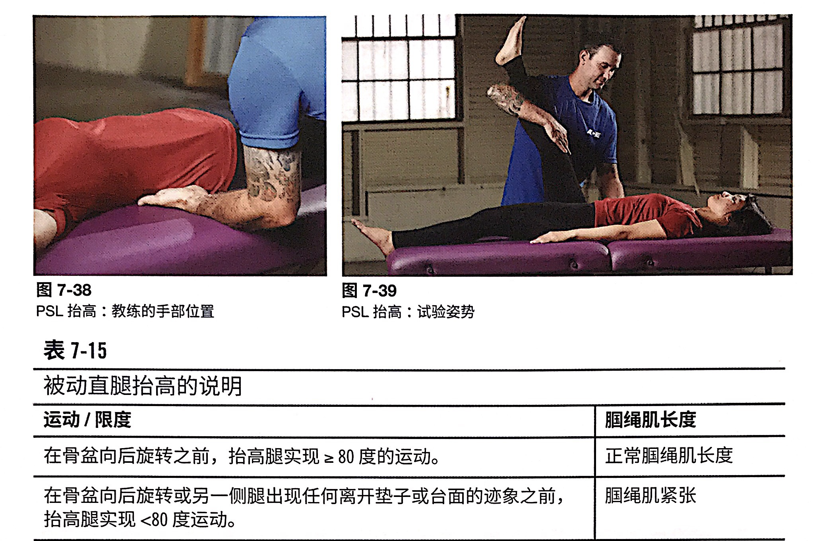

#### P181 肩关节灵活性

##### 肩关节屈曲-伸展试验

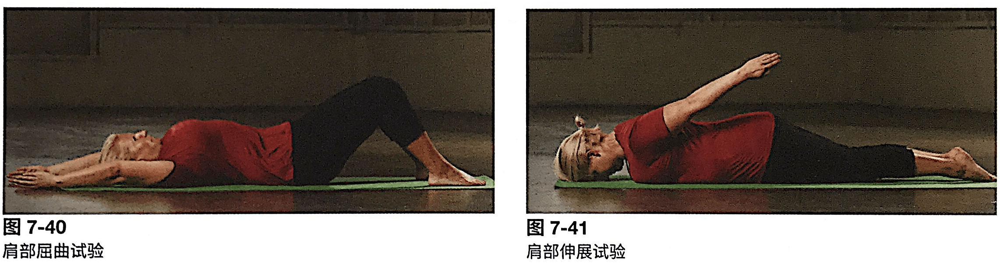

肩屈测试：

- 屈膝屈髋；
- 收紧腹肌来保持脊柱中立位，同时不要抬髋。
- 双臂同时举起，在此过程中会自然内旋。

客户可能出现

- 肘关节弯曲，腕关节不再保持中立位
- 下背部拱起
- 腰椎超伸
- 肋架代偿，从而使双肩离开垫子

肩伸测试：

- 双腿伸直；随后抬离垫子，保持贴紧身体

客户可能出现

- 胸椎小幅度伸展
- 下背部拱起，躯干旋转
- 头部或者胸部离开垫子

观察点

- 运动的角度和范围
- 左右两边的差异

正常情况

- 肩屈170-180
- 肩伸50-60

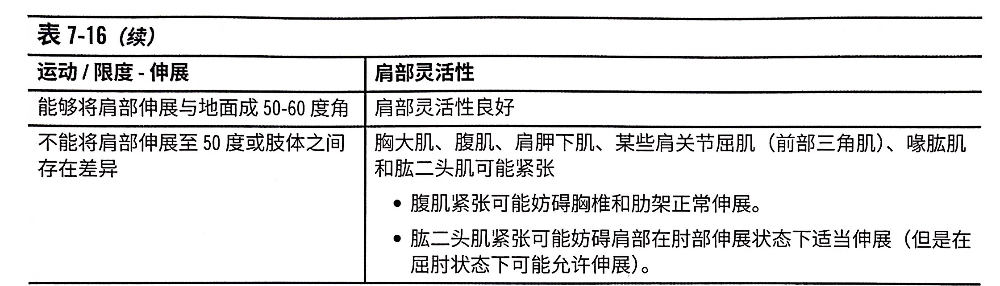

简单来说，伸得不到位就可能是屈曲的肌肉紧张，反之亦然。平日生活的习惯是可能导致客户出现问题的原因。

##### 肱骨在肩关节的内外旋

**注意**：进行肩外旋测评的对象是内旋肌——回忆我们得出的结论：外旋不到位，意味着内旋肌进张。

重点

- 做外旋的时候，需要小臂接触地面而不是手背。

正常情况

- 内旋70度
- 外旋90度

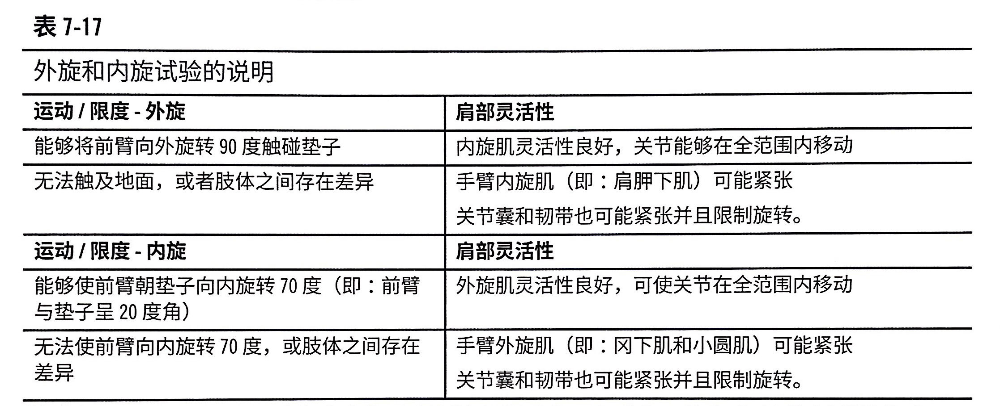

##### Apley摸背试验

目的：评估肩胛胸和盂肱关节同时运动的能力。由于是多平面运动，所以最后一个做。摸背试验包括了

- 肩伸和肩屈
- 肩部肱骨内旋和外旋
- 肩胛外展和内收

为了显得动作更专业，从中立位开始动作比较好。

注意点

- 两个试验都是触碰对侧肩胛
- 向上是测试肩屈、外旋、肩胛外展；触碰肩胛内缘；
- 向下是测试肩伸、内旋、肩胛内收；触碰肩胛下角；

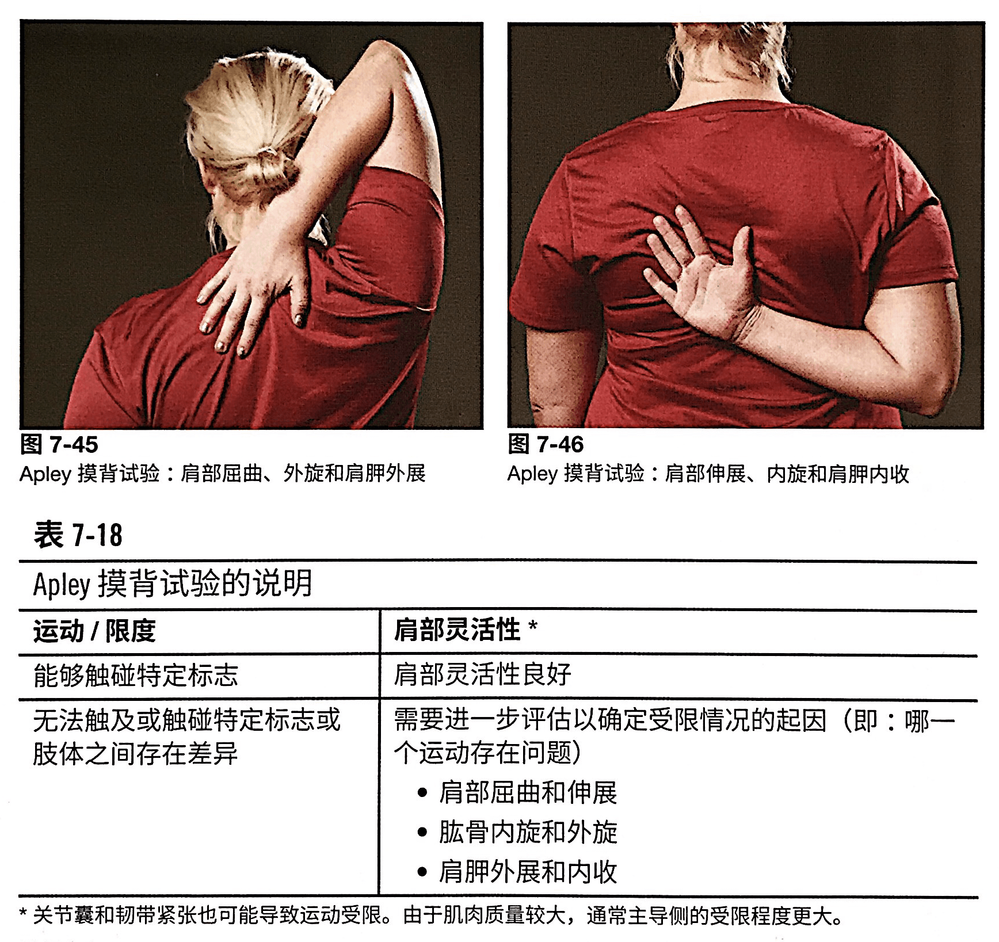

### 测试表格

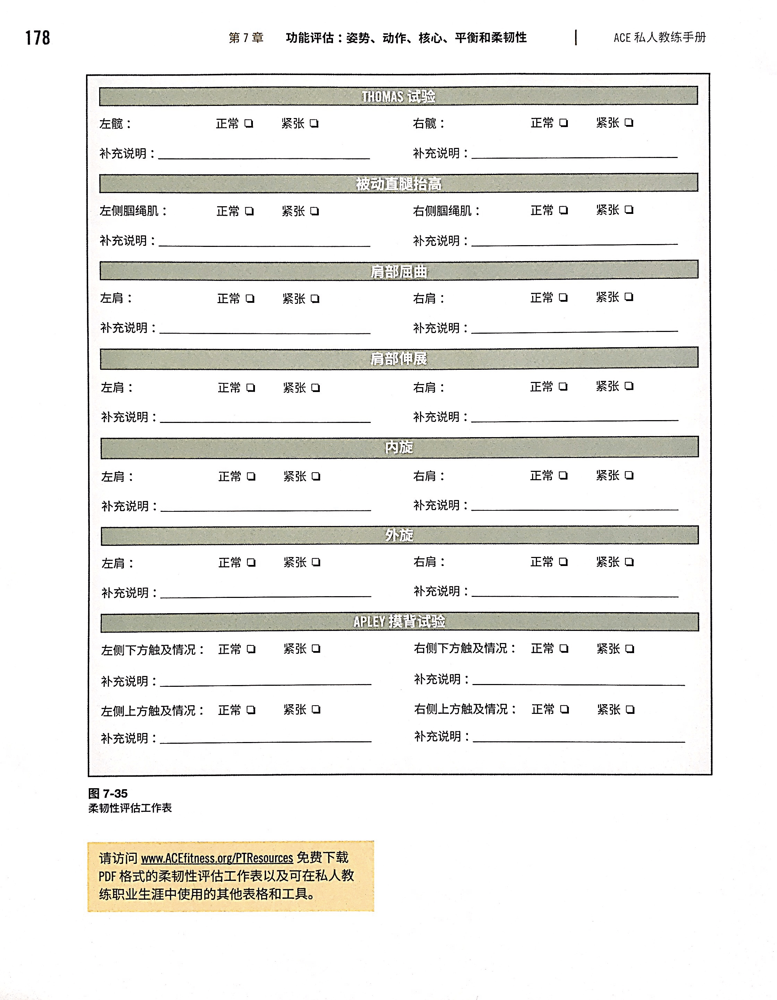
