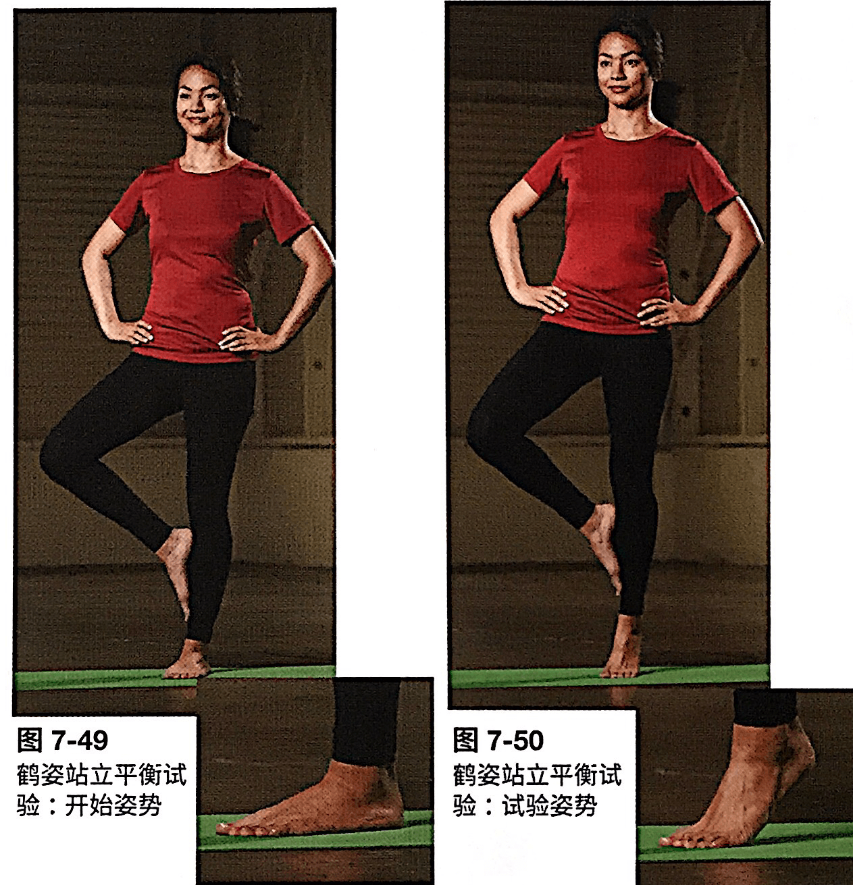
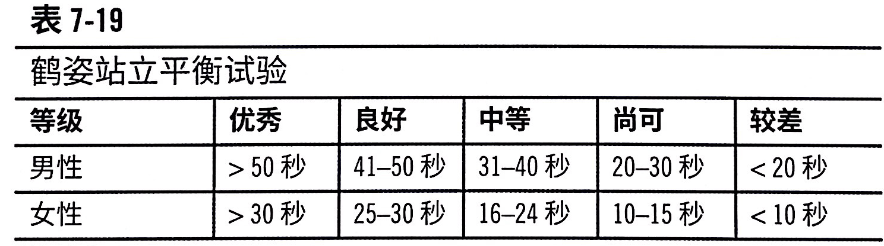
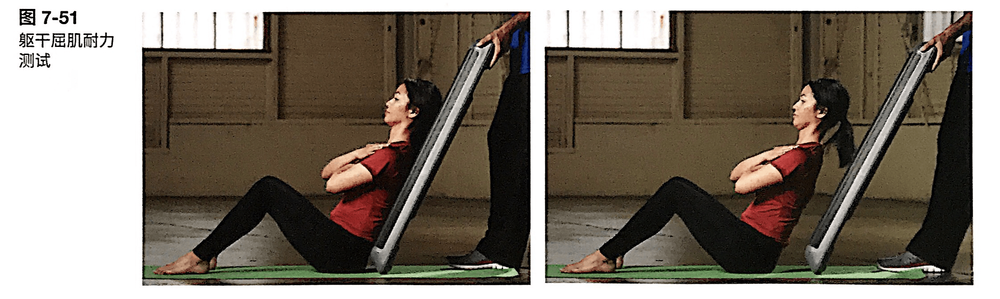
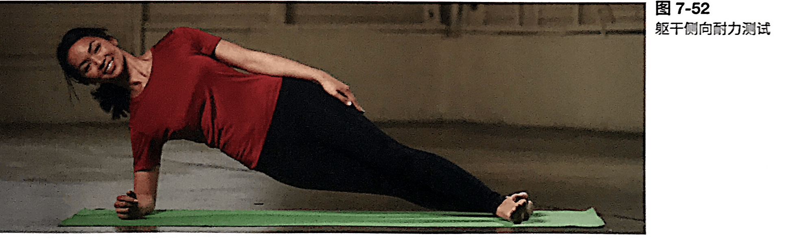
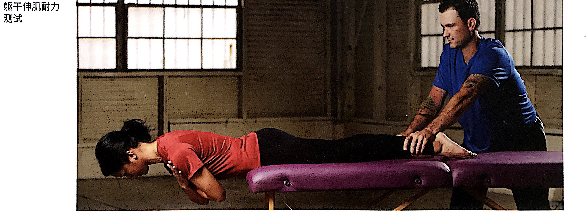
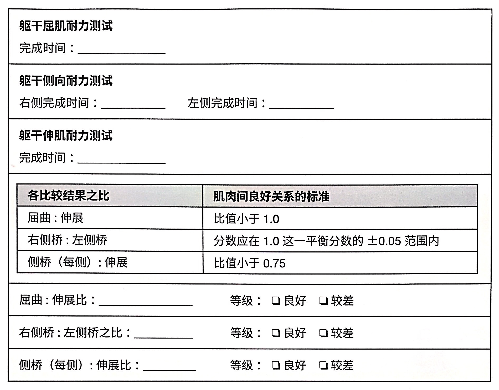

# 功能性评估：姿势，动作，核心，平衡，柔韧性（3）

<!--ts-->
   * [功能性评估：姿势，动作，核心，平衡，柔韧性（3）](#功能性评估姿势动作核心平衡柔韧性3)
      * [静态平衡能力与核心](#静态平衡能力与核心)
         * [闭目直立（强化 Romberg 试验）](#闭目直立强化-romberg-试验)
         * [单腿站立（鹤姿站立）](#单腿站立鹤姿站立)
         * [McGill躯干肌耐力系列](#mcgill躯干肌耐力系列)
            * [躯干屈肌耐力实验（躺在地上斜起）](#躯干屈肌耐力实验躺在地上斜起)
            * [躯干侧屈肌耐力实验（单臂撑地）](#躯干侧屈肌耐力实验单臂撑地)
            * [躯干伸肌耐力实验（架在桌子上）](#躯干伸肌耐力实验架在桌子上)
            * [总结表格[重要]](#总结表格重要)

<!-- Added by: oda, at:  -->

<!--te-->

## 静态平衡能力与核心

平衡能力是可以训练的。

### 闭目直立（强化 Romberg 试验）

出现以下情况说明可以停止了：

- 无法保持姿势和平衡
- 双脚移动
- 睁眼
- 双臂不再交叉
- 保持了60s

**无法达到30秒则意味着静态平衡和控制姿势的能力不足**。

### 单腿站立（鹤姿站立）

有必要的话可以在客户后方保护。

出现以下情况说明可以停止了：

+ 一只手脱离髋部（来保持平衡）
+ 支撑脚内外翻或者移动
+ 支撑脚脚跟接触地面
+ 抬高的脚和支撑腿分离
+ 客户失去平衡

### McGill躯干肌耐力系列

重点是看比值，而不是绝对数值。如果三种肌群之间不平衡，就可能有腰部功能障碍以及核心不稳定的问题。

P191：肌肉耐力是比肌肉力量甚至 ROM 更准确的背部健康预测指标。

P192：核心不够强大的话，在做哑铃推肩的时候可能**腰椎过度前凸**，深蹲和仰卧推举期间可能发生相同的损伤，腰椎收到过大的压力。

#### 躯干屈肌耐力实验（躺在地上斜起）

评估深层核心肌肉（腹横肌，腰方肌和竖脊肌）的耐力。

流程

- 倾斜60度
- 头部和脊柱中立位
- 可以在脚部绑上固定装置

终止条件

- 脊柱偏离中立位（肩膀向前移动=腰椎屈曲；腰椎超伸）

#### 躯干侧屈肌耐力实验（单臂撑地）

评估侧向核心肌肉：腹横肌、腹斜肌、腰方肌和竖脊肌。

如果肩部无力或者下背痛，就不要做了。

流程

- 上面的腿放在前面。
- 身体成一条直线

终止条件：

- 臀部下降
- 臀部前后移动

#### 躯干伸肌耐力实验（架在桌子上）

评估躯干伸肌的耐力（竖脊肌、最长肌、髂肋肌和多裂肌）。

流程

- 一开始髂肌位于台子边缘，同时双臂支撑地面；开始的时候再抬高
- 在小腿处压着

#### 总结表格[重要]

