# 功能性评估：姿势，动作，核心，平衡，柔韧性

姿势/平衡/动作筛查/活动范围/躯干肌肉耐力的评估方案。

所选取的生理评估要和客户的期望以及初次访谈中了解到的需求相符，改善客户**日常生活活动 ADL**的能力是主要目标。

这本书里的`功能`指的就是日常生活的的能力，定义为`人在控制和稳定整个动力链的时候，在对抗反作用力和重力的同时，能在目标关节处产生适当的力并做出合适的动作的能力`。

<!--ts-->
   * [功能性评估：姿势，动作，核心，平衡，柔韧性](#功能性评估姿势动作核心平衡柔韧性)
	  * [静态姿势评估](#静态姿势评估)
		 * [铅垂线使用说明](#铅垂线使用说明)
		 * [姿态偏差](#姿态偏差)
		 * [可以矫正因素](#可以矫正因素)
		 * [不可矫正因素](#不可矫正因素)
		 * [静态姿势评估能够识别](#静态姿势评估能够识别)
		 * [姿势与动作评估的关键](#姿势与动作评估的关键)
		 * [背部畸形姿势](#背部畸形姿势)
	  * [动作筛查](#动作筛查)
		 * [目的](#目的)
		 * [屈髋提起动作筛查](#屈髋提起动作筛查)
		 * [跨栏步动作筛查](#跨栏步动作筛查)
		 * [俯卧撑稳定性筛查](#俯卧撑稳定性筛查)
		 * [胸椎灵活性筛查](#胸椎灵活性筛查)
	  * [柔韧性与肌肉长度测试](#柔韧性与肌肉长度测试)
		 * [肩关节灵活性](#肩关节灵活性)
		 * [平衡能力与核心](#平衡能力与核心)

<!-- Added by: oda, at:  -->

<!--te-->

## 静态姿势评估

运动始于身体的静止状态，这被称为姿势。静态姿势表示身体部位的排列，表示个体要在空间中`静态地`控制身体。

保持正确姿态需要**姿势肌**的作用，姿势肌通常是较深的肌肉，含有较多的**I型肌纤维**，能在长时间内保持静止或者低水平等长收缩的功能。

### 静态姿势评估可以提供以下有价值的信息

P153：关节排列正确的时候，控制肌肉的神经能够产生最佳的活动，肌肉的长度-张力关系和力偶关系能有效发挥作用，身体就能够通过整个动力链来产生和承受力，而不会有代偿。因此，教练的初步重点就应该放在恢复身体的稳定性和灵活性上。

+ 某关节处肌肉本身不平衡
+ 关节附近的神经控制不平衡（因为神经会控制肌肉活动）
+ 肌肉耐力问题

下图中的箭头是因果关系。

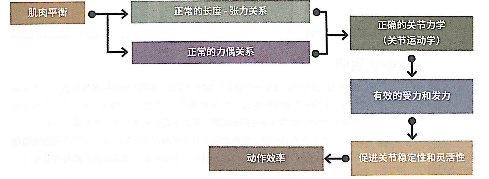

### 背部畸形姿势

首先要知道脊柱中立位的正确姿势：颈部和下背部稍微向前弯曲（脊柱前凸），胸部向后弯曲（脊柱后凸）。

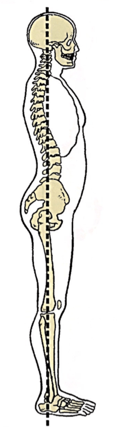

+ 7-1 脊柱后弯=骨盆前倾+胸椎后弯
+ 7-2 平背姿势=骨盆后倾
+ 7-3 凹背姿势=葛优瘫=骨盆后倾+胸椎后弯

P152图7-2.

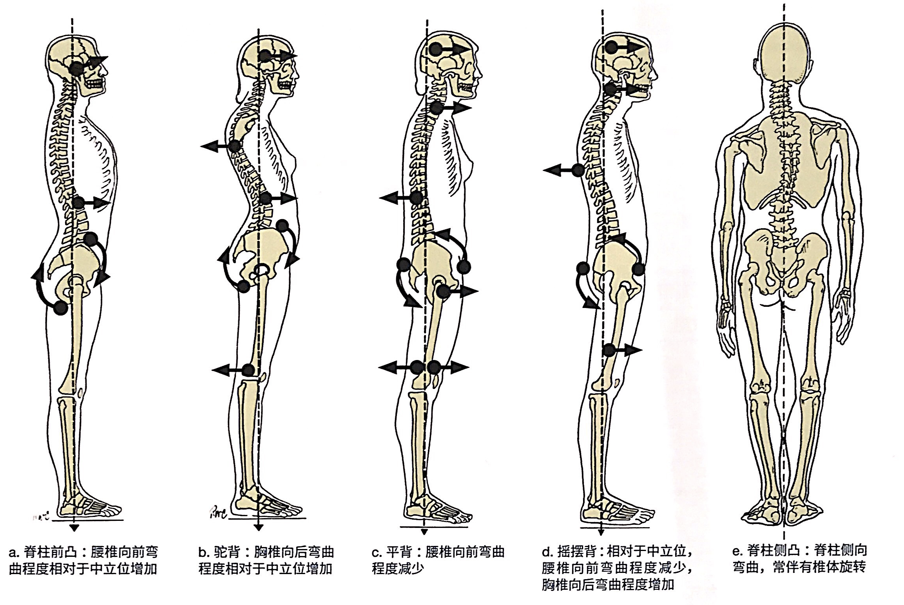

试着对以下每一个紧张的肌群涉及至少一个拉伸动作，并且针对每一个受抑制的肌群设计肌力训练。

P151，下面三个表分别对应上面2-4图。

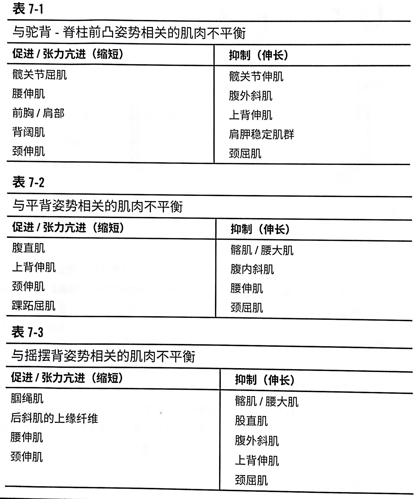

### 肌肉不平衡的可矫正与不可矫正因素[重要]

#### 可以矫正因素

- 重复性动作
- 习惯性的不良姿势
- 单侧优势
- 关节缺乏**稳定性**
- 关节缺乏**灵活性**
- 肌肉训练方案不平衡

#### 不可矫正因素

- 先天疾病
	- 脊柱侧突
- 病理性因素
  - 例如类风湿性关节炎
- 身体结构偏差
  - 胫骨或者股骨扭转
  - 股骨前倾
- 外伤
  - 手术，损伤，截肢

### 铅垂线使用说明

距离地面0.5-1英寸（1.3-2.5厘米）。客户尽可能多路出关节和骨头，脱去鞋袜。客户在意识到自己正在接受观察的时候会或多或少纠正自己，教练应该鼓励客户放松，例如随意交谈来分散注意力。

[**重点**]：重点关注严重不平衡的地方，例如>=0.6公分的身体部位。

P155
+ 横断面观

+ 额状面观（前/后）

	+ 脚内踝和铅垂线距离相等

	+ 标准姿势下，铅垂线穿过两内脚踝的中点、耻骨、肚脐、胸骨、下颌骨（下巴）、上颌骨（面部）、额骨（前额）。从背面看，铅垂线应该二等分骶骨，并且和脊柱棘突重叠。

		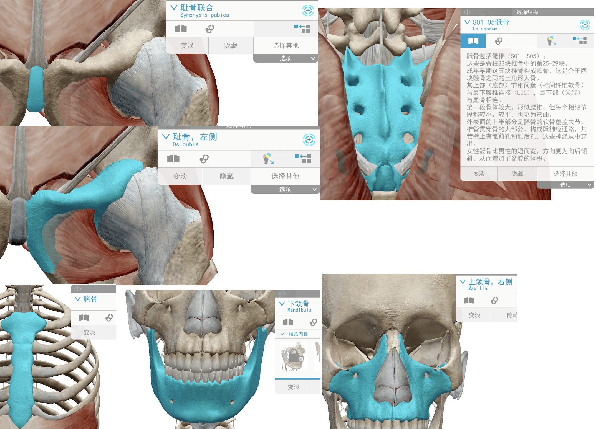

+ 矢状面观（侧面观）

	+ 铅垂线对准外踝前部（下图 c）
	+ 标准姿势下，穿过膝关节前三分之一处、股骨大转子和肩锁关节（肩胛骨和锁骨）、耳朵后方（颞骨乳突前方）。
	+ 股骨大转子：顺大腿外侧往上摸，开始是肌肉，摸起来是软的，当你摸到接近髋关节感觉到的骨性硬物。

### P156 姿势与动作评估的关键

- 收集客户的既往病史
  - 骨骼问题
  - 先天疾病
  - 外伤，损伤
  - 疼痛不适
  - 生活方式信息（单侧主导，职业）
  - 显著的姿势偏差
- 视觉与手动观察
  - 通过肌肉长度测试来确认有没有肌肉不平衡
  - 动作筛查
  - 识别可矫正和不可矫正的动作代偿

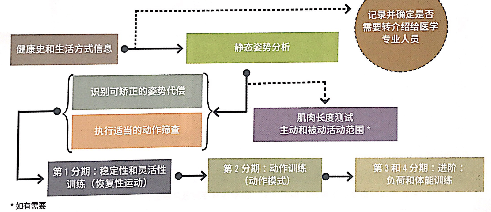

### 姿态偏差

这五项是从下到上看，踝关节、髋关节、骨盆、肩关节/胸椎、头，每一个项目都由正确姿态和错误姿态的部分组成。

- 踝关节内旋/外旋（其实就是高足弓和扁平足）

  - 回忆刚刚的在额状面观察的基本姿势，是**铅垂线穿过两内脚踝的中点**，而不是双脚平行。如果叫踝关节有内旋的客户双脚平行，就已经在纠正他的姿势了。

  - 观察有没有距跟关节过度旋前或者旋后，分别是扁平足（图三）和高足弓（图二）。

    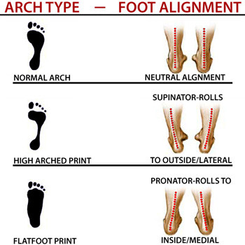

  - 因为有动力链的影响，距跟关节的旋转将影响胫骨和股骨。感受到股骨内旋的方法：双手贴于大腿前侧进行踝旋前旋后。确实有点奇怪，初次感觉是旋前对应 X 型腿，因为外翻->本来是直的最下面朝外了->X。但是要这么想，我们看 O 还是 X 其实要把脚放在地上然后再动小腿。所以参照胫骨的位置来说， O 型腿（下图二）是足外翻。记住一定要参照解剖学姿势。

      腓肠肌和比目鱼肌统称小腿三头肌，腓肠肌有两个头，比目鱼肌一个；小腿三头肌紧张可导致外翻。。

      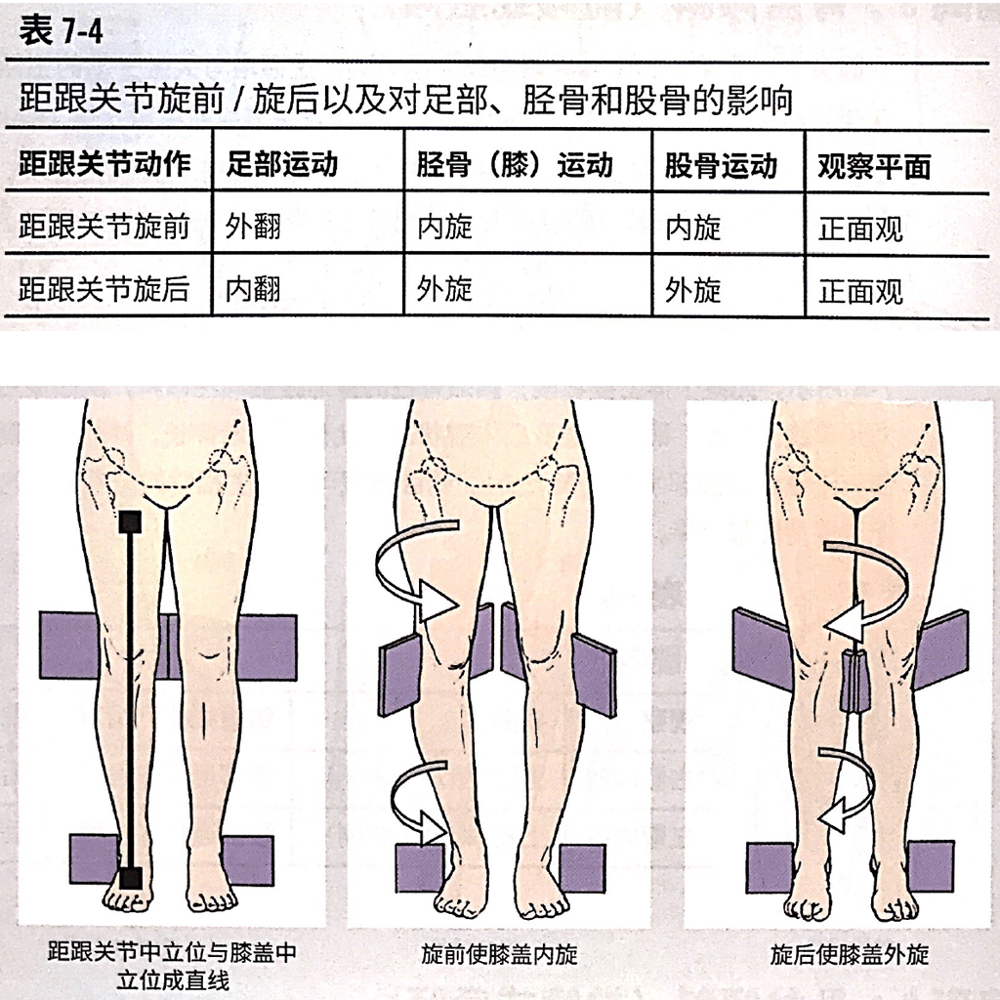

  [补充知识](https://blog.xuite.net/yogazoo/wretch/150657036-%E8%B6%B3%E9%83%A8%E7%9A%84%E6%97%8B%E5%89%8D%E8%88%87%E6%97%8B%E5%BE%8C)：正常足弓，下肢排列會在正確的位置上，髖關節、膝蓋、踝關節會排列在一直線上(上圖第一例)，但足弓過低或沒有足弓(上圖第三例)，則重心會偏向身體內側，足部會變成旋前(Pronation) 。若足弓過高(上圖第二例)，則身體重心會偏向外側；腳會變成旋後(Supination) 。過度旋前(Pronation)會造成功能性的長短腳，使拇指外翻，甚至坐骨神經痛。旋後(Supination)會使踝關節不穩定，無法吸收地面的反作用力。

  腳的旋前(Pronation)動作，包含了三個活動面的複合動作(圖片以右腳為例)：

    1. 在水平面上：外翻 Eversion

    2. 在額狀面上：外展 Abduction

    3. 在矢狀面上：背屈 Dorsi Flexion

    腳的旋後(Supination)動作，包含了三個活動面的複合動作(圖片以右腳為例)：

    4. 在水平面上：內翻 Inversion

    5. 在額狀面上：內收 Adduction

    6. 在矢狀面上：蹠屈 Planter Flexion

  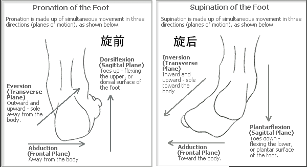

- 髋关节内收：骨盆侧向倾斜。注意一切都是根据中立位来说。虽然骨盆会倾斜，但还是以骨盆的那条线来看，把第二张图的那条线放到水平位置，就是左边外展右边内收。

    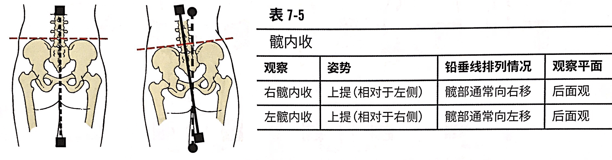

- 骨盆前倾/后倾。

  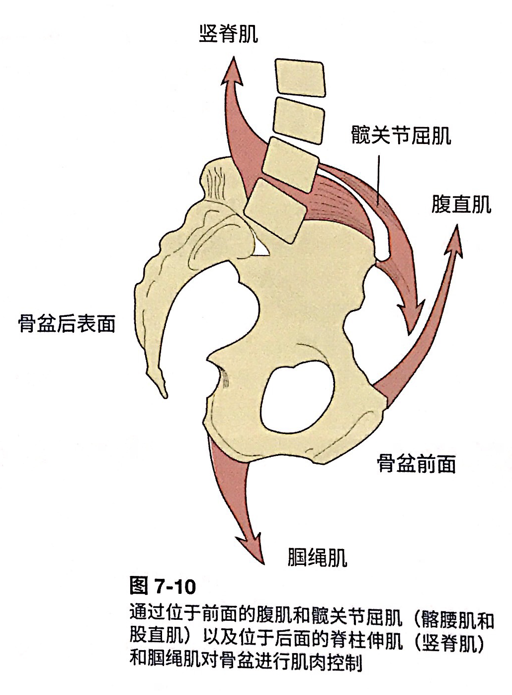

  久坐少动->髋关节屈->骨盆前倾。

  P159

  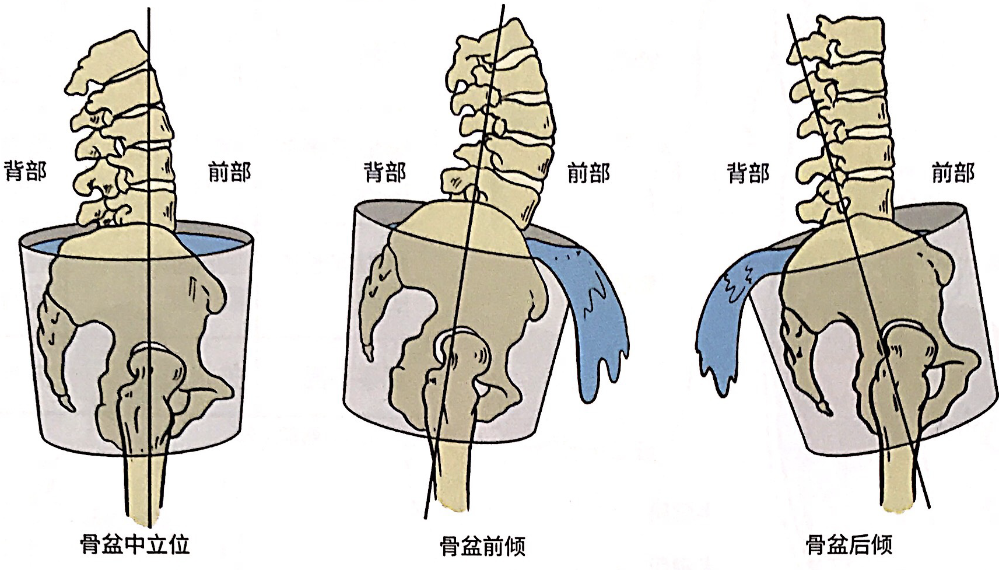

  关于髋关节的肌肉，参见人体肌群导图的`髋屈曲肌群`。

  - 下交叉综合征：髋屈肌和竖脊肌同时紧张
  - 骨盆前倾：增加腰椎的前弯程度
  - 骨盆后倾：减少腰椎的前弯程度

- 肩关节位置与胸椎位置（肩胛前引和翼状肩胛）

    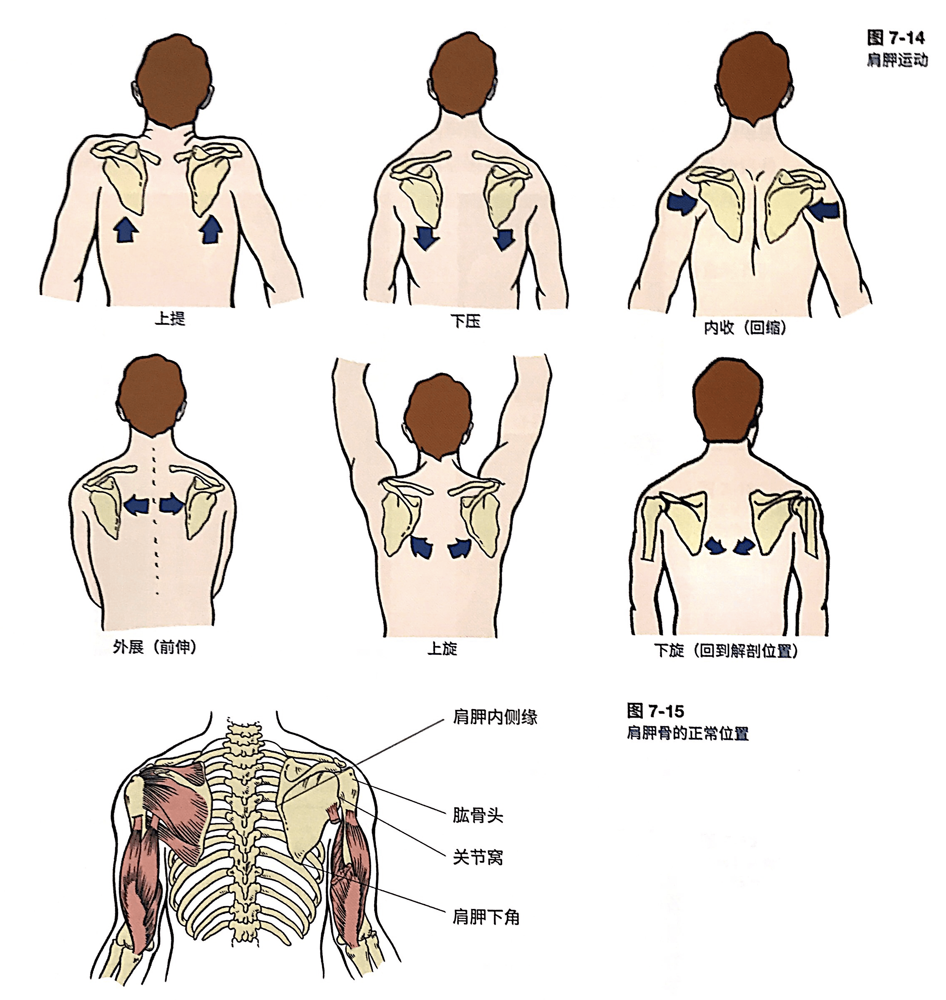

    肩肱节律指的是肩关节上下旋的时候肩胛骨和盂肱关节按照1：2的比例提供旋转，此刻不表。

    **肩胛骨的脊椎（内侧）缘一般位于第二和第七根肋骨之间，与棘突的距离大概三到四指（7.6cm）**。

    P161：主要是前锯肌和菱形肌无法稳定肩胛骨。

    - 肩胛前引：肩胛的脊柱内侧缘向外伸出，但是下角没有翘起来。
    - 翼状肩胛：下角翘起来了，肩胛的脊柱内侧缘其实不一定向外伸出。

    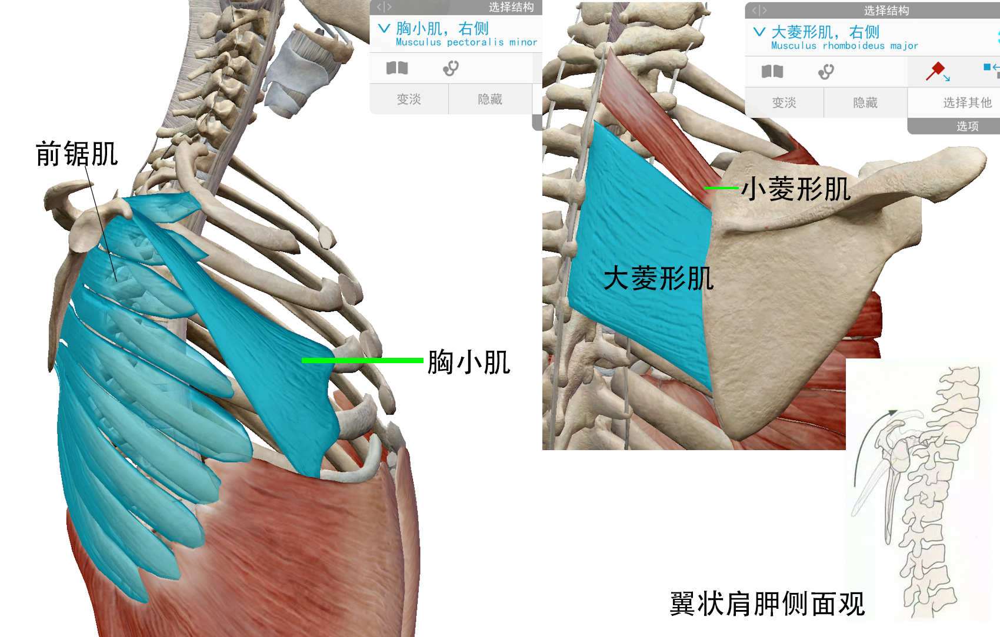

    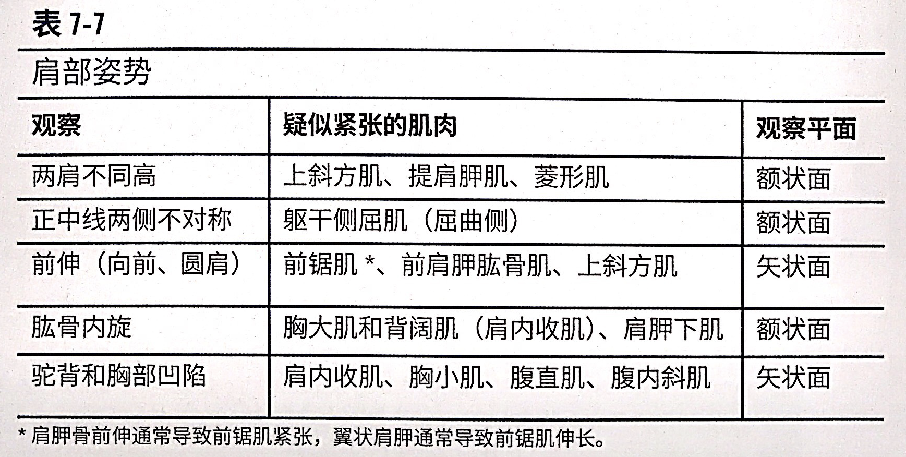

    上图最后一句话很奇怪，导致是什么意思？应该是因为吧。

    [补充资料](https://www.jianshu.com/p/22175a4720e3)。**翼状**这个术语主要是用来描述**前锯肌无力将肩胛骨固定**于肋骨缘时会发生的情况；真正的翼状肩胛产因是**胸长神经或肌肉本身受损**。这两种都不常见。

- 头部姿势

    由于人必定要保持面部的直立，有问题的情况下头部和颈部不会成一条直线。

    

### 评估的总表格

书 P164-166。

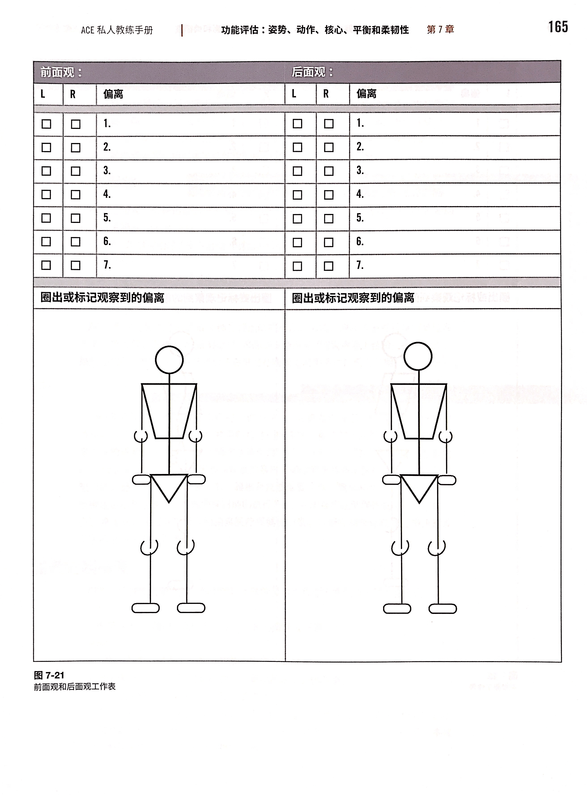

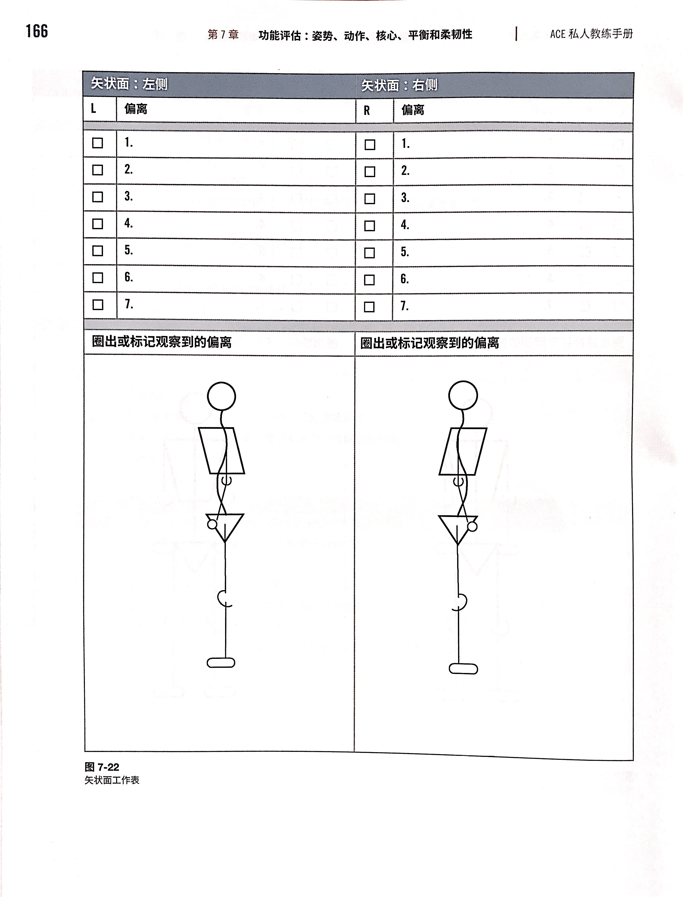

## 动作筛查

**[重要]**：为什么要筛查这五个动作？因为平日生活本质上是这五个主要运动的组合。例如将东西放在地上，是一个`拉`的对抗重力作用。

所有的筛查都不能提示客户有什么注意事项，只教动作。

### 目的

其实和静态差不多

- 判断肌肉失衡
- 识别不良姿势对神经控制的影响
- 识别可矫正和不可矫正的动作代偿 

### 屈髋提起动作筛查

深蹲的动作模式。

目的：检查对称下肢的稳定性灵活性以及上肢的稳定性。

#### 深蹲的检查顺序

P169的表7-9。前面观和侧面观分别有三个和五个项目，那就让客户重复做屈髋提起的动作，然后到正面和侧面按顺序从下到上观察。先列出正确的姿势

前面观

- 足部无旋前、旋后、外翻、内翻
- 双膝与第二趾一条线
- 整个身体的对称性

矢状面观

- 脚跟着地
- 臀肌主导（不能股四头肌主导）
- 胫骨和躯干平行（4），腘绳肌不靠在小腿上
- 胸椎和腰椎凹凸程度不变
- 头部姿势不变。

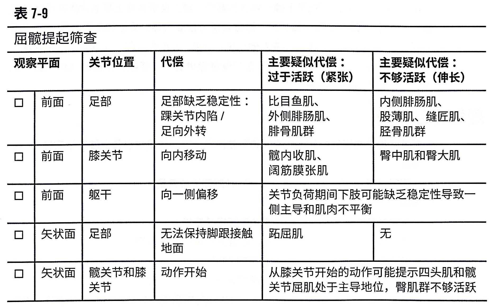

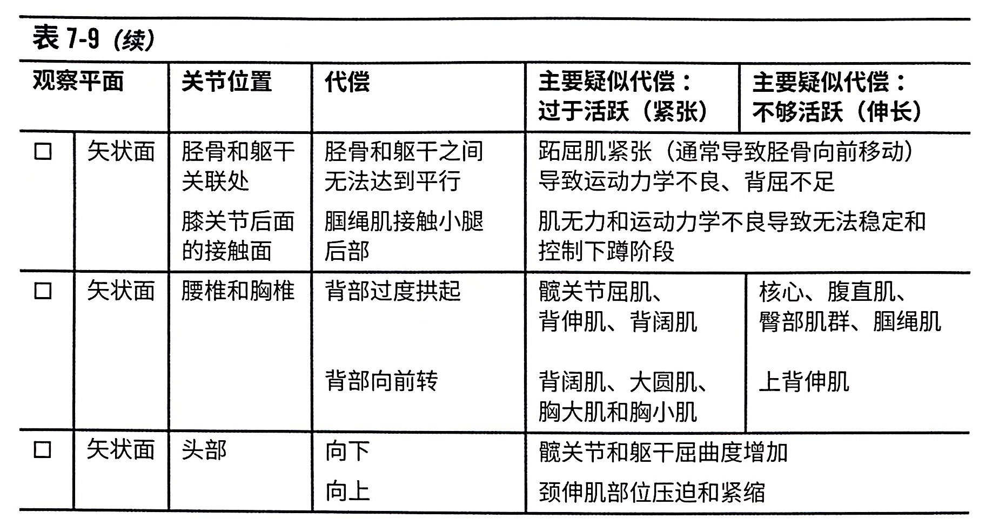

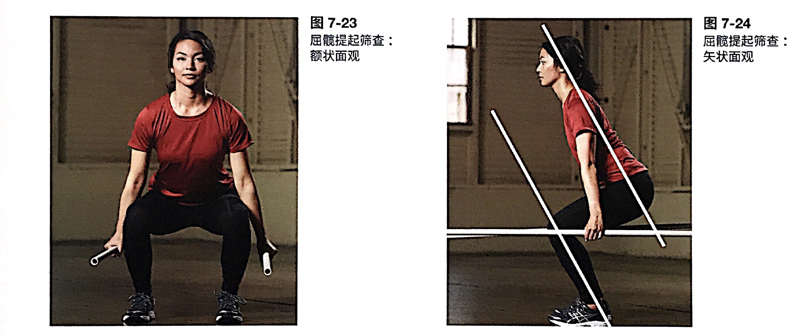

#### 深蹲的三种主导

+ 腰部主导
    + 缺乏核心和臀部力量，因此腰椎伸展代偿平衡，导致受力过大。
    + 久坐的人因为髋屈肌长时间缩短，也可能这样。
+ 股四头主导
    + 前十字韧带负荷过大
+ 臀肌主导（佳）
    + 减轻腰椎负荷
    + 减轻膝盖压力

### 跨栏步动作筛查

### 俯卧撑稳定性筛查

### 胸椎灵活性筛查

## 柔韧性与肌肉长度测试

- 表7-13 健康成人的平均活动范围
- 托马斯试验：屈髋/股直肌长度
- 被动直腿抬高

### 肩关节灵活性

- 肩关节屈伸试验
- 肱骨在肩关节的内外旋
- Apley摸背试验

### 平衡能力与核心

- 闭目直立（强化 Romberg 试验）

- 单腿站立（鹤姿站立）

- McGill躯干肌耐力系列

  - 躯干屈肌耐力实验（躺在地上斜起）

  - 躯干侧屈肌耐力实验（单臂撑地）

  - 躯干伸肌耐力实验（架在桌子上）

