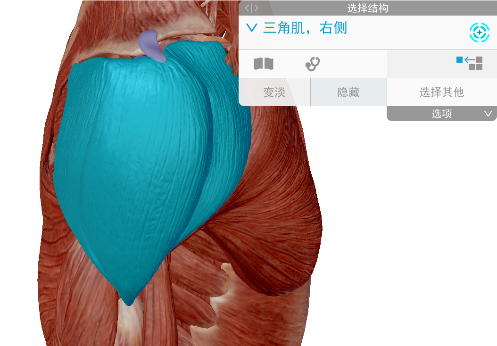
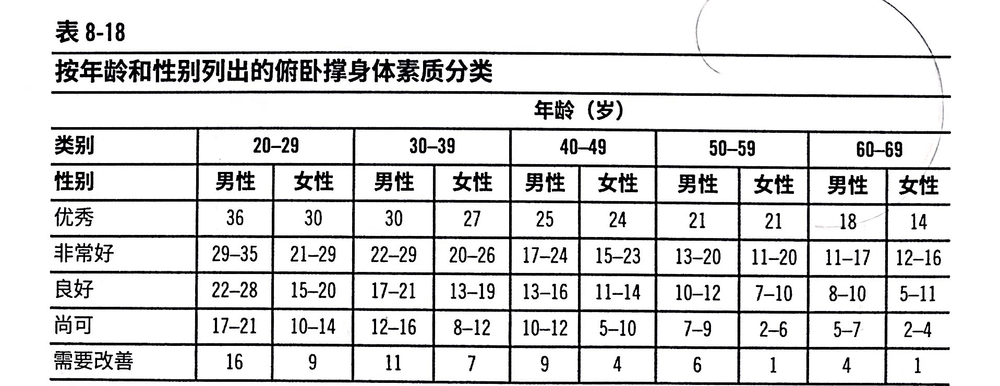
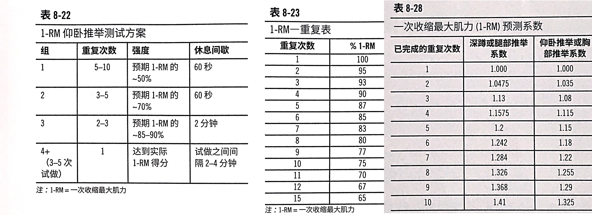
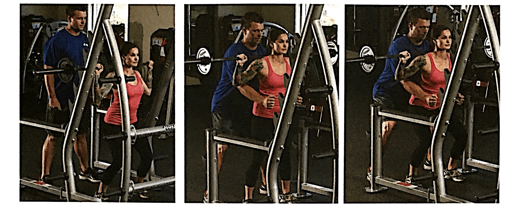
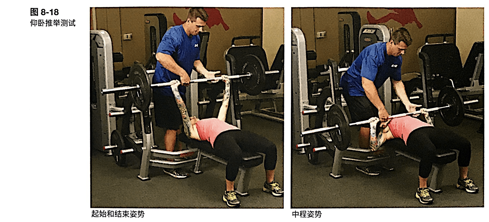
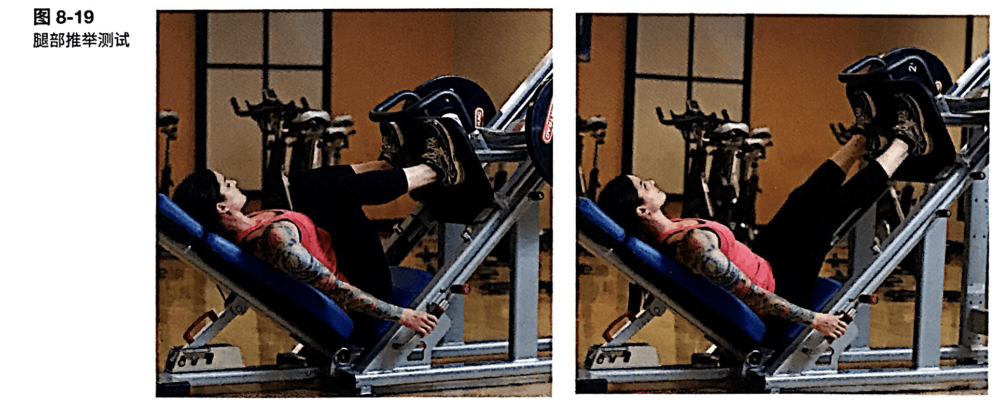
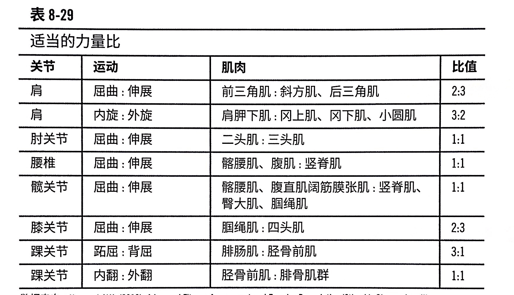
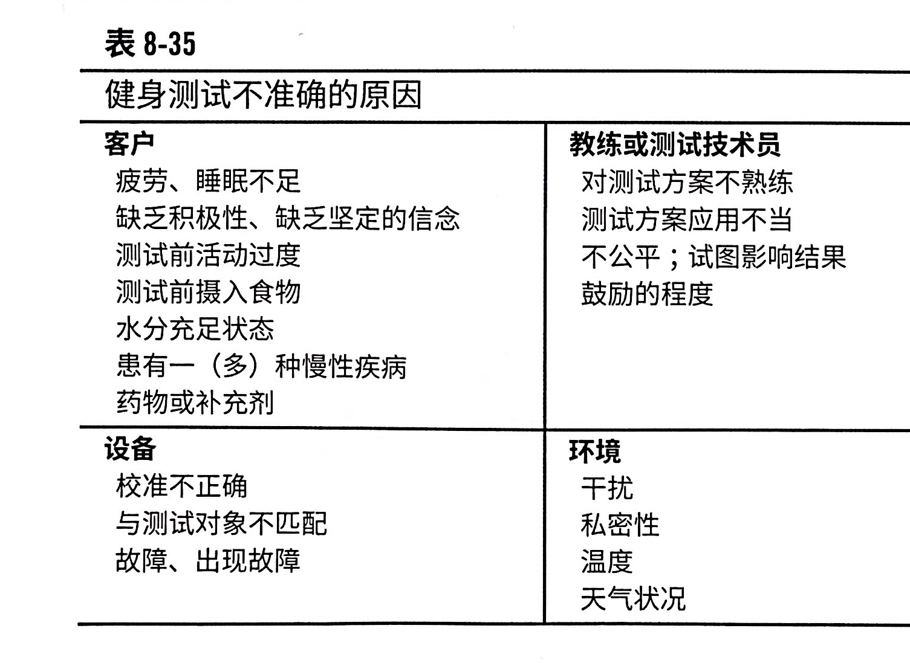

# 生理性评估(2)

评估肌肉力量和耐力，评估心肺适应能力。

健康相关的评估

| 测试项目          | 项目内容                                                 |
| ----------------- | -------------------------------------------------------- |
| 心肺适应能力      | 心肺的总体功能，以及心血管系统向工作肌肉输送氧气的效率。 |
| 身体组成/人体测量 | 身体组成和体脂分布                                       |
| 肌耐力            | 肌群维持重复活动和承受疲劳的能力                         |
| 肌力              | 肌肉克服外部阻力的能力                                   |
| 柔韧性            | 给定关节（组）的活动范围（ROM），或者肌群的伸展能力      |

运动技能相关的评估

| 测试项目     | 项目内容                                                     |
| ------------ | ------------------------------------------------------------ |
| 无氧爆发力   | 功率；最大努力下进行单次、爆炸性的爆发                       |
| 无氧运动能力 | 短时间内，发力的持续性                                       |
| 速度         |                                                              |
| 敏捷性       | 个体如何准确和快速地改变方向；涉及三个阶段：加速、稳定、减速 |
| 反应性       | 个体对刺激进行反应的速度                                     |
| 协调性       | 个体在合适的时间里、用准确的力度完成复杂动作的能力           |

<!--ts-->
   * [生理性评估(2)](#生理性评估2)
      * [肌肉适能测试](#肌肉适能测试)
         * [肌肉适能的益处](#肌肉适能的益处)
         * [肌耐力测试](#肌耐力测试)
         * [肌力测试](#肌力测试)
      * [运动技能评估](#运动技能评估)
         * [爆发力测试：场地测试](#爆发力测试场地测试)
         * [速度，敏捷性和反应性试验](#速度敏捷性和反应性试验)
      * [体适能试验准确性](#体适能试验准确性)

<!-- Added by: oda, at:  -->

<!--te-->

## 肌肉适能测试

P233

### 肌肉适能的益处

- 提高日常生活活动能力，进而提升自信并培养独立意识
- 维持肌肉骨骼完整性，减少常见的肌肉骨骼损伤
- 增加或维持瘦体重，改善静息代谢
- 维持或增加骨密度，预防骨质疏松
- 提高葡萄糖耐量，预防二型糖尿病
- 降低阻力性活动的心血管反应

### 肌耐力测试

P234，只需要记有三个项目。

肌群维持重复活动和承受疲劳的能力。

#### 俯卧撑测试

- 胸部、肱三头、前三角肌
- 
- 结束条件
    - 无法重复完成动作
    - 两次连续动作没有保持正确技巧

#### 卷腹测试

那自然是腹部耐力了。

使用完整仰卧起坐需要髋屈，对腰椎的力很大。

技术细节有点多，P237

#### 自重深蹲测试

### 肌力测试

P240

肌肉克服外部阻力的能力。

绝对力量/体重=相对力量。

[**重要**]：1RM 的测试应该只在三期或者四期的时候测试。一般用次最大力量测试。

以下是使用多个肌肉群来评估不同肌群的力量。

#### 三个项目通用的流程 & 重复次数与最大肌力的 & 1RM 估算表格

#### 1RM 深蹲

#### 1RM 卧推

#### 1RM 倒蹬测试

#### 1RM 试验特别注意事项

- 由于都用自由器械，所以测试者要对器械熟悉
- 初学者会低估自己能力
- 避免 Valsalva 呼吸法

比如深蹲时，下蹲之前，先深吸一口气，憋住，下蹲，直到接近站起时再吐气，每一下动作都做一个完整的单独呼吸。这种呼吸方式在学术上被叫做瓦萨瓦呼吸（虽然也不是完全相同，Valsalva's maneuver一般要求一次进行10-15秒，深吸气后紧闭声门，然后用力在屏住呼吸的同时做呼气动作)   

#### 肌肉力量比

## 运动技能评估

P249，四期。

### 爆发力测试：场地测试

P249

- 立定跳远
- 纵跳摸高

### 速度，敏捷性和反应性试验

P253

- 40码冲刺-测定加速和速度
- pro 敏捷性测试
    - 20码敏捷跑试验（5-10-5）

## 体适能试验准确性

