# 功能性训练方案：稳定性灵活性和动作(1)

训练抗阻第一阶段和第二阶段（动作模式）的工具和策略。

人体是适应性的，加到个体身上的负荷会改变人体的发育。活动水平下降，不良姿势或者肌肉的不平衡倾向会改变神经肌肉系统内的正常生理功能，就会引起代偿，最终导致动力链的破坏。

<!--ts-->
   * [功能性训练方案：稳定性灵活性和动作(1)](#功能性训练方案稳定性灵活性和动作1)
      * [Move well, move often](#move-well-move-often)
      * [动作](#动作)
         * [灵活性和稳定性的定义](#灵活性和稳定性的定义)
         * [<strong>运动链中的灵活性与稳定性</strong>[重要]](#运动链中的灵活性与稳定性重要)
         * [<strong>灵活性不足可能产生的代偿</strong>](#灵活性不足可能产生的代偿)
         * [长度—张力关系[重要]](#长度张力关系重要)
         * [力偶作用关系](#力偶作用关系)
         * [神经控制](#神经控制)
      * [一期：灵活性与稳定性训练](#一期灵活性与稳定性训练)
         * [拉伸技巧](#拉伸技巧)
         * [<strong>与拉伸相关的自生抑制[重要]</strong>](#与拉伸相关的自生抑制重要)
         * [肌筋膜放松术](#肌筋膜放松术)
            * [筋膜是什么](#筋膜是什么)
         * [近端稳定性：为了激活核心](#近端稳定性为了激活核心)
            * [三个层](#三个层)
            * [<strong>训练近端稳定性的动作</strong>](#训练近端稳定性的动作)
               * [仰卧吸腹=凯格尔运动](#仰卧吸腹凯格尔运动)
               * [四足姿势下吸腹并执行肢体动作](#四足姿势下吸腹并执行肢体动作)
         * [近端灵活性：臀部和胸椎](#近端灵活性臀部和胸椎)
         * [肩胛胸的稳定性 &amp; 盂肱关节的灵活性](#肩胛胸的稳定性--盂肱关节的灵活性)
         * [远端灵活性](#远端灵活性)
         * [静态平衡](#静态平衡)
         * [动态平衡](#动态平衡)
         * [单腿站立模式](#单腿站立模式)

<!-- Added by: oda, at:  -->

<!--te-->

## Move well, move often

## 动作

共同的基本目标就是提高客户的动作效率，以及日常活动的能力（第七章也提到过）。

动力链的存在会让一个错误姿势的后果逐渐放大，也就是代偿。代偿指的是无法维持肌肉平衡和关节中立位（P265）。

人体一般受到的力：外部负荷力，重力，保持稳定自己发的力。

### 灵活性和稳定性的定义

关节稳定性的定义：维持或者控制关节动作或姿势的能力。

关节灵活性：围绕某一关节或身体部位进行**不受限运动的范围**。

小笔记：

1. 缺乏稳定性->可以加强本体感受。本体感受可以让人预测运动和稳定型需求（P263），然后做出必要的运动反应。
2. 韧带已经被拉长的情况，只能加强肌肉来加强稳定性。

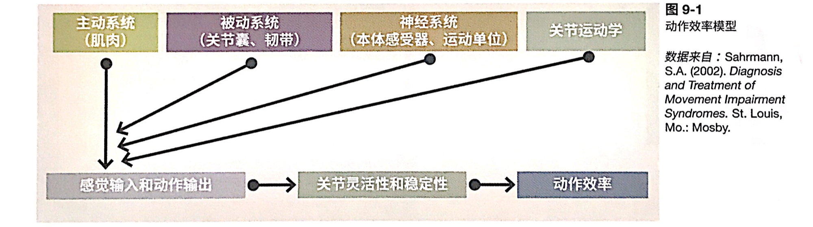

**近端稳定性才能提高远端灵活性**。科学一下就是动量的关系。设想发射导弹，平地上发射和在一艘船上哪一个力量更大？

### **运动链中的灵活性与稳定性**[重要]

从上到下的一条链，影响是 joint by joint。

参见[3Hfit 的知乎专栏](https://zhuanlan.zhihu.com/p/38355738)。

- 盂肱关节——灵活性
    - 盂肱关节是肱骨头与肩胛骨盂臼之间的滑膜性接联，包括半球形肱骨关节面和骨与软组织的臼。该关节的表面运动主要是旋转。
- 肩胛胸——稳定性
    - 严格来说它并不是一个关节（关节的定义是两块骨骼的交汇点），而是肩胛骨与胸廓后侧面的接触位置。一块肩胛骨通过17块肌肉的协同作用，与肱骨共同完成动作（灵活性），同时也为理想的体姿及过顶动作创造足够的支撑（稳定性）。
- 胸椎——灵活性
- 腰椎——稳定性
- 髋关节——灵活性
- 膝关节——稳定性
- 踝关节——灵活性
- 足踝——稳定性

P264：所有关节都有不同程度的灵活性和稳定性，但是往往会出现某一方面比另一方面强一点的情况。例如，腰椎可以转，但是大多数时候都是稳定性。

小笔记：下肢活动一定要放松小腿；上下肢活动都得保证胸椎的灵活性。

### **灵活性不足可能产生的代偿**

- 关节会在**其他运动面产生活动**，以实现期望的关节活动度。
- 临近的**稳定性较高的关节可能牺牲一定的稳定性**，以提高灵活性来完成某个动作。

P265：缺乏灵活性可能的原因（前六个是外因，后四个是内因）

- 外因
    - 重复动作
    - 习惯性不良姿势
    - 工作环境
    - 单侧主导
    - 运动技巧不良
    - 力量训练计划不平衡
- 内因
    - 先天性疾病（脊柱侧凸）
    - 病状（关节炎）
    - 结构偏差（股骨前倾）
    - 创伤（截肢）

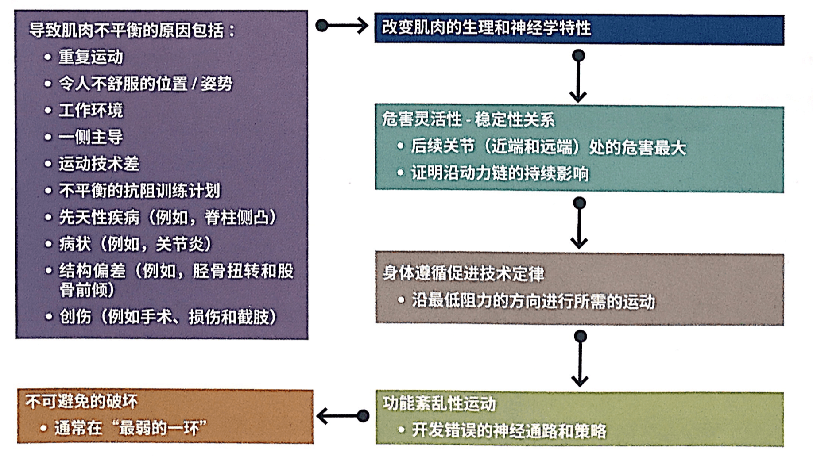

这翻译忍不了了。

### 长度—张力关系[重要]

长度—张力关系指的是**肌小节的收缩性蛋白**（例如肌动蛋白和肌球蛋白）和**肌力产生能力**的关系。简单记一记：中间最高，太收紧和伸长都没那么有力。

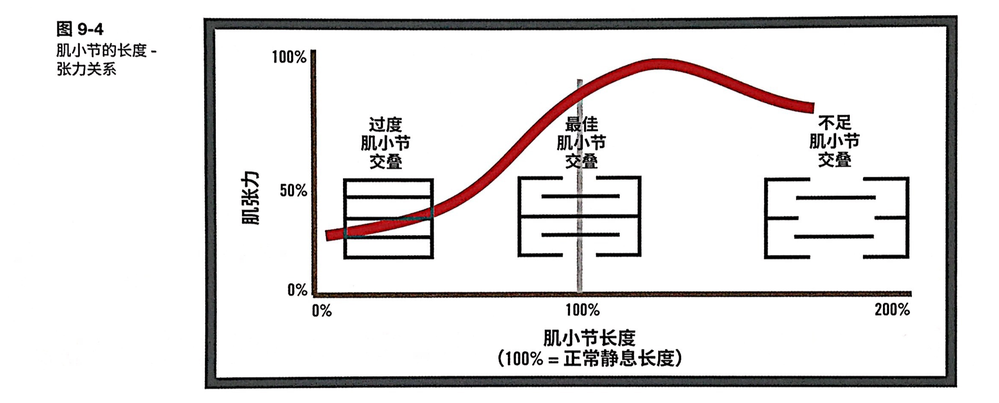

P266：如果肌肉已经缩短或者伸长，那么曲线就会分别左移或者右移，变成下图。肌肉固定，老化，被动缩短和创伤都会使得肌肉缩短（肌原纤维中肌小节数量减少）。

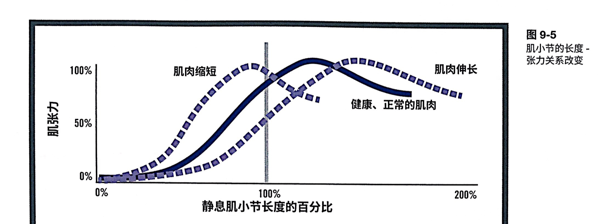

- 表 9-4 P303。静态支撑面的动态动作模式。
- 缩短肌肉的因素
    - 主动
    - 被动
    - 外伤
    - 老化

### 力偶作用关系

力偶关系指的是同一个作用，但是方向相反的一组力。最经典的是骨盆。

力偶（英語：couple）在經典力學裏是一種只有合力矩，而不產生合力的作用力系統。作用於剛體時，力偶能夠改變其旋轉運動，同時保持其平移運動不變。力偶不會給予剛體質心任何加速度。

- 腘绳肌，腹直肌
- 竖脊肌，屈髋肌群

### 神经控制

神经控制肌肉，肌肉控制骨骼。

-  高张性
-  交互抑制作用
    -  利用神经操控主动肌的时候，拮抗肌也会**同步收缩**以**帮助稳定关节**。交互抑制（reciprocal inhibition）指的是当支配一肌肉的运动神经元受到传入冲动的兴奋，而支配其拮抗肌的神经元则受到这种冲动的抑制，此种生理活动现象称为**交互抑制**。
    -  交替抑制指的是「當主動肌收縮，拮抗肌必須放鬆」這個過程。
    -  例如髖屈肌過度活躍/僵緊，導致臀大肌的神經驅動降低。
-  协同肌主导效应
    -  在存在交互抑制的情况下才会出现。具体情况是， A和B 是一组拮抗肌， B和C 是一组协同肌。A 过于紧张（出了问题），由于交互抑制效应，B 就会被抑制。那当我想使用 B 肌肉做动作的时候，只用B 是做不出来对应的动作的，需要 C 肌肉协助。这就是**协同肌主导**。
    -  怎么理解这个名词：本来应该 B 主导的，却变成了它的协同肌C来主导。
    -  由於臀大肌的神經驅動減少，因此扮演協同肌的大腿後側肌群（腘绳肌）接管了臀大肌的工作了。
    -  其实这就是一种代偿。代偿并不是坏事，而只是一种机制。如果协同肌并不具备原主动肌的功能，那还是有害的。

代偿是一个恶性循环。

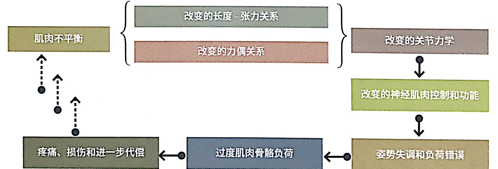

## 一期：灵活性与稳定性训练

抗阻的第一要务永远是建立适当的稳定性和灵活性。

[**重要**]：稳定肌含有较高浓度的 I型肌纤维（慢缩纤维），使肌肉能长时间保持关节的稳定。主要负责关节动作并产生较大肌力的肌肉通常含有更多 II型肌纤维（快缩纤维）。

下图中一般都把骨盆纳入腰椎范围，因此是稳定关节（考试的时候还是归为髋关节，灵活）。

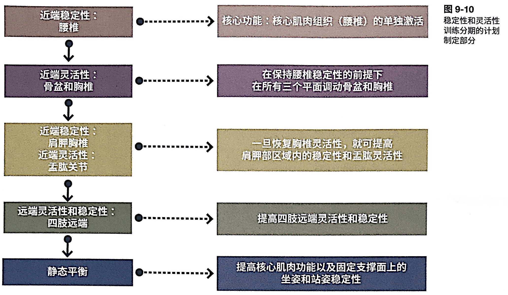

### 拉伸技巧

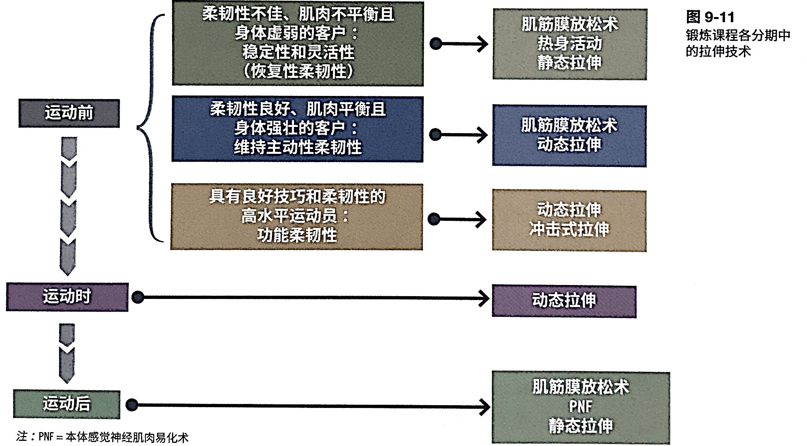

- 自我筋膜放松术（SMR，Self-myofascia release） ：使用泡沫轴小幅度前后移动
    - 5~15cm，30~60s
    - 能重新设定软组织的本体感受机制
- 静态拉伸
    - 针对张力部位，重复至少四次，每次15~60s。
- 本体感觉神经肌肉易化术（PNF， Proprioceptive neuromuscular facilitation）
    - 持续进行松弛拉伸
    - 原动肌维持等长收缩6s，辅助或被动静态拉伸10~30s
- 弹震式拉伸=动态/冲击式拉伸：运动员
- 主动隔离式拉伸：康复训练

### **与拉伸相关的自生抑制[重要]**

- 高尔基腱器官在拉伸7~10s的时候，产生反应。
- 终止拉伸后，前5秒肌梭回复70%
- 交互抑制原则：主动及收缩或执行主动动作（<50% 1RM）超过6s，拮抗肌就会受到抑制，允许进一步拉伸肌肉。

P272。先说几个帮助理解的概念

- GTO 让肌肉不收缩，因此就是协助肌肉拉伸。
- 肌梭让肌肉不拉伸，会让肌肉收缩因此增加肌力。

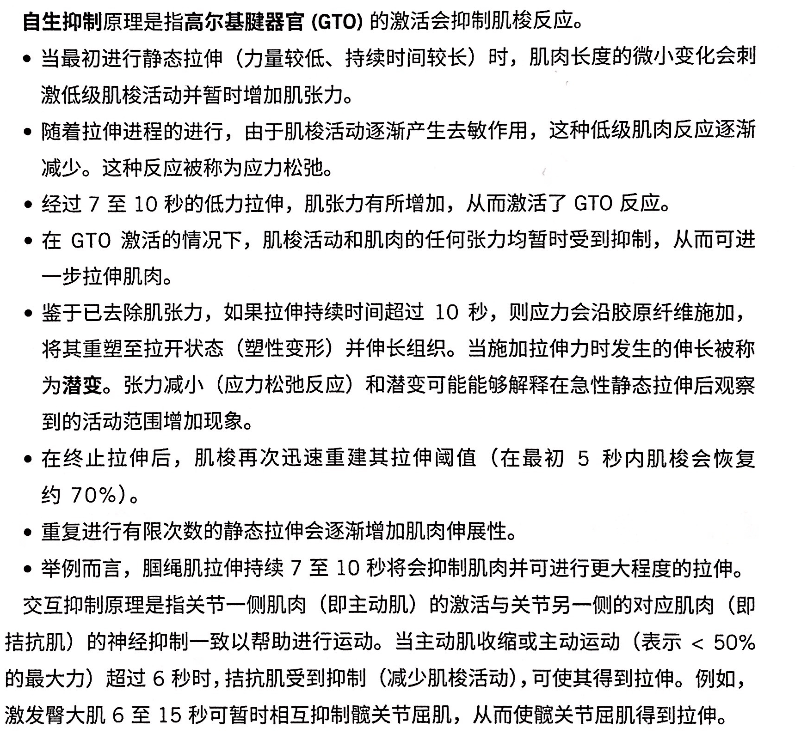

### 肌筋膜放松术

#### 筋膜是什么

筋膜包裹着肌肉来提供稳定性，放松筋膜可以让肌肉活动范围增加（增加灵活性）。对筋膜紧张的区域施加压力，目的是让 GTO 被激活。

见[拉伸技巧](#拉伸技巧)的第一项。痛得一笔，让客户缓慢呼气可以减少疼痛。

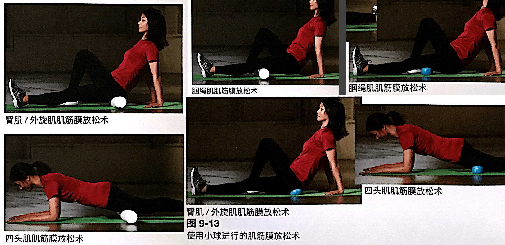

### 近端稳定性：为了激活核心

此阶段的目标是通过改善核心肌肉组织的反射功能来**提高腰椎的稳定性**。

核心一般指的是腰骶-骨盆-臀部-腹部-下背部的肌肉，核心区域的功能是有效地控制骨盆上方躯干的位置和运动，也就是近端稳定。

核心稳定性是为了传递力量，而不是主动创造力量。

#### 三个层

- 深层核心：椎骨和椎间盘；回旋肌，棘间肌，横突间肌。含有大量神经末梢，可以向大脑提供关于本体感受。都在些什么鬼地方啊。棘间肌在椎骨的棘突，横突间肌在下。所以看得出来深层核心其实是稳定脊柱的作用，不怎么发力。

    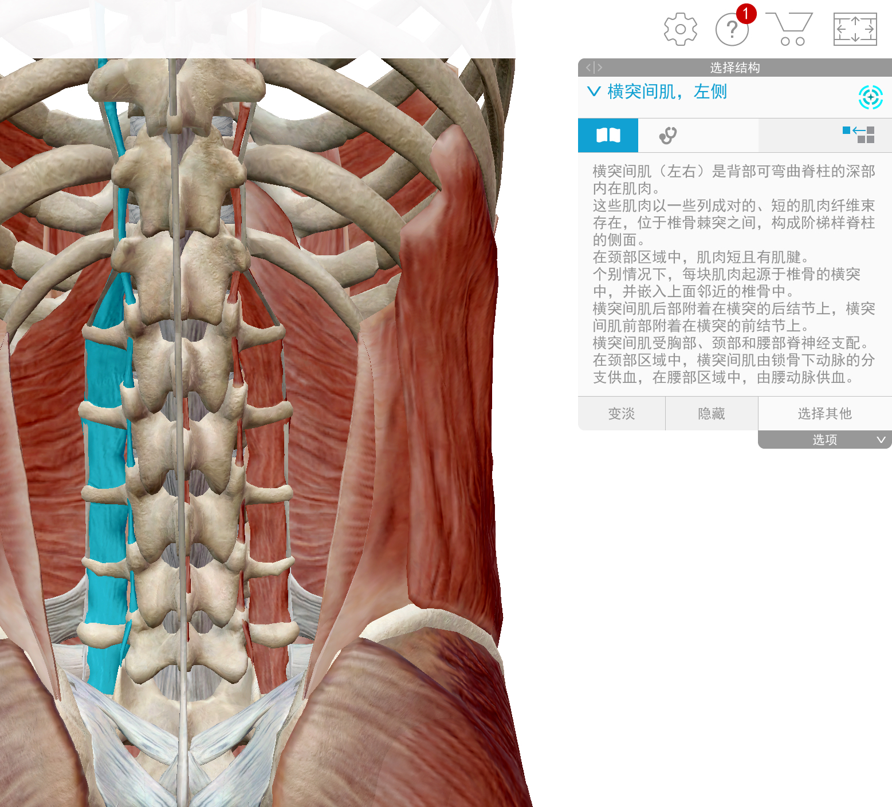

- 中间层核心：脊柱下部区域和筋膜。除了下面四个还有膈（与呼吸有关），腹内斜肌的深部纤维。**腹横肌叫做 TVA。**

    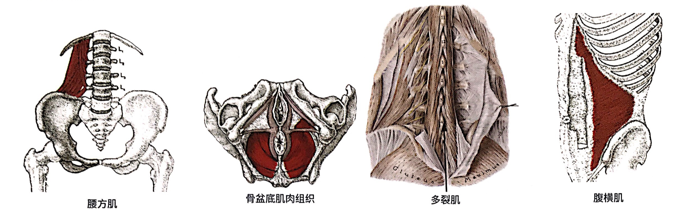

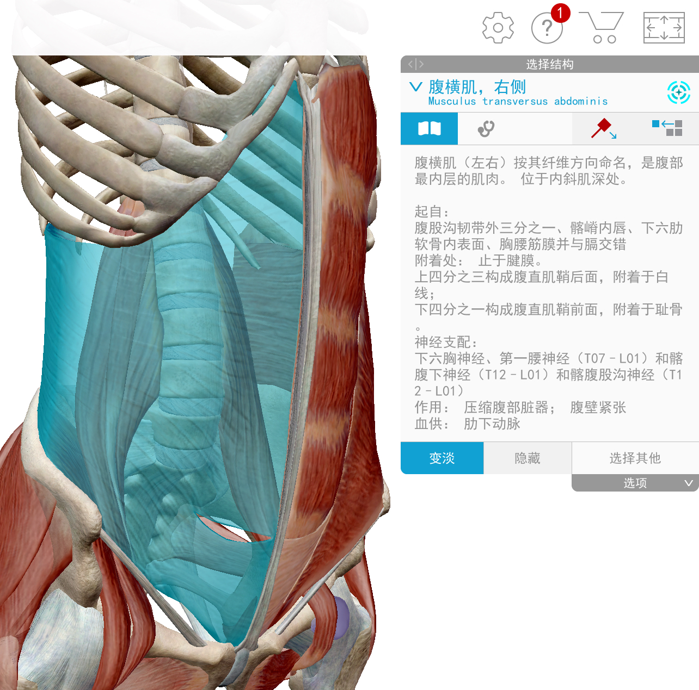

- 最外层核心：更大更有力的肌肉，在躯干内产生大幅的动作和力。包括腹直肌，竖脊肌，腹外/腹内斜肌，髂腰肌以及背阔肌。

    ​    

    一般所說腹肌就是指腹部前側表層的那群腹直肌 (Rectus abdominis)。

    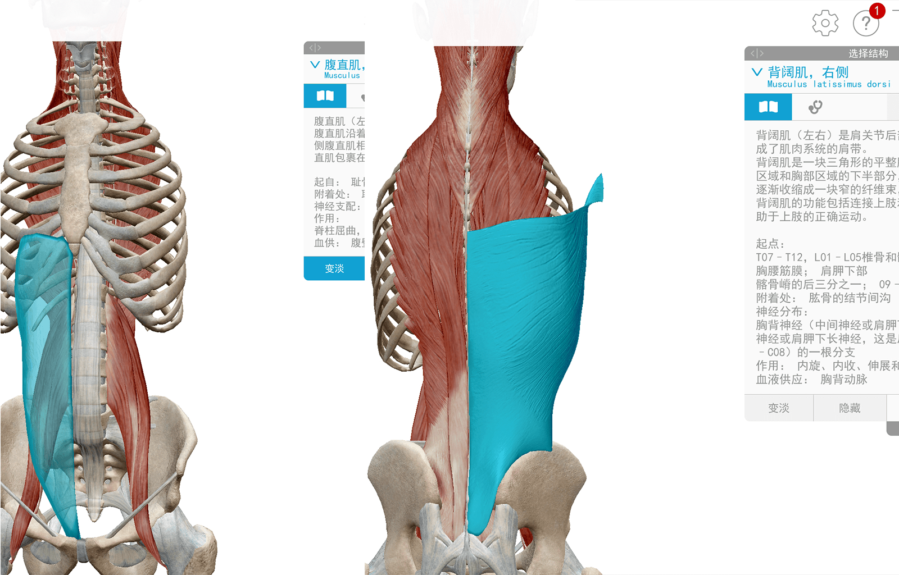

    竖脊肌分为三部：外侧为髂肋肌iliocostalis，止于肋角；中间为最长肌longissimus，止于横突及其附近肋骨；内侧为棘肌spinalis。

    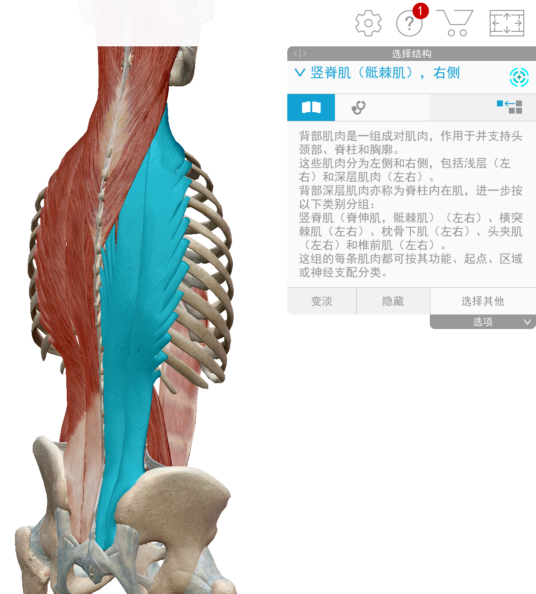

    腹直肌除了美觀，主要的功能是讓身體前彎。腹外斜肌也有美觀的功能，越強壯人魚線就越明顯，他跟腹內斜肌則是主要負責身體旋轉與側彎。 

    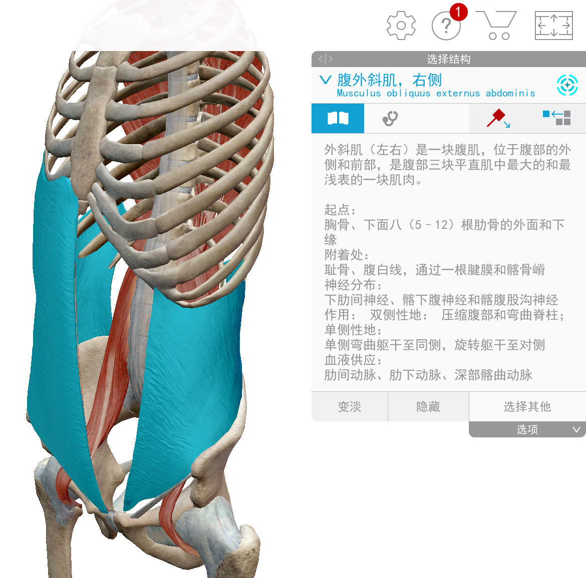

    髂肌和腰大肌合称髂腰肌。

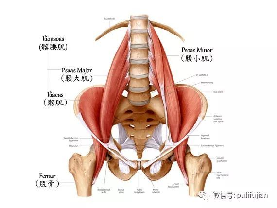

这么想，越靠里面的力臂越短，肌肉本身也短，造成不了大范围的活动。越靠外面的肌肉长，所以活动范围长，能够造成的动作幅度也就越大。

【重要】

**腹横肌（TVA） 没被激活可能在上肢和下肢运动期间不足以稳定腰椎，增加受伤可能性。**于是就会有代偿，需要其协同肌（例如腹直肌）来稳定脊柱。

由于身体的重心处于核心区域内，并且控制平衡需要将重心放在支撑面里，所以训练核心和训练平衡基本相同。下面是一个进阶方案。

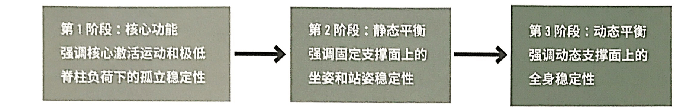

#### **训练近端稳定性的动作**

##### 仰卧吸腹=凯格尔运动

手指对准髂前上棘（ASIS），髂前上棘、膝盖和第二脚趾成一条直线。收腹过程中，骨盆、下背部和肋骨不能活动，否则就有腹直肌的参与。

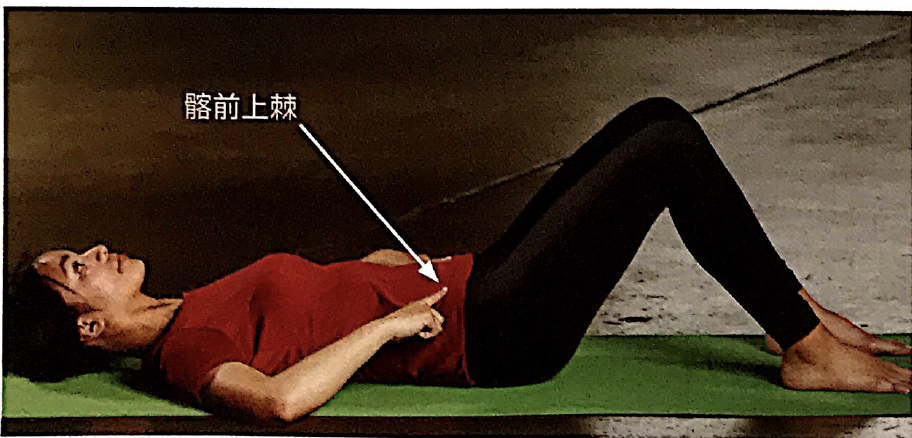

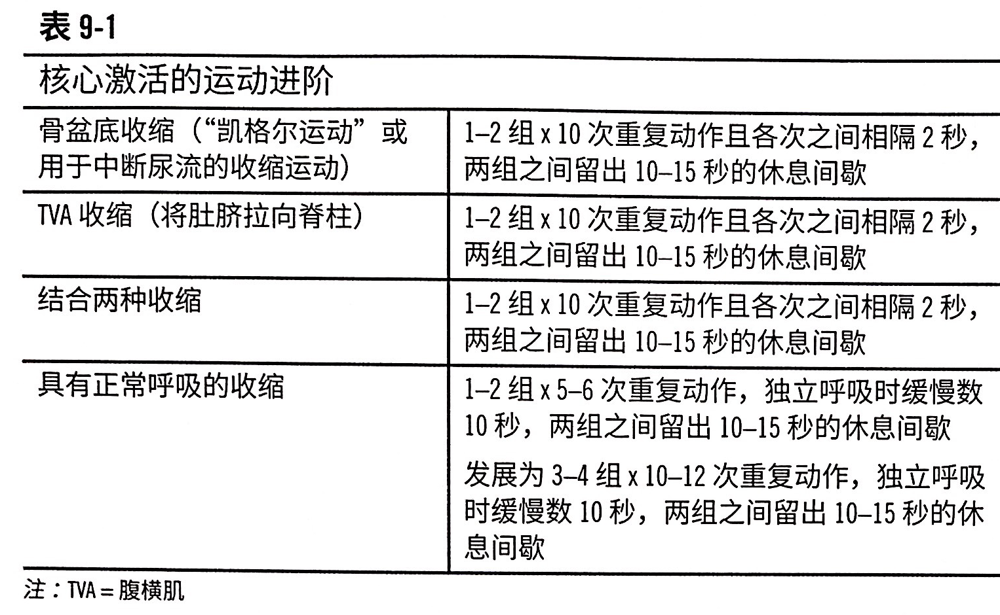

##### 四足姿势下吸腹并执行肢体动作

目的是对抗重力来激活核心肌肉，同时保持腰椎的控制。

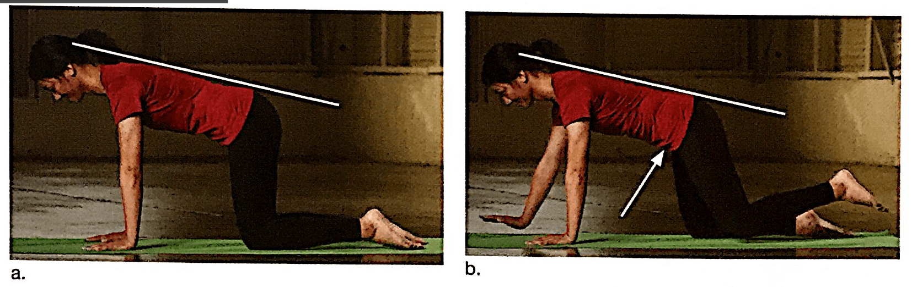

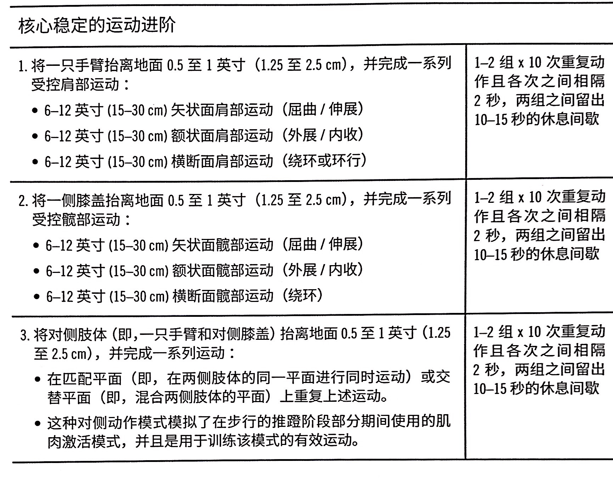

### 近端灵活性：臀部和胸椎

P280

### 肩胛胸的稳定性 & 盂肱关节的灵活性

P289

### 远端灵活性

P297，介绍了深蹲的时候脚跟不着地的情况，小腿三头肌和腓肠肌过紧。

### 平衡能力

**训练平衡的意义[重要]**：因此一旦建立了核心功能，就应该在训练计划的早期来强调。

+ 完成日常生活活动（ADL）
+ 增强身体表现
+ 还可以建立自我效能
+ 促进心理和情感状态的改善

一些缩写

| 缩写 | 全称              | 翻译   |
| ---- | ----------------- | ------ |
| COM  | center of mass    | 重心   |
| BOS  |                   | 支撑面 |
| COG  | center of gravity | 重心   |
| LOG  | line of gravity   | 重力线 |

由于肌肉更多，男性的重心会更高一点。

#### 静态平衡

定义：将身体重心维持在支撑面里的能力。

#### 动态平衡

定义：将身体重心移动到支撑面外的同时保持姿势控制的能力，以及建立新支撑面的能力。

#### 进阶原则

原平衡-扰动-新平衡。例如：减少接触点、使用不稳定的地面（泡沫轴，气垫，实心球）；从坐着变为站着是提高 COG。

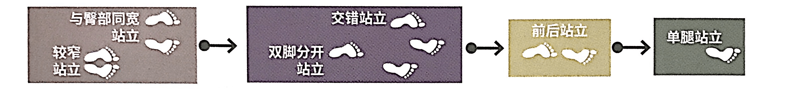

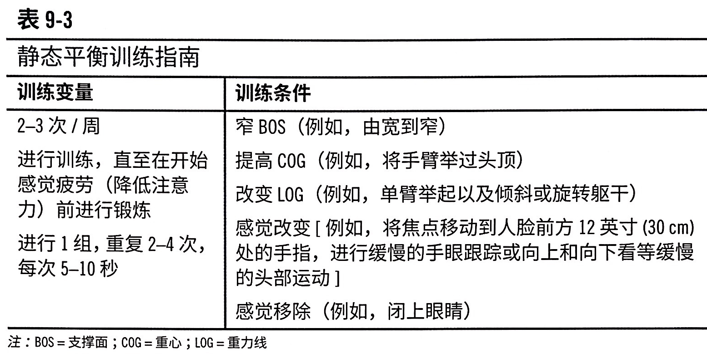

### 单腿站立模式

P301

#### 静态单腿站立

流程

- 屈髋10-15度，将重新移到脚跟
- 核心收紧，右脚稍微离地
- 以不离开铅垂线为目标
- 进阶的话可以摆动腿来模拟走路

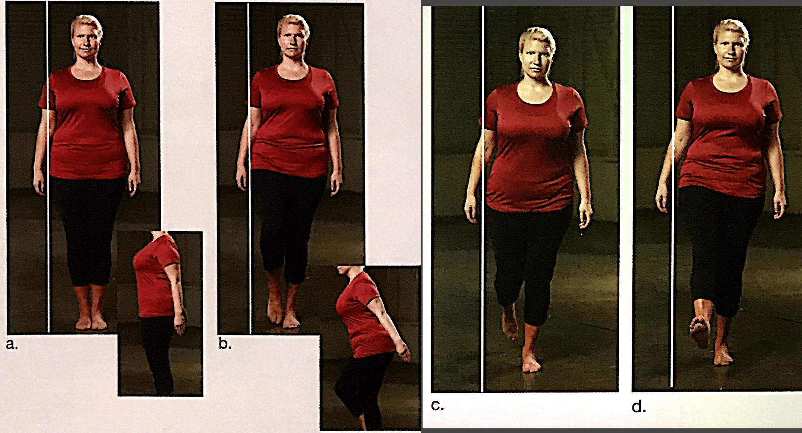

#### 动态单腿站立

这个的进阶可以是在手上加入阻力。

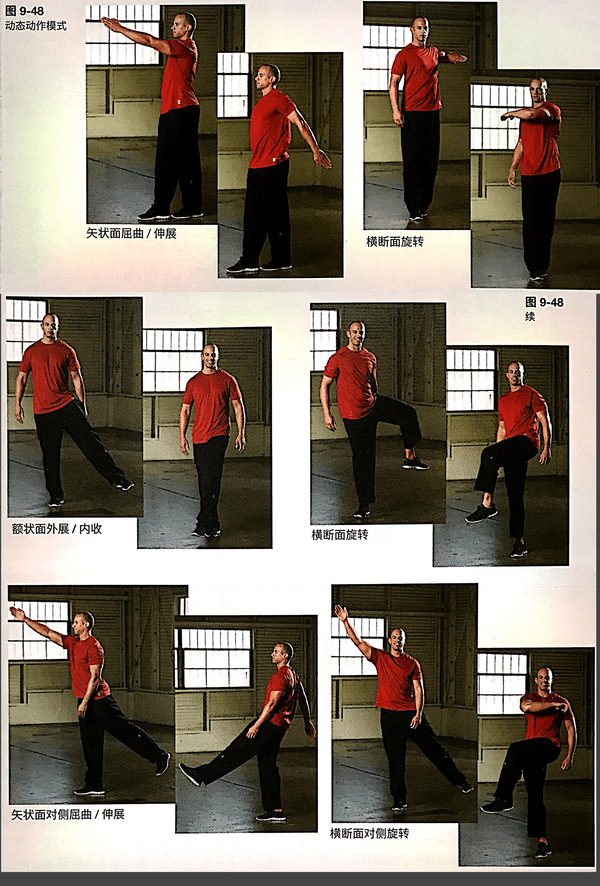

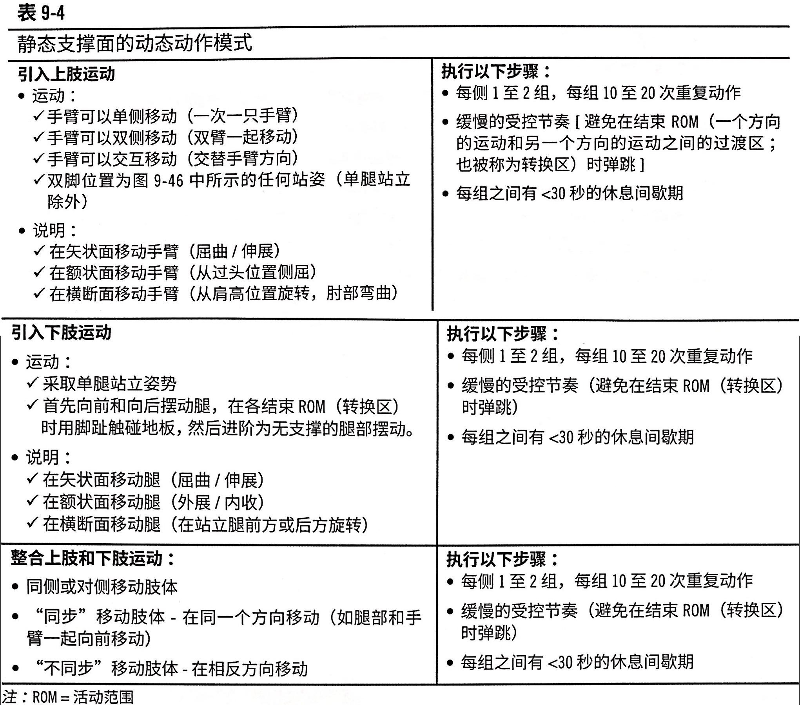

