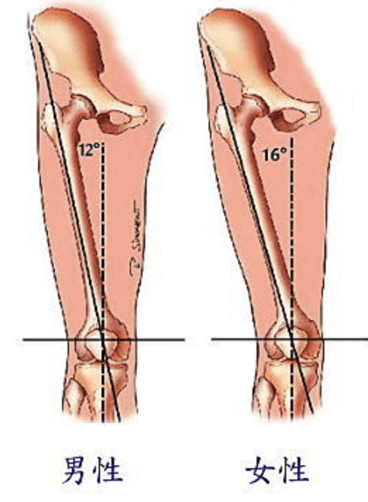
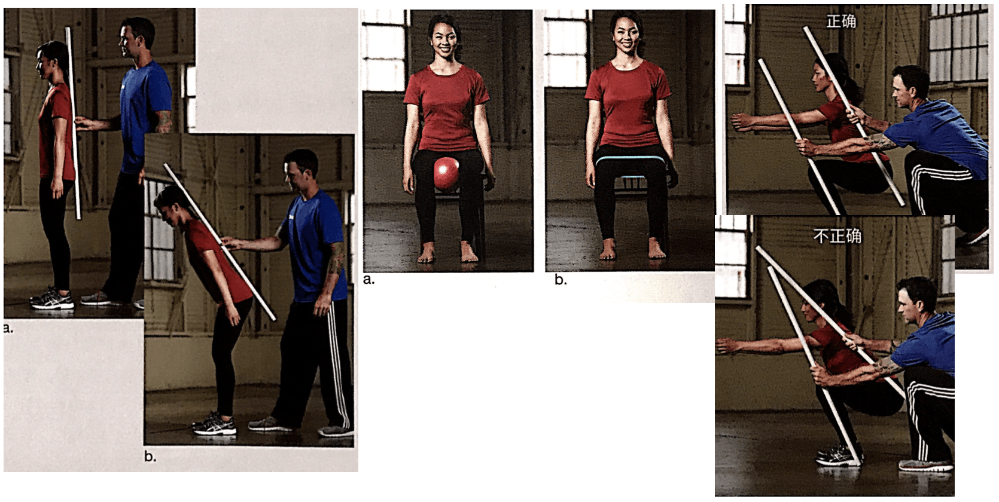
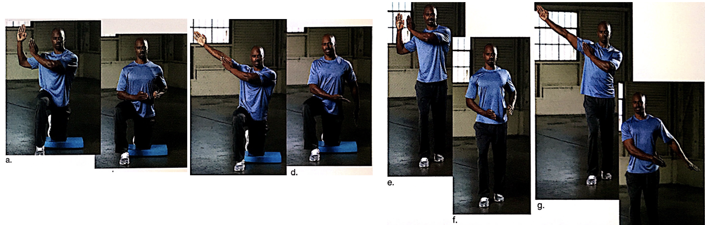
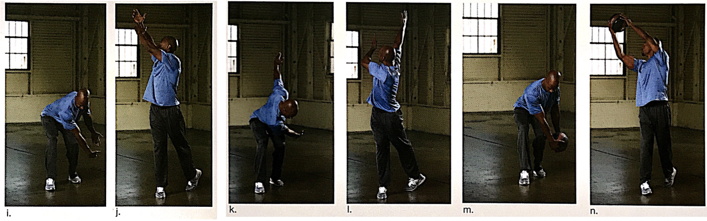
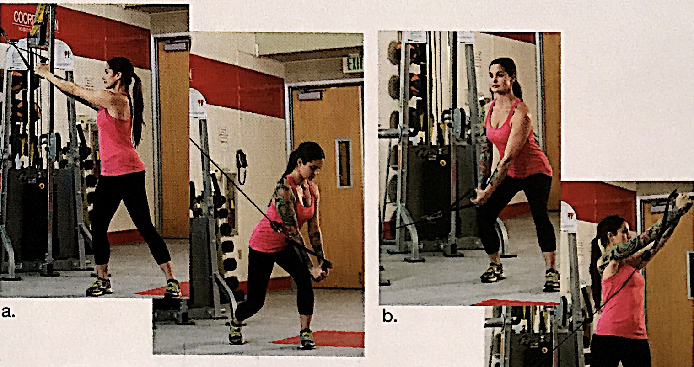

# 功能性训练方案：稳定性灵活性和动作(2)

训练抗阻第一阶段和第二阶段（动作模式）的工具和策略。

人体是适应性的，加到个体身上的负荷会改变人体的发育。活动水平下降，不良姿势或者肌肉的不平衡倾向会改变神经肌肉系统内的正常生理功能，就会引起代偿，最终导致动力链的破坏。

<!--ts-->
   * [功能性训练方案：稳定性灵活性和动作(2)](#功能性训练方案稳定性灵活性和动作2)
      * [二期：动作训练](#二期动作训练)
         * [下半身的动力链](#下半身的动力链)
         * [屈髋提起](#屈髋提起)
         * [单腿动作](#单腿动作)
         * [推](#推)
            * [推举练习](#推举练习)
            * [胸部矩阵（站姿3D-Active）](#胸部矩阵站姿3d-active)
            * [过头推举](#过头推举)
         * [拉](#拉)
            * [双侧/单侧划船](#双侧单侧划船)
         * [旋转](#旋转)
            * [旋转动作训练前提[重要]](#旋转动作训练前提重要)
            * [伐木](#伐木)
            * [打包干草](#打包干草)

<!-- Added by: oda, at:  -->

<!--te-->

## 二期：动作训练

P304

### 下半身的动力链

P306，参见[第七章的静态姿势评估](#ACE-chap07-1.md/#踝关节内旋外旋其实就是高足弓和扁平足)。

ACL 前十字韧带连接股骨后侧和胫骨前侧，在膝关节伸展的时候， ACL 的作用是将股骨连接在胫骨上。ACL 也在步行时防止胫骨向前滑动和过度内旋。

反正我光凭文字是不懂。

Q角：因为骨盆一般比两脚并拢要宽，那必须是有个角度的。

### 屈髋提起

P307，屈髋提起有几个动作点，就需要练几个项目。

第一个，学会屈髋的时候减少臀部向下移动。

第二个，分别加强髋关节的内收和外展能力。

第三个，是为了学会躯干和胫骨之间的最佳位置。

如果客户太靠前了，可以手伸直加一个重物，那就可以练习他重心后移。

### 单腿动作

P310

先练习单膝跪地**弓箭步起身**（稳定），然后才能练习正确的弓箭步。

进阶一点是弓箭步八向矩阵。

### 推

P314

#### 推举练习

#### 胸部矩阵（站姿3D-Active）

#### 过头推举

### 拉

P318

#### 双侧/单侧划船

### 旋转

P319

#### 旋转动作训练前提[重要]

旋转运动对胸椎灵活性的要求更高，所以要先练习胸椎。

#### 伐木

站姿和跪姿，长短臂。先跪姿的原因是对脊柱的力比较小，更受控。

再进阶：全幅度深蹲旋转。

#### 打包干草

是伐木的反向进阶版，没有跪姿。**打包干草强度更大，因为是对抗重力抬举（向心收缩），伐木是离心收缩。**

**两个的进阶都是使用绳索或者药球加重量**。
