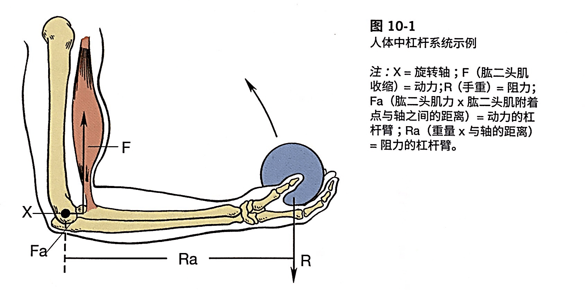
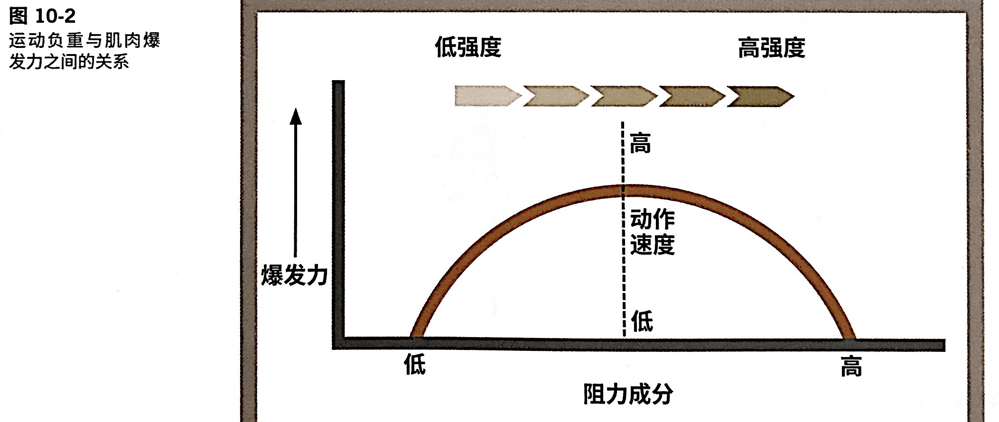
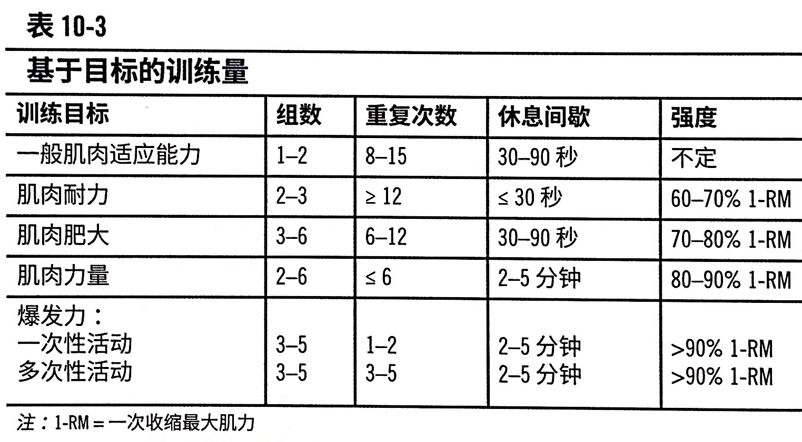
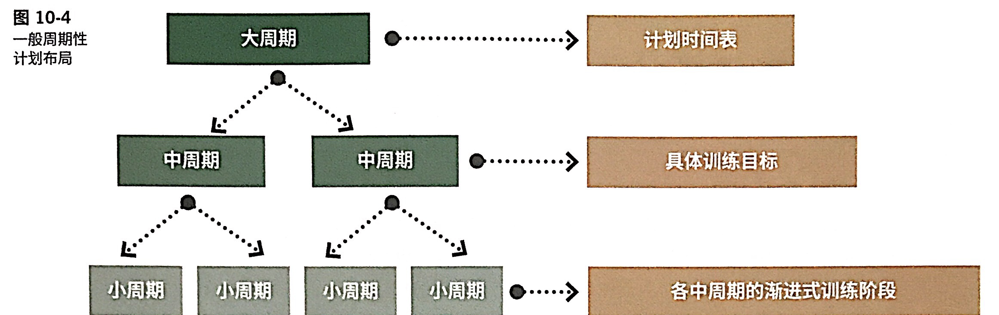
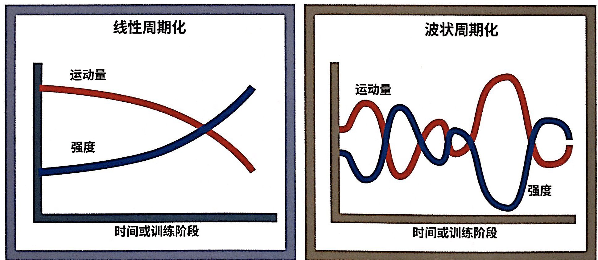

# 抗阻训练：计划和进阶（1）

<!--ts-->
   * [抗阻训练：计划和进阶（1）](#抗阻训练计划和进阶1)
      * [抗阻训练的益处](#抗阻训练的益处)
         * [体能](#体能)
         * [外貌和身体组成](#外貌和身体组成)
         * [代谢功能](#代谢功能)
         * [损伤风险和预防疾病](#损伤风险和预防疾病)
      * [抗阻训练的急性与慢性生理反应](#抗阻训练的急性与慢性生理反应)
         * [短期和长期适应](#短期和长期适应)
            * [短期](#短期)
            * [长期](#长期)
         * [肌浆肥大](#肌浆肥大)
         * [肌原纤维肥大](#肌原纤维肥大)
         * [影响肌力和肌肥大的因素](#影响肌力和肌肥大的因素)
         * [运动技能学习](#运动技能学习)
      * [肌肉力量/爆发力/耐力的关系](#肌肉力量爆发力耐力的关系)
      * [训练参数：设计运动方案的影响因素](#训练参数设计运动方案的影响因素)
         * [对客户需求的评估](#对客户需求的评估)
         * [适当的运动频率](#适当的运动频率)
         * [运动项目的选择及其顺序](#运动项目的选择及其顺序)
            * [运动项目的分组](#运动项目的分组)
            * [提高肌肥大、肌耐力、肌力与爆发力的训练方法](#提高肌肥大肌耐力肌力与爆发力的训练方法)
            * [进阶](#进阶)
         * [适当的运动量和负荷](#适当的运动量和负荷)
            * [不同目标有不同的训练量[重要]](#不同目标有不同的训练量重要)
         * [适当的训练强度](#适当的训练强度)
            * [延迟性肌肉酸痛DOMS](#延迟性肌肉酸痛doms)
         * [训练节奏](#训练节奏)
         * [适当的休息时间的长度](#适当的休息时间的长度)
      * [训练的一些原则](#训练的一些原则)
         * [进阶](#进阶-1)
         * [专项性](#专项性)
         * [超负荷](#超负荷)
         * [倒退性](#倒退性)
         * [收益递减](#收益递减)
      * [抗阻训练周期模型](#抗阻训练周期模型)
         * [运动分期[重要]](#运动分期重要)
         * [分期模式](#分期模式)
            * [范例：从91kg 到114kg 卧推](#范例从91kg-到114kg-卧推)

<!-- Added by: oda, at:  -->

<!--te-->

## 抗阻训练的益处

主要好处：肌纤维大小增加，肌力增加。肌纤维数量是一定的。

次要结果：肌腱、韧带的张力增加；骨密度增加。

### 体能

P327: 体能指进行工作或者运动的能力。

- 体能的定义
    - 肌力：1RM，更大负重进行单次运动
    - 肌耐力：在次最大负重下，进行更多次重复运动
- 进行十周的抗阻训练
    - 增加1.4kg 肌肉
    - 静息代谢率RMR 增大7%
    - 体脂减轻1.8kg

### 外貌和身体组成

回忆第八章：身体组成指的就是体脂率，也就是和瘦体重相关。

数周的传统力量训练可以让成年人和老年人的肌肉增加1.4kg，脂肪减少1.8kg（因为代谢上去了）。这种速率可以持续几个月。

P328拓展知识的重点：**有氧和抗阻结合对健康参数更有影响**。

### 代谢功能

- 成年人如果不进行力量训练，每年肌肉就会降低2.3kg，RMR（静息心率） 下降3-8%
- 无训练的人：进行剧烈抗阻训练三天后，RMR 增加9%
- 训练者：进行剧烈抗阻训练三天后，RMR 增加 8%
    - 例如典型的 RMR 是1500kcal/天，那么会增加120kcal，一个月差不多一磅（3500kcal）。

这是因为在剧烈运动后，微伤修复和肌肉重塑过程需要能量。

### 损伤风险和预防疾病

P330

肌肉发育不平衡会带来损伤，例如慢跑对小腿后侧肌肉施加的压力大于前侧，于是肌肉不平衡，所以膝盖可能损伤。**所以私教设计的时候，一定要设计针对所有主要肌群的抗阻训练，特别是也要注意拮抗肌。**

一开始说的`骨密度增加`就是在这一部分应该提到的好处，下面第一项。

- 骨密度增加1-3%
- 预防二型糖尿病和心血管疾病风险（三高）
- 改善下背痛
- 降低骨关节炎和风湿性关节炎的疼痛
- 降低老年男性和女性的精神抑郁
- 提高老年人的功能能力
- 提高肌组织内线粒体数量和氧化能力

## 抗阻训练的急性与慢性生理反应

### 短期和长期适应

#### 短期

- **神经控制优化**，来激活/募集原动肌中的运动单位和肌纤维（**张力增加**）。
- 磷酸肌酸和糖原被分解来提供能量，并产生代谢副产物（氢离子和乳酸）
- 内分泌系统的话，抗阻训练期间会分泌**分解代谢激素**（<u>皮质醇、肾上腺素</u>）和**合成代谢激素**（<u>生长激素、睾酮</u>）。
    - 分解代谢和合成代谢的含义：代谢分两种，一种是把某物质通过分解反应消除，另一种是将它作为底物合成另一种物质。前者是分解代谢，后者是合成代谢。

#### 长期

- 肌纤维肥大
- 肌浆肥大
- 运动学习

关于肌浆和肌纤维，得看 EES 了。

为什么会增大肌力？重复训练导致不断激活运动的部位，于是产生所需动作的运动单位得到促进，并且产生相反动作的运动单位被抑制，因此原动肌的收缩能力变强。重塑的时间可长达72小时。

肌肥大的原理（两个皆适用）

1. 抗阻训练导致肌肉组织微伤（Micro Trauma）
2. 肌肉组织重塑，导致肌纤维生长，伴随着肌力小幅度增加
3. 肌肉内的卫星细胞构建更大更强的肌纤维。
    1. 肌衛星細胞（Myosatellite cell）是一種位於骨骼肌中的細胞。肌衛星細胞呈扁平形，有突起，通常附着在肌纖維表面。當肌纖維受損傷後，肌衛星細胞可增殖分化，參與肌纖維的修復，具有幹細胞性質。
4. 肌纤维在横截面积上有了增加

### 肌浆肥大

肌浆就是肌细胞的细胞质。这种情况并不会增加肌力，但是会增加肌肉横截面积->死肌肉。

- 暂时性肌肥大
- 中等负荷
- 中等重复次数
- 组间休息时间短

### 肌原纤维肥大

- 增加肌力
- 重负荷
- 低重复次数
- 休息间隔长

### 影响肌力和肌肥大的因素

最重要的因素是**遗传**。

+ 激素水平

    + 生长激素
        + 随着年龄增长，生长激素水平降低
    + 睾酮
        + 睾酮也是男性肌肉的大小和力量高于女性的**主要原因**。
    + 睾酮和生长激素较高的个体具有较强的肌肉发育潜力。

+ 性别：男性肌肉量多于女性，因此肌肉力量通常大一些。瘦体重相同->平均肌力几乎相同。

    + 每平方厘米的横截面积产生1-2kg 的收缩力。

+ 年龄：20-80岁期间，每10年肌力下降10%。

    + 老年期的时候，肌肉的潜能会渐弱。

+ 肌纤维类型

    + I 型肌纤维（慢肌纤维）
    + II 型肌纤维（快肌纤维）： II a 和 II x。
    + I/II 都参与抗阻，力量低-I/高-II。
    + 都会因为力量训练而增加横截面积
    + II 型的尺寸增加大于 I， 所以肌肥大更靠 II。
    + 进行耐力和抗阻训练后， 会发生IIa <=> IIx的适应性转化（<10%）。

+ 肌肉长度

    + 肌腱短->肌肉长->肌肥大潜力更大
    + 腓肠肌长/跟腱短的人和腓肠肌短/跟腱长相比，前者更容易。

+ 肢体长度

    + 不会影响肌肥大，而会影响力量表现，因为`肌力 × 肌力臂=阻力 × 阻力臂`。

    + 

+ 腱止点（肌腱插入点）：同上。上提的肌腱插入点是肌肉（红）和桡骨结合部。

### 运动技能学习

**训练的前几周中，力量增加是神经募集肌肉的能力增加的结果，这叫做运动学习**。

## 肌肉力量/爆发力/耐力的关系

P334 。三者连续存在，互相影响

- 肌力是一切身体活动的基础

    - 任何动作都需要**一定比例**的最大肌肉力量。

        1-RM： 一次收缩最大肌力。

- 肌耐力：用<u>给定**次最大阻力**，可进行重复的次数</u>**进行评估**。而给定最大重复次数，这个阻力和1-RM 的力比值不会变。

    - 大多数人可以重复完成10次75% 1RM 的动作

- 爆发力=肌力×动作速度，也就是功率。

    - 动作速度不变的话，肌力增加就会导致爆发力增加。

    - 运动负重和爆发力的关系并没有一个公式。

        - 负重太低，速度越快，但肌力越小，所以爆发力小
        - 负重太高，肌力越大，但速度越慢，所以爆发力小
        - 负重适中的时候，二者乘积最大。

        

    - **因此中等阻力和中高速的抗阻训练产生的爆发力最大，是提高爆发力最有效的方法。**

## 训练参数：设计运动方案的影响因素

[**笔记**]：痒就是痛，这两个只是筋膜对不同程度力的反应，本质上一样。筋膜如果越紧张，那么疼痛感越大。因此多喝水和筋膜放松可以降低疼痛。

### 对客户需求的评估

- 活动或者运动分析
    - 动作分析
    - 生理分析
        - 供能系统
        - 肌耐力/肌肥大/肌力/爆发力的需求
    - 损伤分析
        - 个体现在有的损伤
        - 活动相关的普遍损伤
        - 如果个体现有的损伤和普遍损伤不冲突，可以绕开伤病训练（看私教的设计了）
- 个性化评估
    - 当前训练水平
    - 训练史与训练技巧
    - 损伤史，就会畏惧损伤
        - 身体在损伤之后会建立新的动作模式来避免疼痛，但是伤好之后虽然不痛了也改不了。
    - 对身体不适的耐受力，忍痛的能力。

| 健康相关的参数 | 技能相关的参数 |
| -------------- | -------------- |
| 有氧爆发力     | 爆发力         |
| 肌耐力         | 速度           |
| 肌力           | 平衡           |
| 柔韧性         | 敏捷性         |
| 身体组成       | 协调性         |
|                | 反应性         |

### 适当的运动频率

为什么要设定适当的运动频率？不太剧烈->肌肉微伤少->恢复时间短->频率高。参见这一章[代谢功能](#代谢功能)，和运动频率有关系。

要与客户目标、训练经验、当前的训练水平和课程间的恢复期一致

- 标准的力量训练：八项运动，三组，每组十次

- 新手：2-3次每周
- 中等：3-4
- 高级：4-7

### 运动项目的选择及其顺序

要和客户的目标，设备使用率，客户的运动经历，运动技巧与体能水平一致。

#### 运动项目的分组

**主要运动**

- 涉及跨两个或者以上**关节**的**一个或者多个较大**肌肉区域的多块肌肉
- 肌肉动作和关节动作在同一个方向直线运动（这个定义好像不符合深蹲？）
- 深蹲，肩部推举

**辅助运动**

- **跨单一关节的、较为孤立**的小肌群。

#### 提高肌肥大、肌耐力、肌力与爆发力的训练方法

在单次训练中的思路

- 先进行主要运动，再进行辅助运动
    - 先深蹲、胸推、肩推，然后飞鸟、侧举、腿屈伸
- 先多关节、直线运动，再单关节、旋转运动
- 一次训练中或两次训练间交替进行上下肢的运动
- 一次训练中，交替进行推拉动作
- 或者交替训练主动肌与拮抗肌
    - 交替训练肱三头和肱二头
    - 交替训练背和胸。背和胸指的是背部肌肉和胸部肌肉
- 安排超级组/复合组训练（P357）
    - 组间休息很短或者不休息
    - 练完之后安排适当的休息时间

#### 进阶

| 从                   | 到                   |
| -------------------- | -------------------- |
| 单运动面器械         | 多运动面器械         |
| 有支持的器械         | 无支持的器械         |
| 单关节运动           | 多关节运动           |
| 双侧、固定杠杆类器械 | 单侧、自由运动的器械 |

### 适当的运动量和负荷

- 运动量的计算
    - 重复量 = 动作组数×重复次数
    - 负荷重量 = 重复量×运动负重

运动量/训练量的意义

- 确定锻炼中消耗的能量
- 确定训练周期，定期改变运动量
    - 人在心理上会对同样的事物倦怠
    - 人在生理上也会疲劳

**注意**：90kg x 4RM, 80kg x 8RM, 70kg x 12RM，虽然运动量大不相同，但是都产生了相似的肌肉疲劳程度（力竭）。

#### 不同目标有不同的训练量[重要]

[**笔记**]

- 有无氧只取决于强度（功能系统），而不是运动的项目
- 2-5分钟是 IIx 型恢复时间
- 单边、孤立肌肉的项目一般不会测试1RM， 因为会有风险
- 一次性活动=1RM
- 第一项是一期，第二到四项是三期。

P338：客户处于 TTM 的**准备阶段到行动阶段**过渡的时候，总体的训练量保持低一点（成就感）。

？？？所以我不懂的是，是不同的目标需要不同的训练量，还是不同的目标有不同的训练强度？

### 适当的训练强度

定义各不相同。一说重量决定（90kg x 4RM就是比 80kg x 8RM强度大），一说肌肉疲劳决定（90kg x 4RM和80kg x 8RM一样强度）。无论如何，训练强度和训练量肯定是反比的。

周期化训练模型

1. 高训练量+低强度
2. 中训练量+中强度
3. 低训练量+高强度

#### 延迟性肌肉酸痛DOMS

Delayed onset muscle soreness。一开始如果用相对于客户来说水平比较高的强度，会造成 DOMS，并降低客户端坚持度。

[**笔记**]：离心收缩会加重 DOMS（P339最下面）。

### 训练节奏

做动作的快慢。

- 奥运会举重：动作速度很快
- 健美运动员：适中的速度
- 力量举运动员：动作速度慢
- 科学的规则
    - 全幅度（ROM）的活动，而不是做到一半来加快速度
    - 通常一个周期是6s，向心收缩1-3s，离心收缩2-4s

### 适当的休息时间的长度

**组间休息是为了供能系统的恢复（人不动就行），课间休息是为了神经系统的恢复（需要睡眠）。**

所以负荷越重，恢复时间更长。参见[表10-3](#不同目标有不同的训练量[重要])。

+ P340：身体会对磷酸肌酸迅速补充
    + 30s 内更新50%
    + 1min 内更新75%
    + 2min 内更新95%

一开始给客户的休息时间可以长一点（舒适区），但是不要让他的体温和心率恢复到正常水平。

## 训练的一些原则

如果当前训练计划达到瓶颈了呢？为了再次引发所需要的神经肌肉适应，这里有改变运动方案的思路。

### 进阶

- P341：为了最大限度使得目标肌完全疲劳来增长肌力，阻力负荷要在无氧系统功能的范围以内足够大。
- 90s 完成动作最好。如果超过90s，那么再延长就没有什么意义了。
    - 原因可能是根据上面[训练节奏](#训练节奏)的每次动作6s × 15次动作
- 双渐进进阶原则
    - **增加次数**：每组动作重复完成10-15次
    - **增加重量**：增加5%的负荷
    - 例子：设定一次腿部推举（Leg press） 的时间是6s，那么15次就是90s。双重进阶：10×45kg-训练（次数进阶）-15×45kg-（重量进阶）-？×48kg-训练-15×48kg-……
    - 也可以设定4-8/8-12/12-16次的重量为 baseline。
- ACSM规定
    - 8次=80%1RM
    - 12次=70%1RM

### 专项性

针对特定的项目

- 使得合适的肌肉得到锻炼
- 使用合适的阻力-重复方案
    - 如果所需项目需要一次性发力，则应该用重负重和少次数来加强肌力。
    - 如果需要连续几分钟的激烈活动，则需要肌耐力（中等负重+多次数）。
    - 供能系统方面，用大肌力的是**磷酸肌酸**，肌耐力是**无氧糖酵解**。

### 超负荷

- 逐渐增加运动阻力，以**超过自己最大限度**的过程叫做超负荷，这么做可以增加肌力。
- 一般指5%的增加。
- 其实也就是[双重进阶原则](#进阶)。

### 倒退性

- 肌肉减少1.4kg/6年=2.33kg/10年
- 基础肌肉训练可以在三个月内增加1.4kg 肌肉组织
- 如果客户停止抗阻训练，力量损失速度是增加速度的0.5倍
- 也就是说，抗阻训练应该成为生活的一部分，而不是暂时的。

### 收益递减

- 新手福利
- 遗传会限制肌肉的发展
- 采用新的动作模式来刺激新的神经-肌肉反应模式
    - 例如，客户在卧推的时候出现平台期，变成上斜卧推

## 抗阻训练周期模型

P343

周期化训练指的是，**在训练进阶中在强度和运动量上有意改变训练刺激**。

### 运动分期[重要]

时长不一定固定，按照目标来算。

- 大周期：6-12月
- 中周期：3-6月
- 小周期：2-4周

### 分期模式

- 线性
    - 线性训练在小周期内提供一致性的训练方案
- 波动
    - 小周期期间也使用不同的训练方案。

但是两个总体都是向上进阶的。

#### 范例：从91kg 到114kg 卧推

