# 抗阻训练：计划和进阶（3）第四分期：运动表现

<!--ts-->
   * [抗阻训练：计划和进阶（3）第四分期：运动表现](#抗阻训练计划和进阶3第四分期运动表现)
      * [进入第四期的先决条件[重要]](#进入第四期的先决条件重要)
      * [几个可以分解计划的问题](#几个可以分解计划的问题)
      * [增强式训练](#增强式训练)
         * [上下半身增强式运动](#上下半身增强式运动)
            * [重复次数和组数](#重复次数和组数)
            * [下半身增强式运动类型](#下半身增强式运动类型)
            * [上半身增强式运动类型](#上半身增强式运动类型)
         * [跳跃的正确姿势[重要]](#跳跃的正确姿势重要)
         * [速度和敏捷增强式运动](#速度和敏捷增强式运动)
            * [强度](#强度)
            * [重复次数/组数](#重复次数组数)
            * [速度训练类型](#速度训练类型)
            * [敏捷性训练类型](#敏捷性训练类型)
            * [速度训练的跑步姿势](#速度训练的跑步姿势)
            * [业余网球运动员12周训练周期实例](#业余网球运动员12周训练周期实例)

<!-- Added by: oda, at:  -->

<!--te-->

P358，总的来说就是爆发力训练。P359介绍了爆发力训练对一般人的好处。

爆发力 = 功率 = 力 × 速度

## 进入第四期的先决条件[重要]

- 关节的稳定性和灵活性有保证
- 静态和动态平衡有保证
- 有效的核心功能，力量足够
- 有着无氧运动效率（心肺第四期）
- 有足够的运动技巧
- 在这个运动方面没有禁忌
- 没有出现影响平衡和运动技能的医学问题

参见[肌肉力量/爆发力/耐力的关系](ACE-chap10-1.md/#肌肉力量爆发力耐力的关系)。P360：就运动来讲，开始动作靠的是肌力，而后续的动作主要是靠已有的动量维持。

P360:力量举和奥运会举重的区别。

- 力量举：高肌力+慢速动作。测试的是绝对力量的极限，项目是卧推、蹲举和硬举。动能更少。

- 奥运举重：快速地尽量多次举起重量。

## 几个可以分解计划的问题

- 现在缺乏哪些运动技能和能力？
- 在这项活动中，客户需要哪些动作模式和心肺供能系统？
- 客户有没有和活动相关的损伤？
    - 例如客户想踢球，但是有高足弓，那么就应该加强客户脚踝的稳定性。

## 增强式训练

增强式运动是快速的强烈运动，并且涉及**伸展收缩循环**——同一肌肉主动拉伸，然后立刻缩短的过程。

有一个现象是说，起跳前深蹲的运动员和保持静态深蹲之后几秒再跳比起来，纵跳高度会有增加。这个的解释是，**伸展收缩循环**中如果被拉长的时间太长，则储存的肌腱能量会随着热量的散失而流失。因此，个体需要快速进行动态活动。

下面分别介绍下半身、上半身、速度和敏捷的增强式运动。

### 上下半身增强式运动

上下半身的增强式运动有着相同的 FIRS。

由于下半身的运动（下面的表）发现都是跳跃运动，有冲击性，所以需要客户有合适的力量、柔韧性、动作姿势。P363建议要先能蹲起自己体重1.5倍的深蹲，或者5s 内做五次60%体重的重量。

|             |                                                              |
| ----------- | ------------------------------------------------------------ |
| Frequency   | 每周1-3天，视恢复时间而定（48-72小时）                       |
| Intensity   | 确定强度的主要方面是肌肉结缔组织和关节上的应力量。接触部位，速度运动的垂直高度，客户的体重和运动的复杂性，都会影响身体受的力，从而影响强度。这个很好理解。 |
| Repetitions | 见下                                                         |
| Sets        |                                                              |
| Type        | 见下                                                         |
| 进阶        | 保持姿势中立、重心稳定、动作速度受控                         |

#### 重复次数和组数

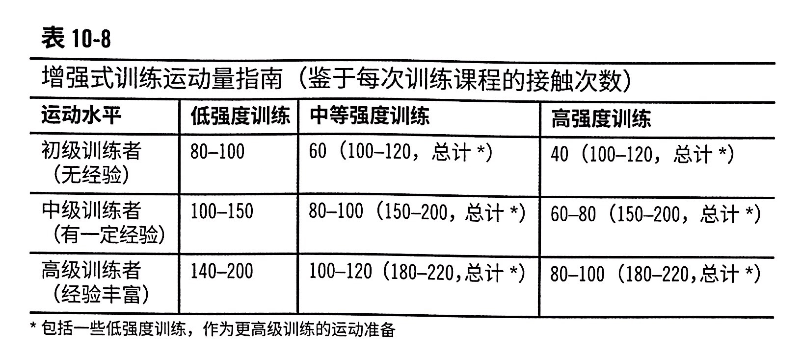

#### 下半身增强式运动类型

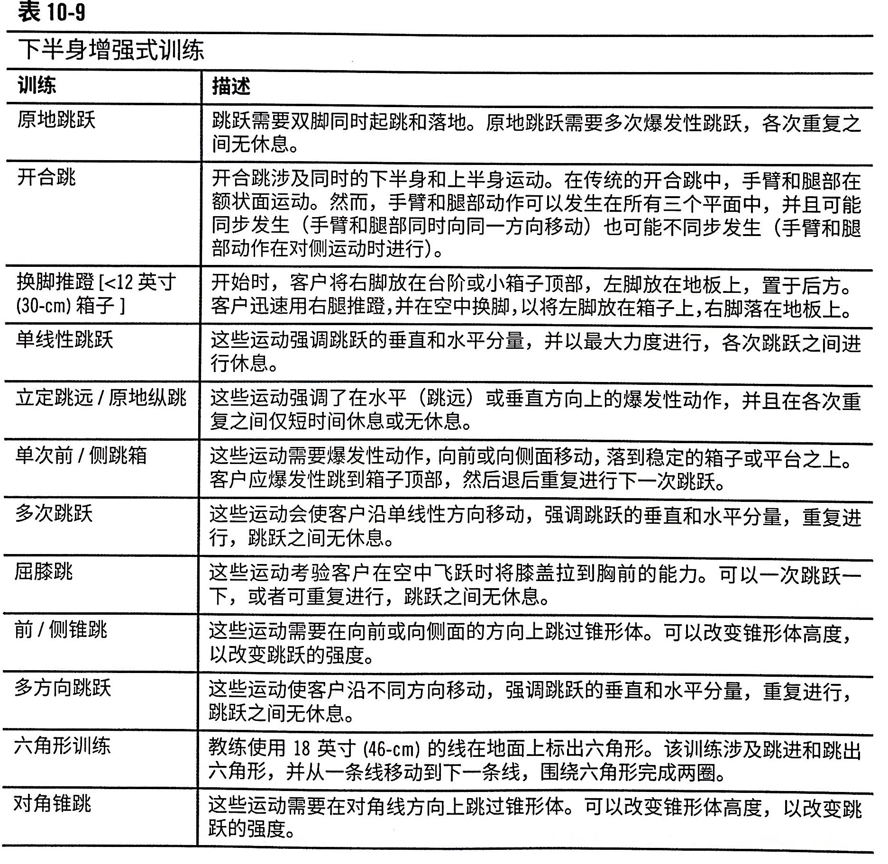

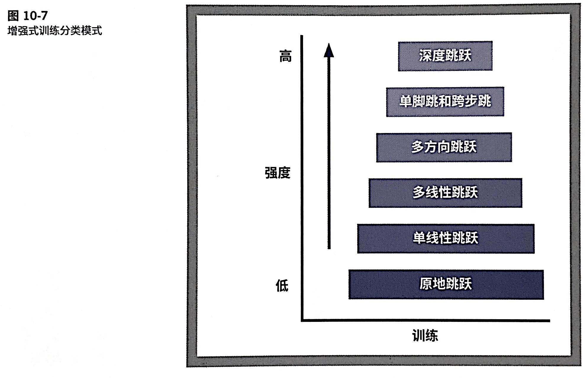

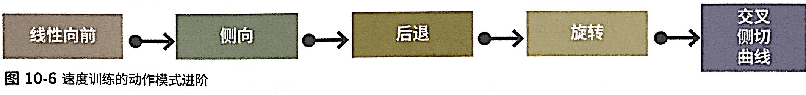

#### 上半身增强式运动类型

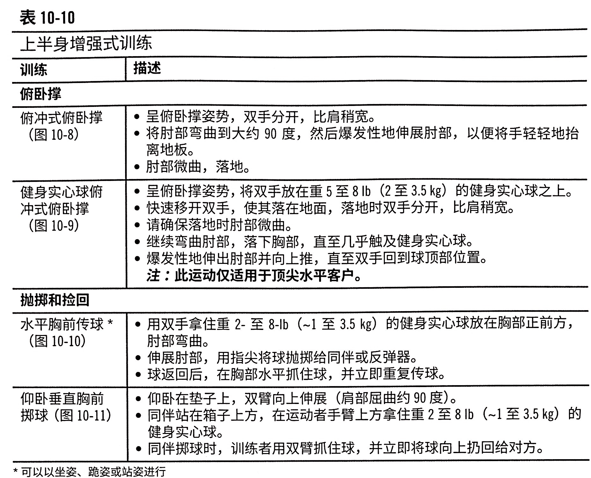

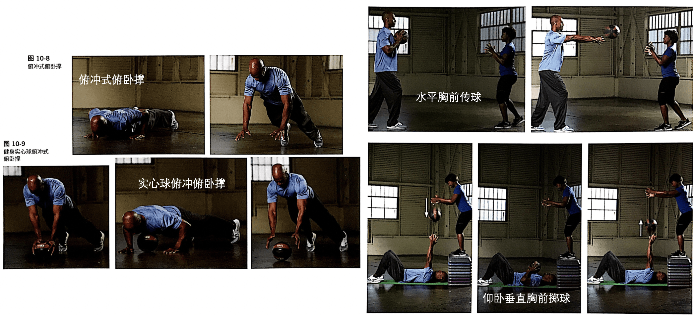

### 跳跃的正确姿势[重要]

### 速度和敏捷增强式运动

速度和敏捷有着一样的 FIRS。他们都具有高强度、高爆发力的特点，所以应该在训练课程早期进行此类活动，**在适当的热身之后，并且在其他的疲劳训练之前**。

|             |                                                            |
| ----------- | ---------------------------------------------------------- |
| Frequency   | 每周1-3天，视恢复时间而定（48-72小时）                     |
| Intensity   | 主要看供能系统。见下强度                                   |
| Repetitions | 见下                                                       |
| Sets        | 1-3组，按照运动时长和跑步距离进阶，组间休息2-3分钟。见下。 |
| Type        | 见下                                                       |
|             |                                                            |

#### 强度

这个表里的初级中级高级，指的是在四期里的初级中级高级。

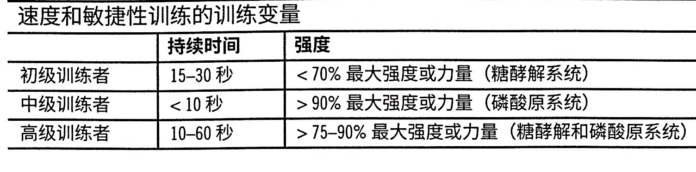

#### 重复次数/组数

P369

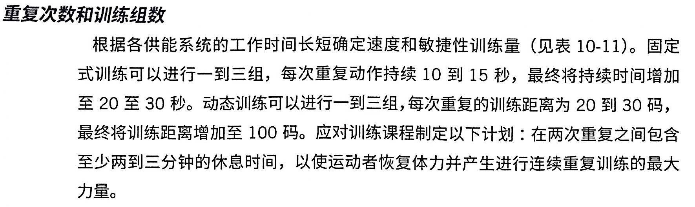

#### 速度训练类型

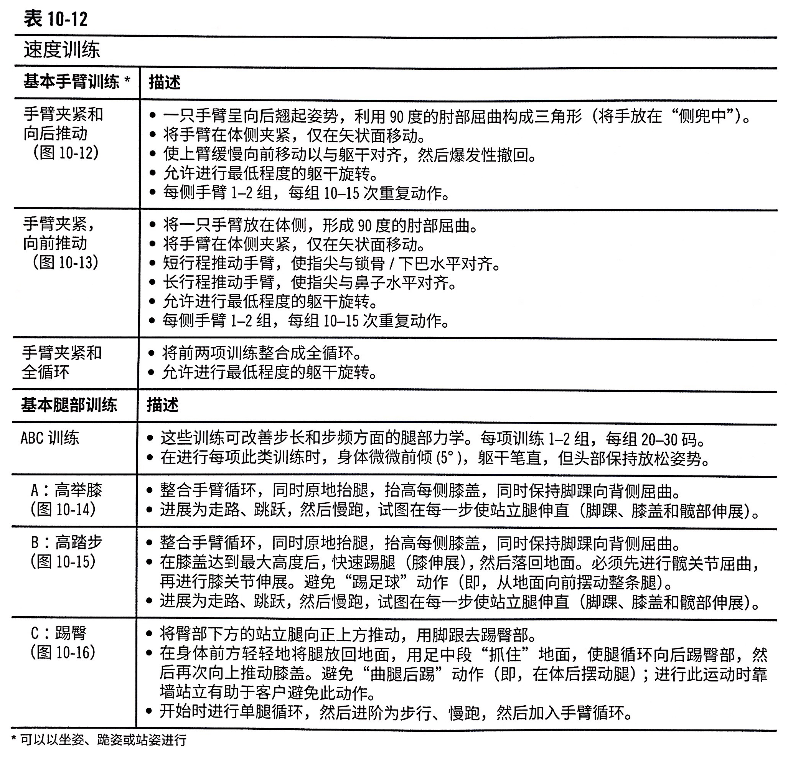

#### 敏捷性训练类型

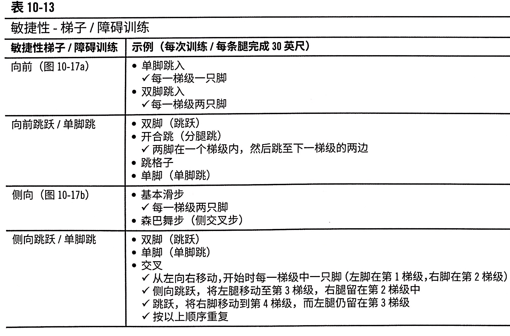

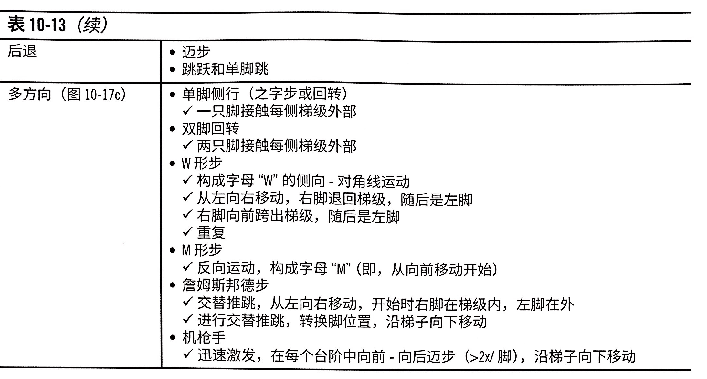

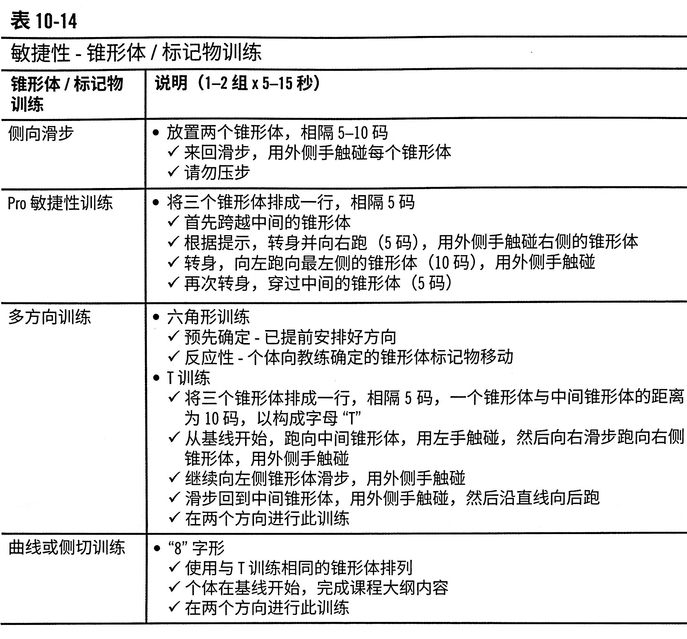

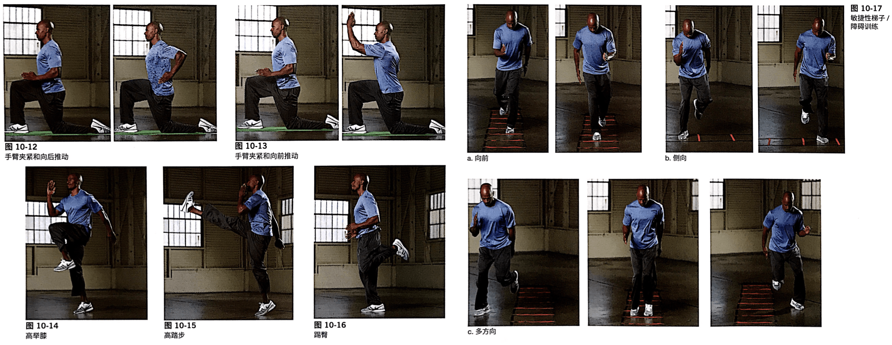

#### 速度训练的跑步姿势

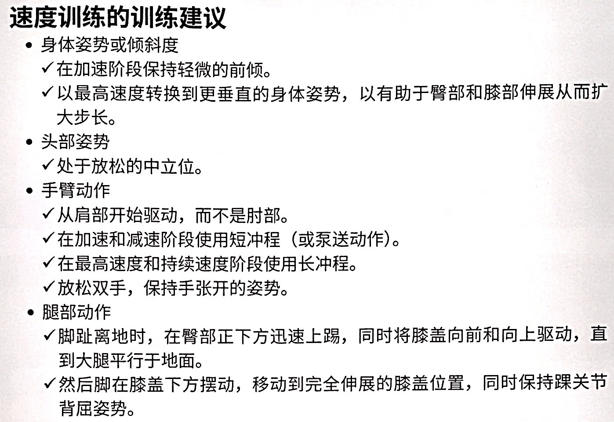

#### 业余网球运动员12周训练周期实例

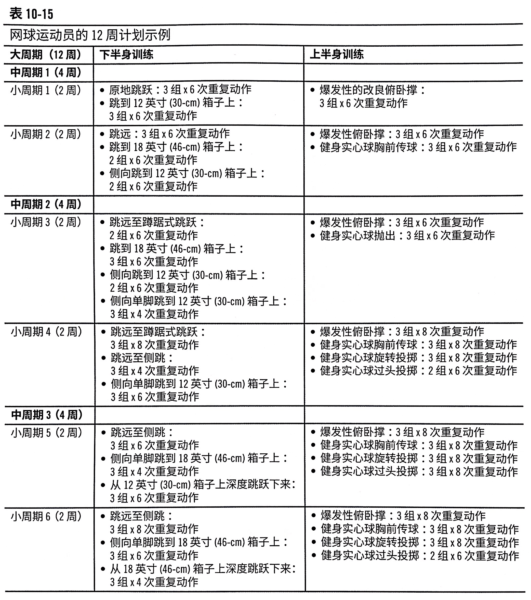
