# 心肺训练：计划和进阶

回忆，心肺一期就是让客户动起来。

P413：任何类型的**涉及大量肌肉**的，并且可以**有节奏**地**持续超过几分钟**的**中等强度**活动，几乎都可以被归类为心肺运动。

这是四个要点，`涉及大量肌肉`才会刺激心率。

<!--ts-->
   * [心肺训练：计划和进阶](#心肺训练计划和进阶)
      * [心肺运动的长期和短期生理适应](#心肺运动的长期和短期生理适应)
         * [肌肉系统[重要]](#肌肉系统重要)
         * [心血管系统](#心血管系统)
         * [呼吸系统](#呼吸系统)
         * [有氧爆发力的变化[重要]](#有氧爆发力的变化重要)
         * [稳态和间歇性运动的生理适应](#稳态和间歇性运动的生理适应)
      * [心肺训练的课程模块](#心肺训练的课程模块)
         * [热身活动](#热身活动)
         * [调节阶段（体能）](#调节阶段体能)
         * [放松/冷身](#放松冷身)
      * [针对健康、体适能和减肥为目的的一般指南](#针对健康体适能和减肥为目的的一般指南)
         * [频率](#频率)
         * [持续时间](#持续时间)
         * [运动进阶](#运动进阶)
         * [6-17岁青少年运动指南](#6-17岁青少年运动指南)
         * [18-64岁人运动之南](#18-64岁人运动之南)
      * [运动的强度](#运动的强度)
         * [心率](#心率)
         * [自感用力度 RPE](#自感用力度-rpe)
         * [代谢当量（VO2）](#代谢当量vo2)
         * [热量消耗](#热量消耗)
         * [谈话测试](#谈话测试)
      * [心肺运动模式或者类型](#心肺运动模式或者类型)
         * [器械型心血管运动](#器械型心血管运动)
         * [团体运动](#团体运动)
         * [循环训练](#循环训练)
         * [户外运动](#户外运动)
         * [季节性运动](#季节性运动)
         * [水中运动](#水中运动)
         * [身心运动](#身心运动)
         * [生活方式运动](#生活方式运动)
      * [ACE-IFT 实例](#ace-ift-实例)
         * [有氧基础训练](#有氧基础训练)
         * [有氧效率训练](#有氧效率训练)
         * [无氧耐力训练](#无氧耐力训练)
         * [无氧爆发力训练](#无氧爆发力训练)
      * [青年和老年人的特殊事项](#青年和老年人的特殊事项)

<!-- Added by: oda, at:  -->

<!--te-->

## 心肺运动的长期和短期生理适应

### 肌肉系统[重要]

- I 型肌纤维
    - 线粒体大小和数量增加：增加 ATP 生成
    - 募集到的肌纤维周围毛细血管数量增加
- II 型肌纤维
    - 肌纤维肥大
        - 肌动蛋白和肌球蛋白
        - 增加无氧酶数量，提高无氧能力

### 心血管系统

心肌肥大->扩张心室+肌肉变大变强->每搏输出量增加

- 最大心率（MHR） 并不会因为训练而增加

### 呼吸系统

- 肺泡通气量增加

- 与呼吸相关的肌肉分布

    - 横膈膜，与被动（或者叫静息）吸气有关
    - 向上拉伸胸廓的肌群，与主动（或者运动中）**吸气**有关
    - 向下拉伸胸廓的肌群，与主动**呼气**有关

     

### 有氧爆发力的变化[重要]

- 最大摄氧量（VO2max）在训练六个月的时候**达到平台期**
- 通气阈（VT）的变化可以持续很久

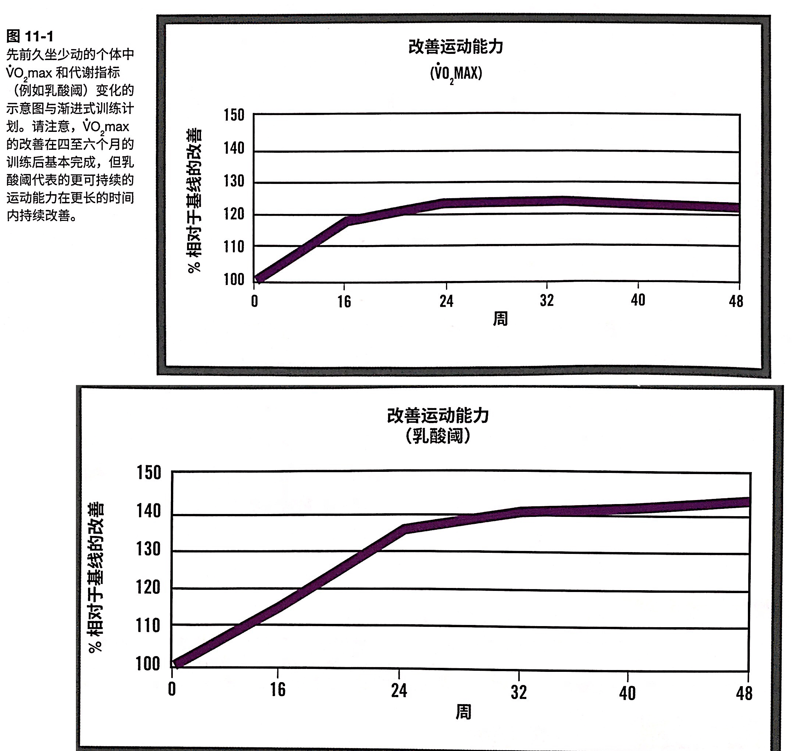

通气阈、乳酸阈、VO2max 是 EES 的内容，还没看。

### 稳态和间歇性运动的生理适应

这是两种训练模式。

- 个体需要45s-4min 达到运动时的稳定状态。
- 运动稳定状态指的是短时间运动后，各项指标都会升高，但也会趋于一个稳定水平的现象。有时候叫做 `第二呼吸`。

[**重要**]：**间歇训练**简介（重复几次高强度训练，然后恢复）。

- 不适用于身体较弱的客户
- 相比于稳态训练来说，可以更大地改善身体素质
- 可以改善对乳酸堆积的适应性（无氧耐力）
- 

## 心肺训练的课程模块

[**重要**]：任何训练课程都包含以下三部分：热身、体能训练、冷身。

### 热身活动

- 5-10分钟
- 体能训练难度越大、运动者年龄越大，热身就越应该全面
- 拉伸不一定好。静态拉伸适合柔韧性运动（体操、舞蹈），动态拉伸适合需要奔跑和跳跃的（篮球、短跑）

### 调节阶段（体能）

调节是 conditioning 的直译，但是 conditioning 在运动里一般指的是体能。**考试用词是调节**。

经验证据表明，应该在体能训练一开始就上强度，结束部分要用更偏向稳态的训练。

P397,间歇训练一般是1：1或者1：2的恢复比。15-30s 的较高强度 HIIT 可以有效募集并刺激 II型肌纤维，但是从总体代谢的角度来看，仍然属于有氧训练。

#### 心血管循环转变

运动的稳态中，心率会逐渐增加（那是了），原因在于

- 体液因为流汗以及被转移到细胞间空隙中而减少，因此血容量（在血管里的总体血量）和每搏输出量减少。为了维持心输出量=心率×每搏输出量，就需要加心率。
- 运动时会升温，除了出汗之外，把血液多次流到皮肤表面可以促进散热。

### 放松/冷身

5-10分钟。

## 针对健康、体适能和减肥为目的的一般指南

FITTE

- frequency
- intensity
- time
- type
- enjoyment

### 频率

P399

- 中强度：每周5天*30分钟
    - 一区
- 高强度：每周3天*25分钟
    - 2区
- 中高结合：3-5天

### 持续时间

- 每次运动至少坚持10分钟；可以分散到一天中的各个时段
- 每周>=1000kcal，可以改善健康状况
- 每周>=2000kcal，有效促进减重并显著提高总体体适能水平
- 普通人群（见[频率](#频率)）
- 超重者与希望控制体重的人（两倍）
    - 中等强度：每周5-7天，50-60min
    - 剧烈强度：每周3天，50min
    - 两种强度交替

### 运动进阶

#### 超负荷原则

施加额外压力=超出自己的能力一点点。

增加单次运动的时间、动作的频率、运动的频率、运动的强度。

运动=一次训练。

#### SAID 原则=专项性原则

P413：客户的目标项目会有常用的肌肉群，要针对这些肌肉群，并且用对应的项目训练。转专业的效益很低。

采用多种运动模式来防止疲倦和创伤风险

- 交叉训练、步行、骑单车、椭圆机
- 稳态运动、间歇运动、法特雷克训练法

##### 法特雷克训练法 Fartlek

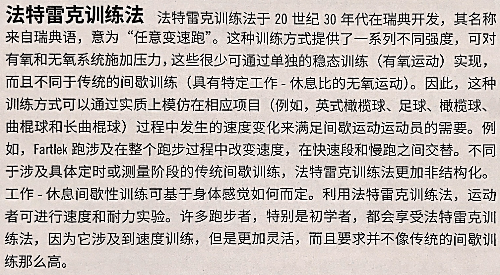

### 6-17岁青少年运动指南

+ 每天进行至少一个小时中等强度的运动
+ 每周至少三天剧烈运动
+ 每周至少三天参加强化肌肉和骨骼的活动

### 18-64岁人运动之南

+ 每周150min 中等强度
+ 每周75min 高强度
+ 超过上述运动量的话，身体会获得更多的益处
+ 每次有氧运动持续时间至少10min
+ 每周至少两天要强化大肌群

## 运动的强度

是上面指南的一个子类，但是由于太多，就分开成另一个节啦。

### 心率

#### 最大心率

- 影响最大心率的多种变量
    - 遗传因素
    - 运动模式
    - 药物
    - 身体尺寸。心脏小->MHR 高。
    - 海拔。
        - 海拔越高，能达到的 MHR 就越低。
    - 年龄
- 不要按照凭年龄计算的最大心率来指导训练
- 220-年龄是平均值。会低估老年人的，高估青年人的。
    - 68%的人群在±12次内
    - 95%的人群在±24次内
- Gellish et al: 206.9-(0.67*年龄)
    - ±7次

P401：使用最大心率作为指导指标的表格

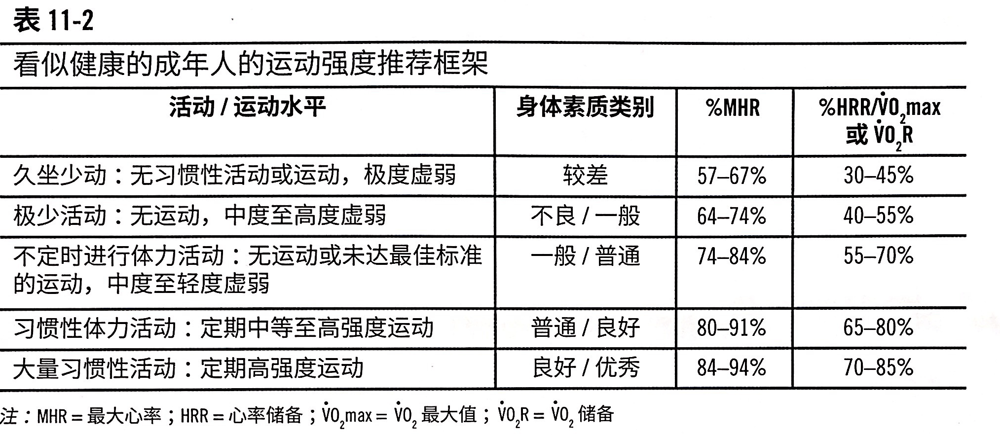

#### 心率储备（HRR）[重要]

为什么选择 HRR： 每个人的静息心率 RHR 不同，如果用 MHR 的话相当于把每个人的 RHR 当成一样的了，就有误差。HRR 就可以归一化。

THR 是目标心率， targeted。

- 卡氏公式 Karvonen
    - HRR=MHR-RHR
    - THR=（HRR×训练强度%）+RHR=MHR×强度-（1-强度）RHR
- 局限性
    - 仍然需要估算MHR
    - 测量静息心率的身体姿势会影响

### 自感用力度 RPE[重要]

[**笔记**]：刚开始训练的时候不准，用多了才会收敛。

Tap TEST： 静息状态下最速点击；下次训练爆发力之前再次测试，如果差太多，那就别练了（神经不兴奋）。

- 经典量表（6-19）对应心率
- 改良版（0-10）
- 强度
    - 中等强度：70%的储备心率
    - 略难：80%
    - 困难：85%

#### 利用 RPE 设计训练负荷

P403

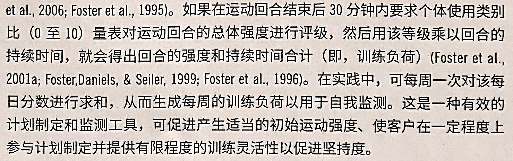

### 代谢当量或者摄氧量（VO2）

传统标准。经验表明，训练强度低于 VO2max 或者 VO2R 的40-50%，那么 VO2max 不会怎么提高。P423也提到了这个。

缺点在于不够精确，可以训练的范围太大了（我并不知道是什么范围，也不知道为什么不精确）。

- VT1：最低有效训练刺激强度
- MET： 梅脱，原理是假定平均静息代谢率为 3.5ml/(kg×min)。例如5MET 就是5倍的平均静息代谢率。
    - 要比 VO2max 精确一点
    - 轻度：<3
    - 中度：3-6
    - 高度：>6

P406，日常生活的梅脱表——那就很直观了。

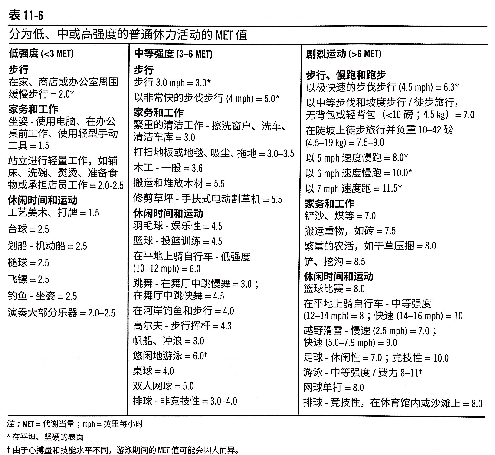

### 热量消耗

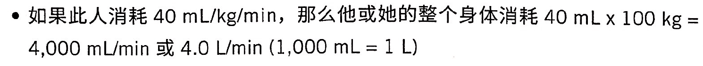

强度就是40mL/kg/min，大约是12MET。

**5kcal**：每升摄入的氧气大约相当于这么多能量。对于脂肪是4.69kcal，对于碳水是5.05kcal。 注意耗氧量和能量的关系因强度而变化。

### 谈话测试

参见[第八章](ACE-chap08-1.md/#通气阈的概念重要)。

-  VT1 
- 血乳酸堆积 OBLA
    - 4mmol/L 成为 OBLA 标准值
    - 刚好低于 OBLA的运动强度表示运动者可以维持的最大运动强度，通常可以持续20-30 min

## 心肺运动模式或者类型

### 器械型心血管运动

跑步机，椭圆机，划船机，手臂测力计，踏车测力计

### 团体运动

音乐驱动强度。

### 循环训练

### 户外运动

攀岩，龙舟

### 季节性运动

冬天滑雪，暖日跑步。

### 水中运动

游泳，水中团课。

好处是

- 浮力可以减轻一些走路的负荷
- 水中加快一点速度就需要消耗很多能量

### 身心运动

普拉提，瑜伽，太极

### 生活方式运动

一般人心中的运动：专门抽时间来做。

生活方式运动：猎人的日常生活就是狩猎（运动）。

### 运动环境注意事项

心肺运动主要关心心率。

#### 高温

参见[心血管循环转变](#心血管循环转变)，运动时心率会上升+血液流动到表面散热。高温下散热更难（热交换），所以为了保持内环境温度稳定，会散掉更多的热，所以心率变得更高。那么为了保持心率处在合适的范围，高温的时候就要降低运动强度。

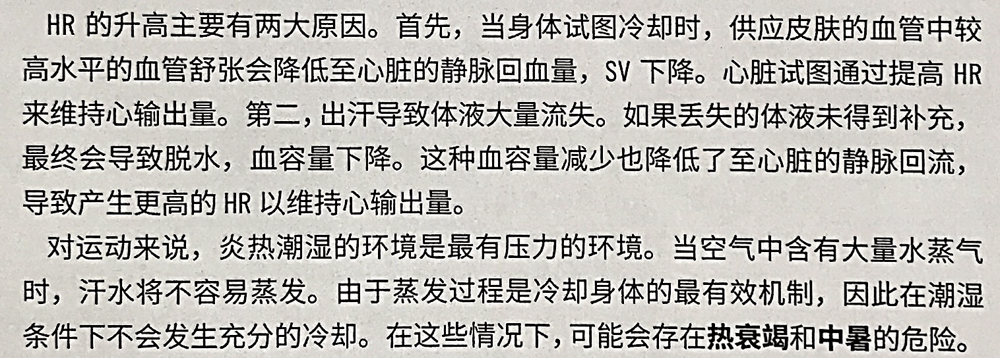

应对高温的做法

- 7-10天适应期
- 透气衣服
- 少量多次地补充水分
- 通风好

#### 寒冷

P418，主要问题是热损失过多。

#### 高海拔

P418，主要问题是氧分压降低，所以需要降低运动强度。另外也会冷。

#### 空气有污染

刺激气道，降低血液的携氧能力。

## ACE-IFT 实例

记住P422的表格，其它不用看。

设计计划的思路是创建一个**具有适当频率、强度和持续时间**的运动计划，来适应客户当前的能力并且能够让客户进阶。

### 强度指标

在某一项运动中测出的VT2强度只适用于该运动。跑步的不能适用于游泳的。

- 代谢指标 VT1/VT2
- 谈话测试
- RPE 有点/费力/非常
- RPE 0-10
- RPE 6-20
- VO2R：摄氧量储备
- VO2max：最大摄氧量
- MHR： 最大心率
- HRR： 储备心率
- MET：当谢当量，3-6-9

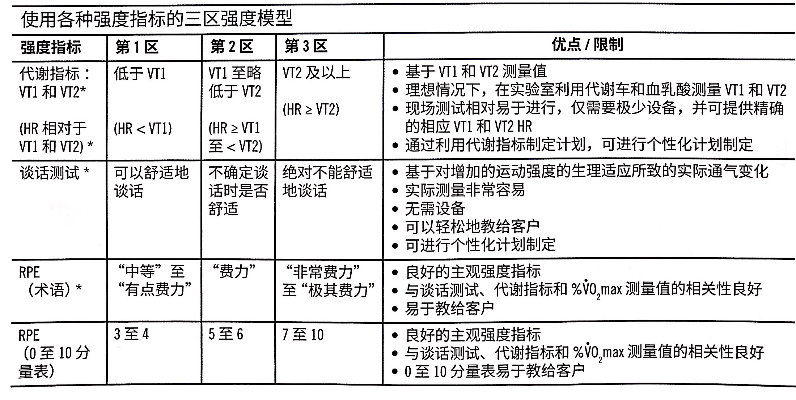

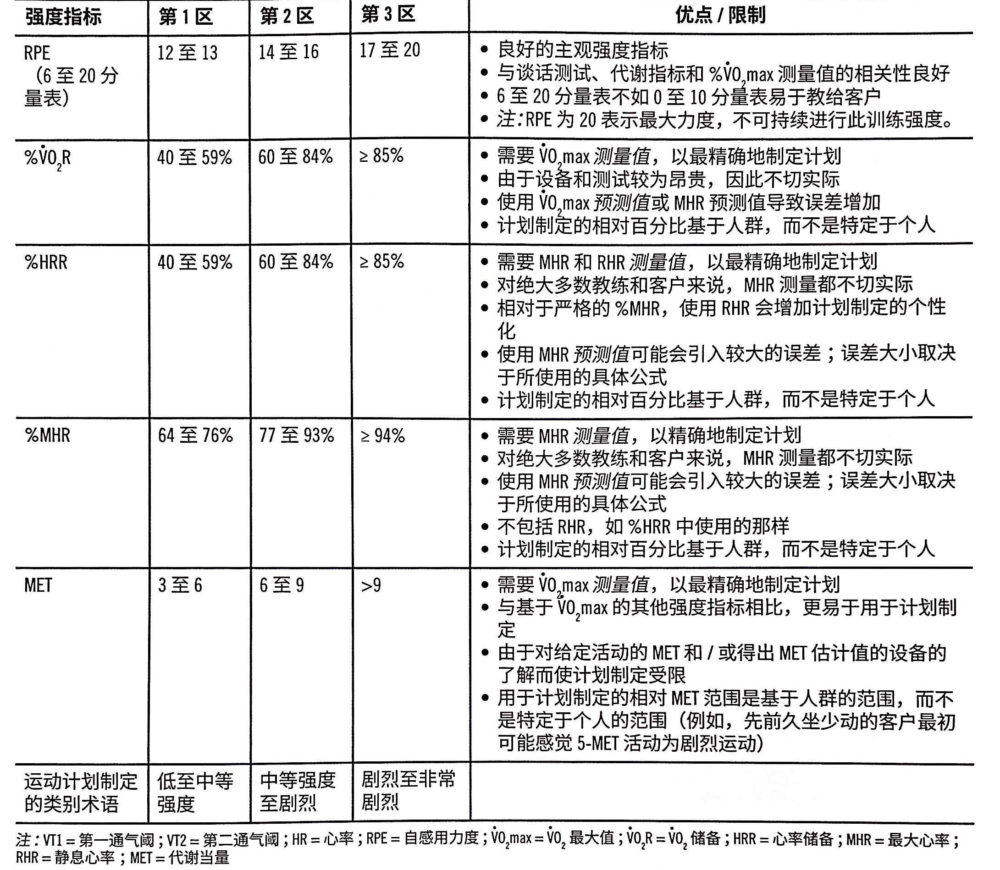

#### 分期概述

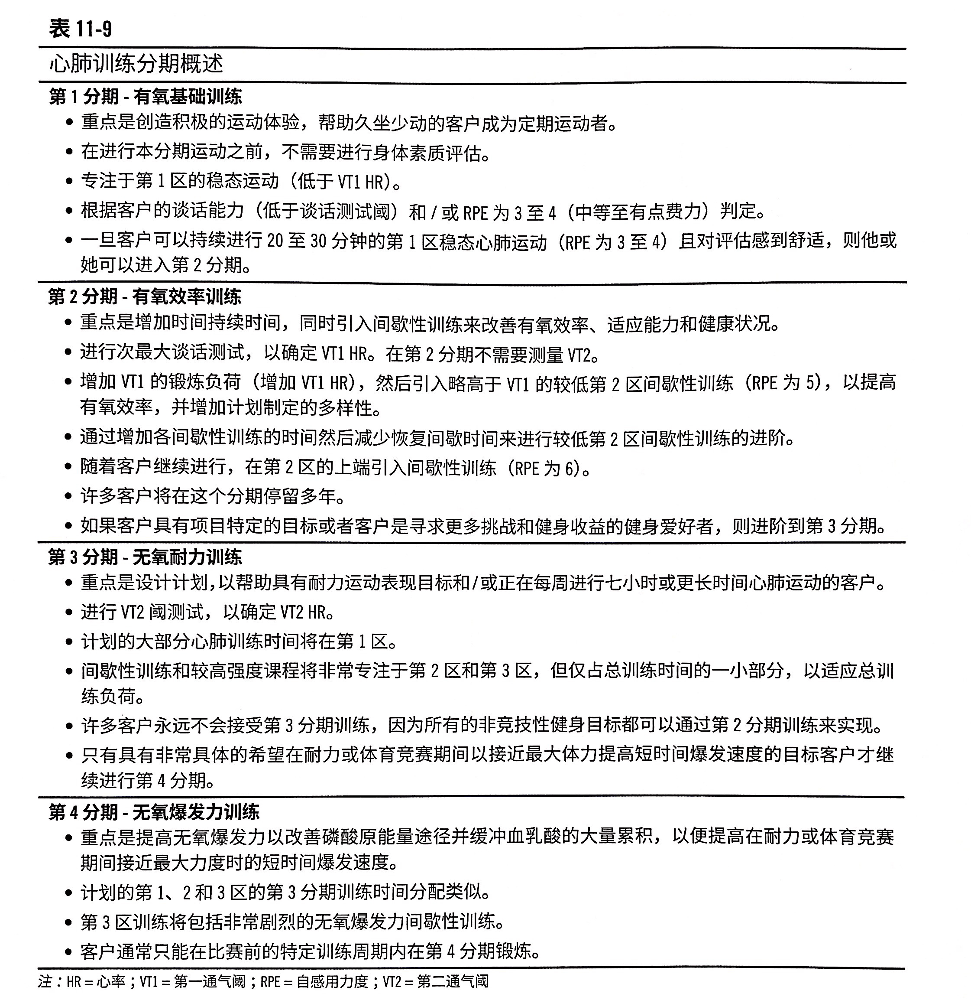

### 有氧基础训练

P422

P423：如果 VO2max 的增加伴随着体重减轻的现象，那么更说明练得好（回忆mL/kg/min）。

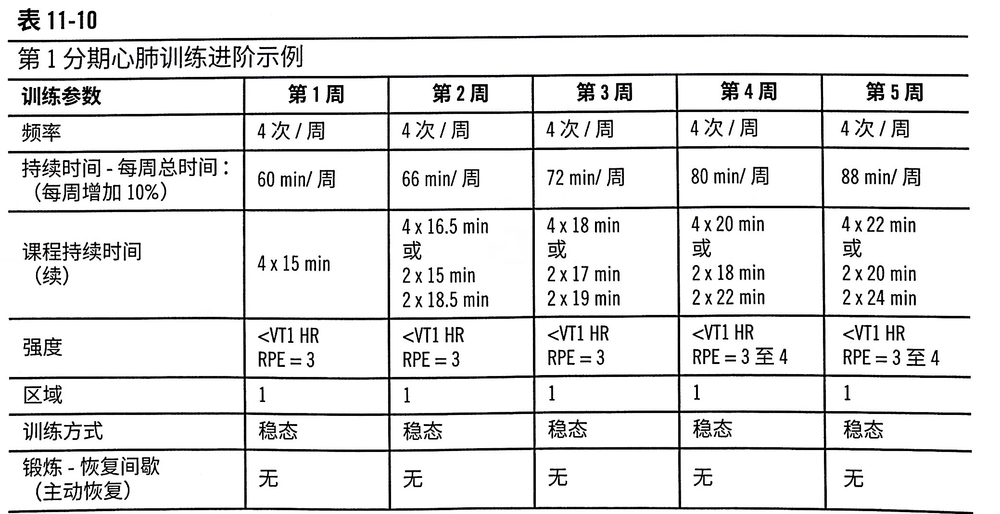

P425有对于超重或者肥胖者的运动建议。

### 有氧效率训练

P425

从第二区的下端进阶到上端。

持续时间每周增加10%。

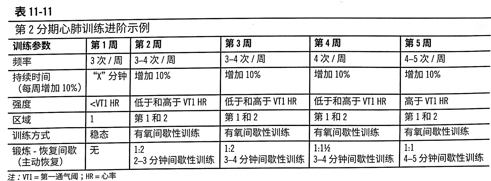

P428，对超重者来说，可以使用听歌健身法。

### 无氧耐力训练

P428，`二区黑洞`。对于竞技性运动来说，二区又累还不能提高能力。

三区本身也不能持续多久，所以科学来讲本身一区就应该占据大部分时间。那能不能不要一区呢？P430表示，通过在一区训练，能让客户有足够的心理（精神）和胜利（身体能量）准备来进行2、3区的。

在这个区域的进阶的话，不加强度而是加时间。

P429：需要加入更多的休息时间来恢复，不然会有**过度训练综合征**。

P430：如果客户的适应能力不高、恢复时间极短，或者总训练时间不足，则教练应该设置仅包括一个或者两个第二区或者第三区的间歇性训练日的计划。在娱乐性比赛中，除了每周可能有一天的三区训练课程之外，几乎所有的训练都为一期训练。

+ 训练重点
    + 5-10%的训练在 VT2以上
    + 至少每周七小时的心肺训练
+ 训练设计
    + 提高无氧耐力水平，有助于延长在 VT2的时间
    + 训练量应该逐渐增大，每周增幅小于10%；每周的训练时间达到运动者参加的赛事时间的三倍
    + 3区强度的 RPE>7

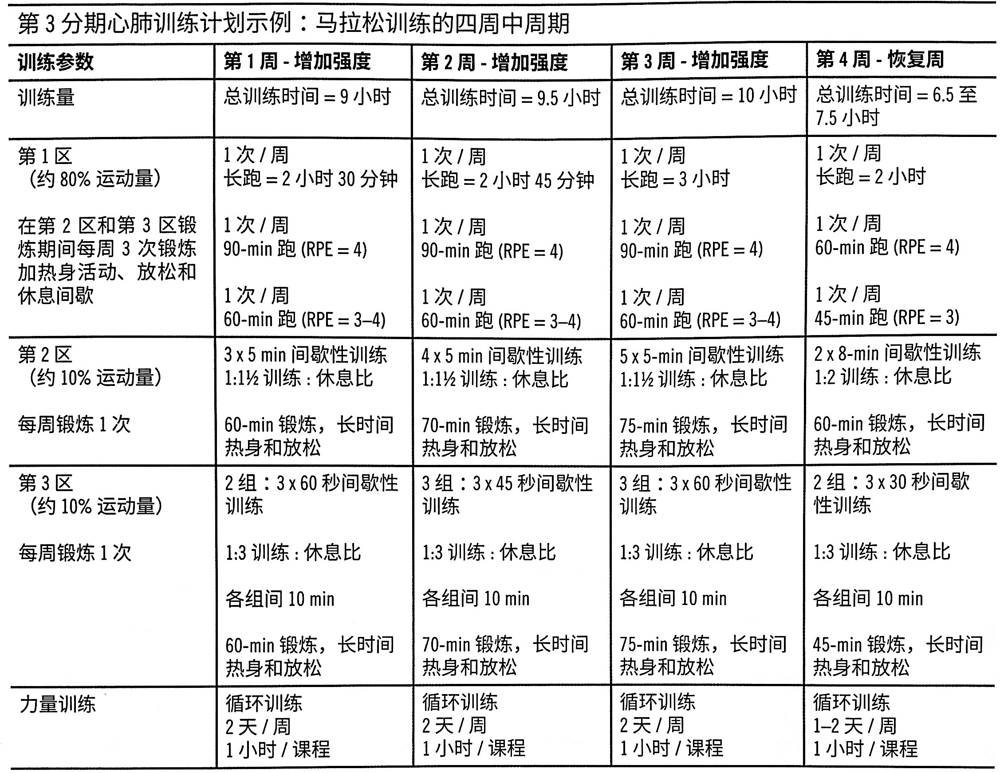

P432, 如果客户开始显示出过度训练的体征，比如RHR 增加、睡眠有障碍，或者连续多天饥饿感降低的情况，私人教练应该降低频率或者强度，并提供更多的恢复时间。

此外，如果客户在间歇性训练期间无法达到期望的强度，或者在恢复期间无法达到期望的恢复强度或者心率，则应该停止间歇训练课程，并且让客户进行自感用力度为3-4的心肺运动来恢复来防止过度训练。

### 无氧爆发力训练

P433，无氧爆发力的本质可以看做是力量训练。

- 训练重点
    - 只有体适能水平很高，目标与耐力项目中需要高速体能表现的竞技性运动者，才需要进入4期
    - 如果磷酸原储备大量持续性消耗且形成乳酸堆积，则机体需要更多的磷酸原储备和更多的缓冲物质储备来进行适应。也就是说，**训练的原理就是增加磷酸原和缓冲物质储备**。
    - 较短恢复期的高强度运动
        - 人们通常认为，进行恢复期相对较短，可诱发更大**动态平衡紊乱**的高强度训练回合，可以提高无氧爆发力。
- 训练设计
    - 短暂的高强度（RPE9-10）的训练结束后，需要10-20倍的休息时间

和第十章里提到的速度、敏捷、反应能力不同。

P434，**恢复期很重要**。在最优秀的运动员中，每周费力训练的日子也不能超过四天。在不太严格的比赛者中，每周两个或者三个的费力训练日，就可以进阶最大多数的目标。

## 青年和老年人的特殊事项

P434

### 青年人

有两个注意点：第一是要防止早期过度专业化，第二是要防止训练过度，导致骨骼创伤。

过早进行大负荷的训练没有意义。

### 老年人

设计针对老年人的计划时要考虑

第一，避免心血管风险；第二，避免骨科风险；第三，保护肌肉组织；第四，老年人能够适应训练的速度。

P435，老年人不运动容易出现的问题。