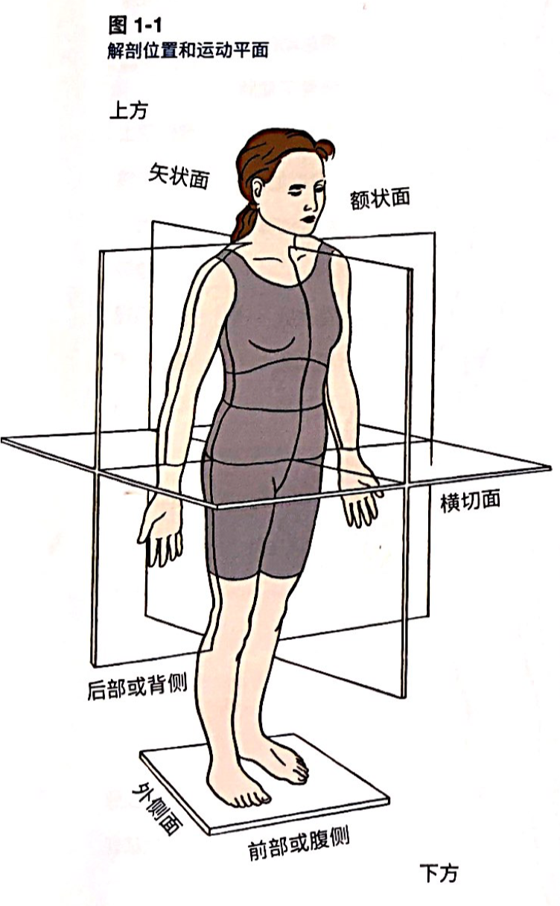
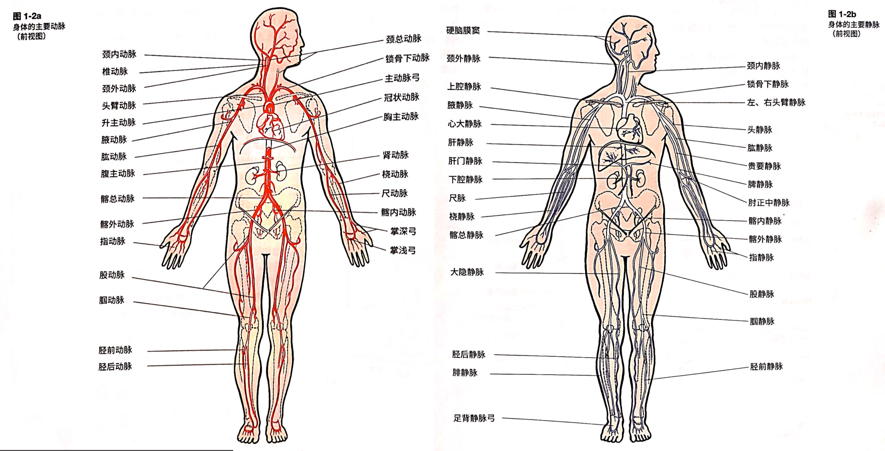
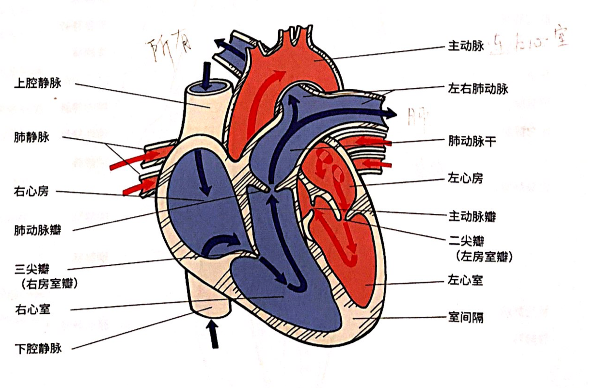
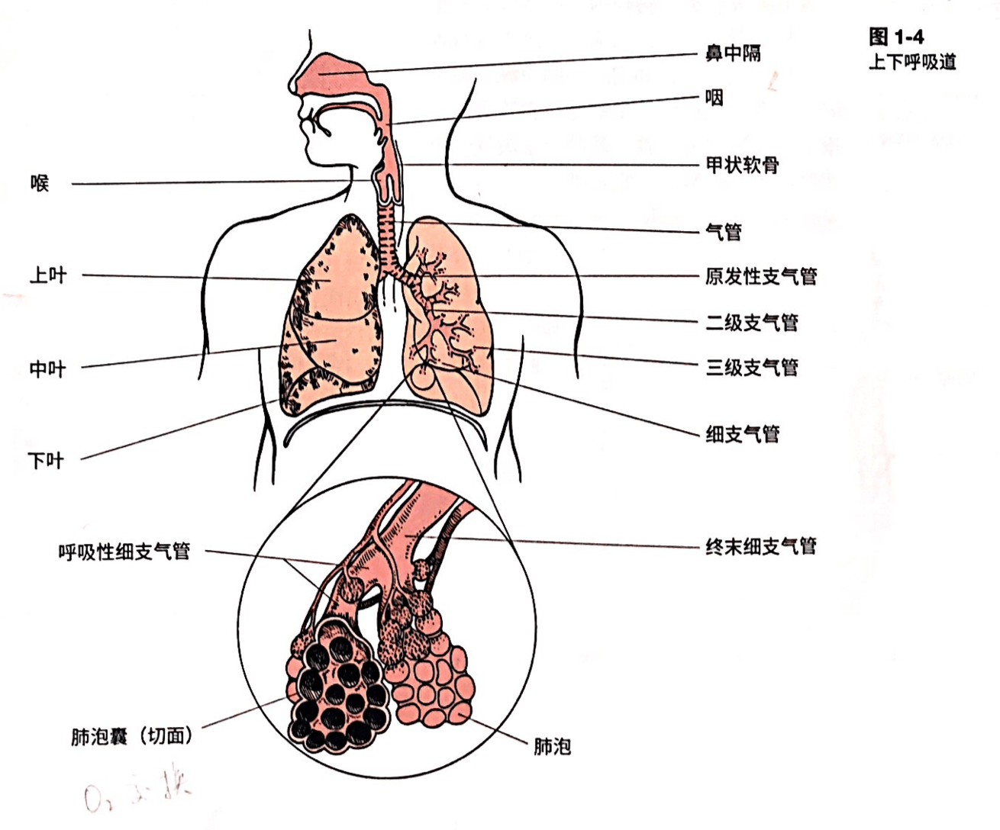
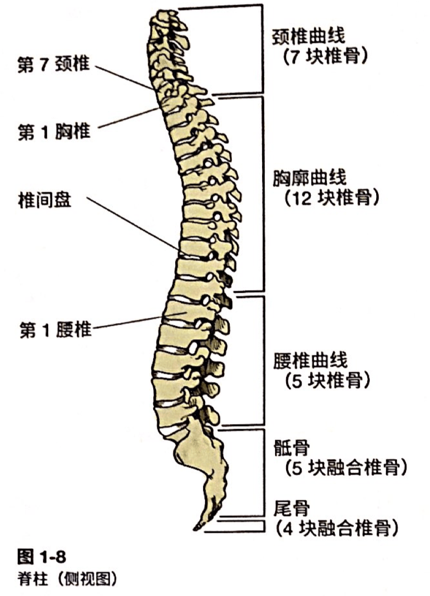
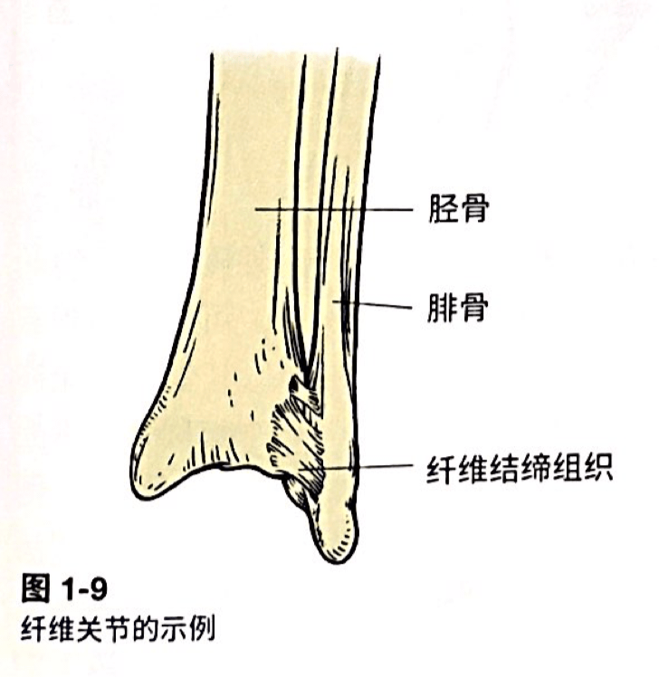
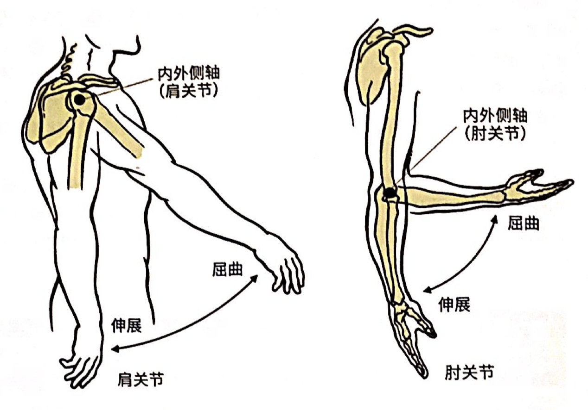
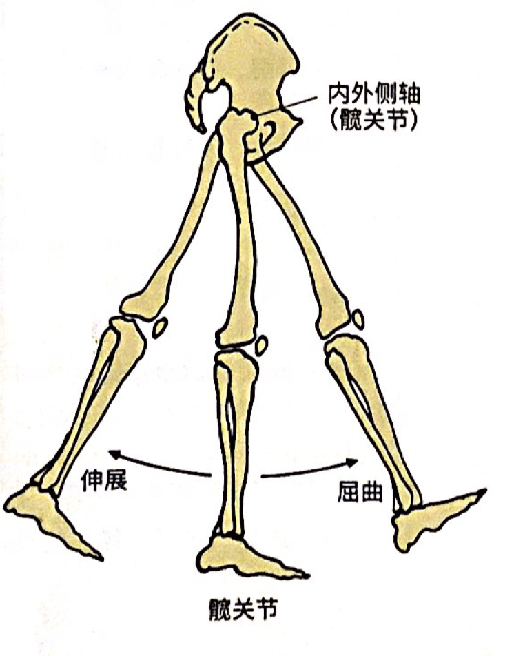
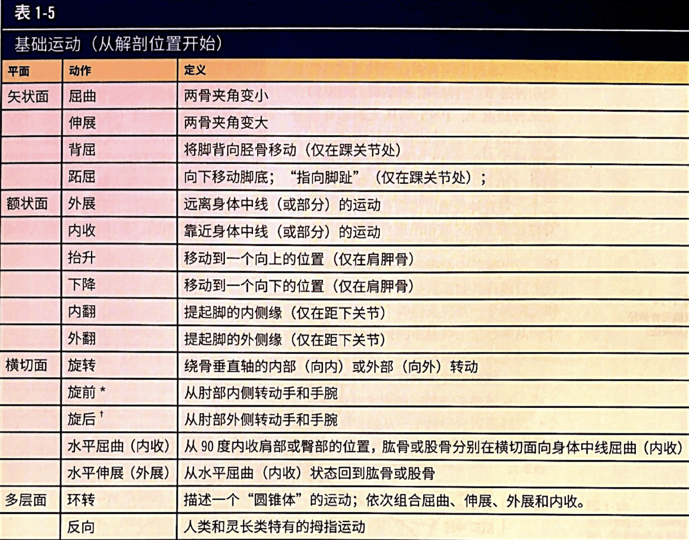

# 人体解剖学

## 解剖学术语

| 名称         | 指向                                 |
| ------------ | ------------------------------------ |
| 前部（腹侧） | 向前                                 |
| 后部（背侧） | 向后                                 |
| 上方         | 朝向头部                             |
| 下方         | 远离头部                             |
| 内侧         | 朝向身体中线                         |
| 外侧         | 远离身体中线                         |
| 近端         | 朝向肢体的附着末端/结构起点/身体中线 |
| 远端         | 远离肢体的附着末端/结构起点/身体中线 |
| 表面         | 外部；靠近或者在身体表面             |
| 深层         | 内部；比表面结构更深                 |
| 颈的         | 颈的区域术语                         |
| 胸的         | 颈部和腹部之间                       |
| 腰部的       | 腹部和骨盆之间                       |
| 足底         | 脚底                                 |
| 背面         | 脚和手的上表面                       |
| 掌           | 手的前面                             |
| 矢状面       | 分成左右部分的面                     |
| 额状面       | 分成前后部分                         |
| 横切面       | 水平面                               |

解剖学姿势：人站直，头眼和手掌面向前方，双脚并立，脚趾朝前，双手垂于身体两侧。

健身专业人士应对肌肉，神经和结缔组织的结构和功能有基本的了解。

## 各大系统

### 心血管系统

血液通过心脏流到**动脉**，然后到**毛细血管**，再到**静脉**，最后返回心脏。主要功能就是输送。

动脉硬化导致动脉扩张能力下降，因此高血压。

相比起动脉壁，静脉壁更薄，弹性更小。下肢静脉常见瓣膜，使得血液只向心脏流动。（P5）

心脏的构成：上房下室，左二右三。

**心动周期**：一次心跳开始到下一次心跳开始的时间段。

心脏跳动时心脏右侧和左侧的两个心房同时收缩，将血液泵送到两个心室。

收缩期：心动周期的收缩阶段，血液离开心室。

舒张期：心动周期的舒张阶段，血液进入心室。

### 呼吸系统

气体在肺泡中交换。

两肺位于**横膈膜**上，由**纵膈膜**分开。横膈膜是唯一一块被认为是生命必须的骨骼肌。

**呼气**在正常时是被动的，不需要肌肉辅助；但在运动时呼气变为主动，例如腹直肌，内斜肌，后锯肌和肋间内肌帮助向下拉动胸腔。

定期的耐力锻炼可以提高呼吸肌的氧化能力，从而提高呼吸肌的耐力。提高呼吸肌的耐力，对于中高强度活动有很大帮助。

### 消化系统

胃肠道是一个连续的管道，分为几个区域

- 口
- 咽
- 食管
- 胃
- 小肠
- 大肠

（P10）吞咽掉一口食物，叫做食团。食管的收缩运动称为蠕动，推动食团。

胃的化学作用：胃细胞诱使分泌物，去分解食物颗粒。

物理作用：研磨成悬浮颗粒，形成食糜——浓稠的液体混合物。胃会一直储存食糜，直到以最适合的消化和吸收速度进入小肠。

小肠是吸收食物的主要场所，食物则包括各种营养。因此，让胃以合适的速度送食物到小肠里非常重要。

小肠=十二指肠（20.3厘米）+空肠（2.4米）+回肠（3.7米）。在小肠里，肝脏和胆囊分泌的**胆汁**（帮助消化脂肪）和胰酶（帮助消化蛋白质，碳水和脂肪）。十二指肠和空肠中的**绒毛和微绒毛（上有毛细血管和淋巴管）**对大部分的食物分子吸收。

大肠里吸收水分和盐分，半固体废物排出肛门。饮食中的纤维和不可消化食物结成块。结肠肌帮忙处理。

### 骨骼系统

肌肉收缩，骨头通过关节移动，因此可以运动。

不断分解，将矿物质和其他物质释放到血液中，也在不断复原（成骨细胞，破骨细胞）。重塑过程修复骨骼损伤，防止过多老骨积聚。

骨骼里生成红细胞/白细胞/血小板。

| 骨的分类 | 特点               | 例子                                     |
| -------- | ------------------ | ---------------------------------------- |
| 长骨     | 轴比较长           | 肱骨，桡骨，尺骨，股骨，胫骨，腓骨，趾骨 |
| 短骨     | 长度和宽度几乎相等 | 腕骨，跗骨                               |
| 扁骨     | 薄而弯曲           | 颅骨，肋骨，胸骨                         |
| 不规则骨 |                    | 髋骨，椎骨                               |

沃尔夫定律是人体骨骼的一种成长定律：骨骼结构的变化与骨骼功能的变化一致。说人话：适应性变化。骨骼如果长时间接受外部压力，就会增大骨密度和坚硬程度；反之亦然。

骨骼系统按照位置分类：

- **中轴骨**：74块。提供主要的轴向支撑，保护中枢神经系统和胸腔器官。颅骨，脊柱，胸骨，肋骨。

    - 脊柱（重要）：33块。脊椎的力学会影响所有的运动效果。

        

- **附肢骨**：126块。

**关节分类**。按照连接骨头的物质分类。

- 纤维关节。通过纤维结缔组织连接，不能活动（不动关节）。颅骨的骨缝/胫骨和腓骨远端之间的关节。

    

- 软骨关节。通过软骨连接，很少/不能活动。

- 滑膜关节。可以自由活动（动关节）。四个性状特点：关节软骨，关节囊，滑膜，滑液。

    - 运动方式分类关节。关节的旋转轴使得它可以在各种平面上活动。

        - 单轴关节（铰链关节）。脚踝，肘部。
        - 双轴关节。脚，膝盖，手，手腕。
        - 多轴关节。臀部，拇指，肩部。

    - 活动类型

        - 

        - 成角活动：

            - 屈曲，伸展。在矢状面角度减小/扩大。肩关节和髋关节注意下就好。

                

                

            - 外展，内收。额状面远离/靠近身体中线。

    

### 神经系统

**按照功能分类**

- 中枢神经系统（CNS）：大脑和脊髓。接受 PNS 的感觉输入，并响应之。

- 周围神经系统（PNS）。按功能分为两类，传入神经，传出神经。

回忆流程：（感受器）-传入神经-CNS-传出神经-（效应器）。感受器处于：皮肤，筋膜，关节，内脏器官。

**按照可以自主控制分类**

- 躯体神经系统（不可）
- 自主神经系统
    - 交感神经系统。有应激源或者紧急情况出现时（剧烈疼痛，愤怒恐惧），交感神经系统被激活（“战逃反应”），动员所有资源应对压力。
    - 副交感神经系统。身体放松时助于消化，储存能量和促进发育。

两种肌腱感受器

- 高尔基腱器官（GTO）：拮抗肌肉收缩；肌肉疲劳时，拮抗力会降低；激活拮抗肌群。
- 肌梭：拮抗肌肉拉伸。会减少使得该肌肉收缩的其他肌肉的收索。

