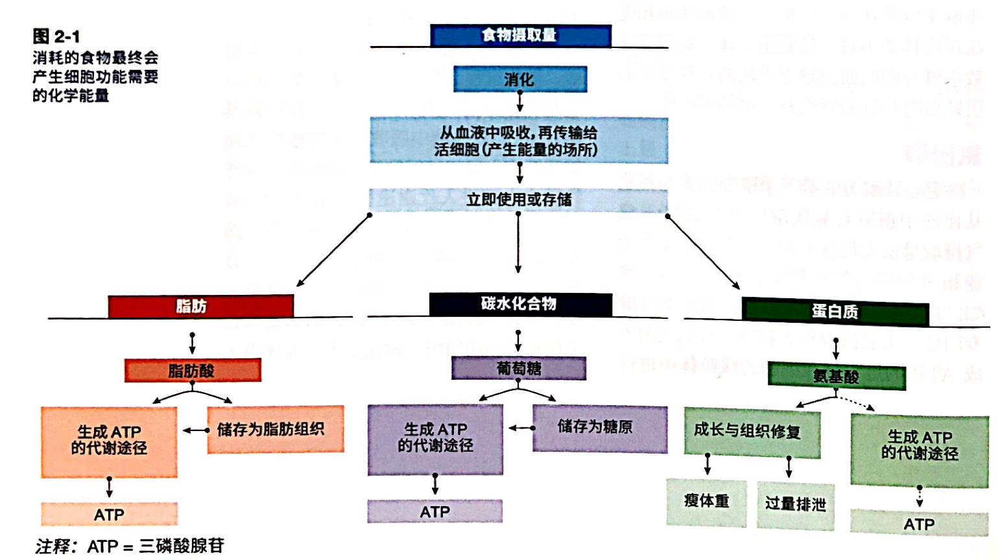
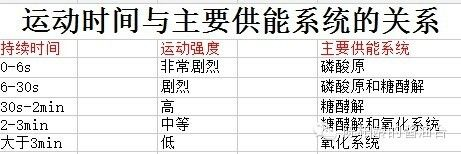
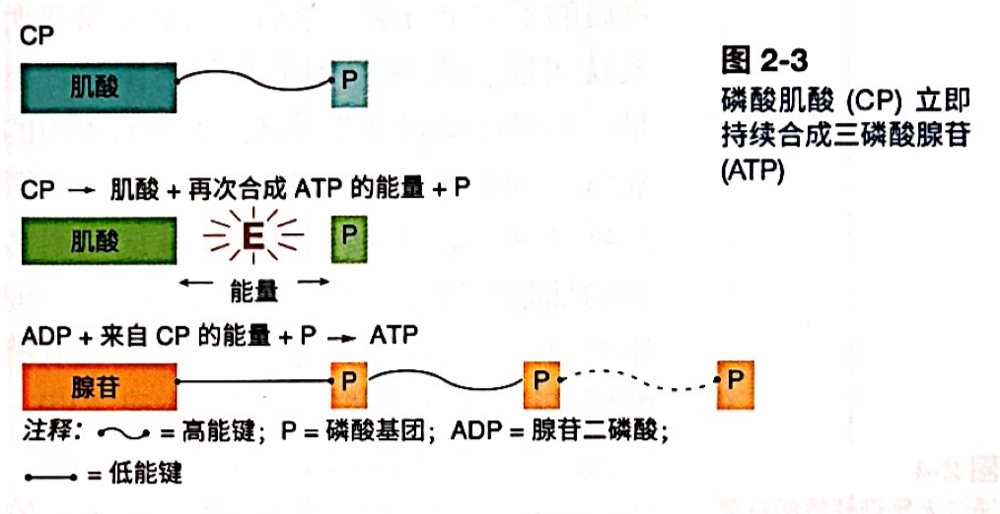
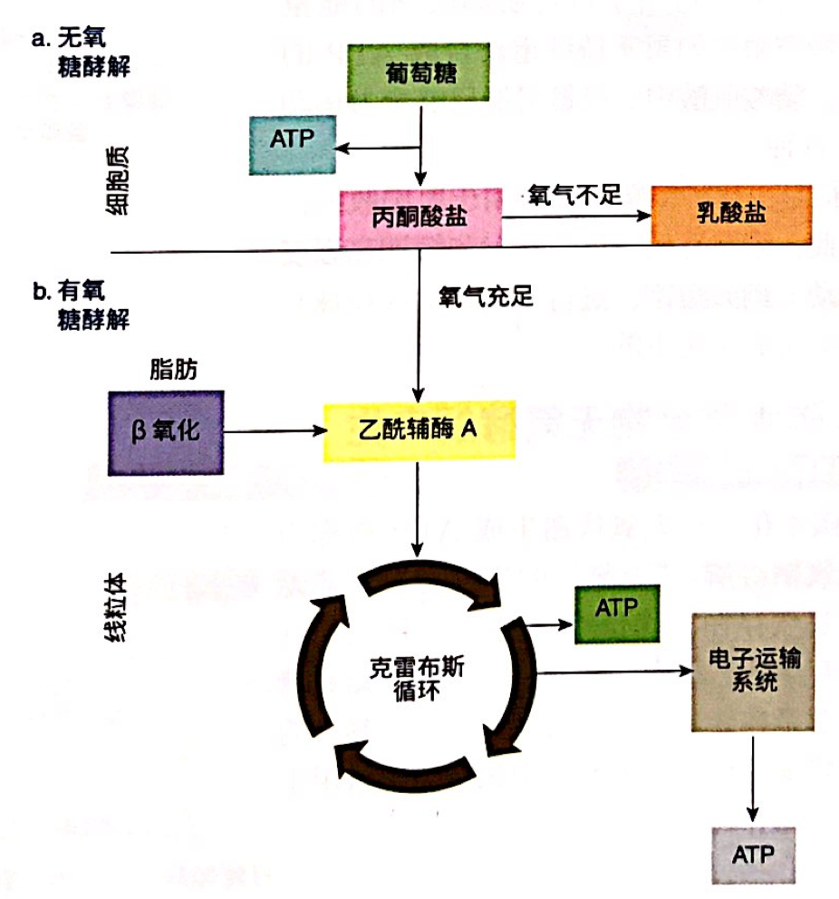
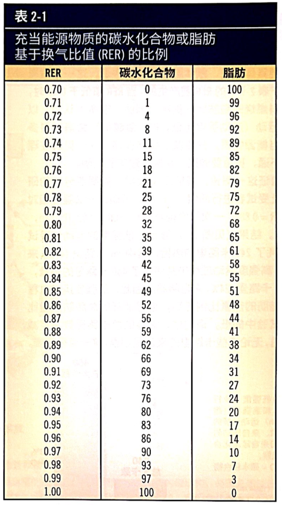
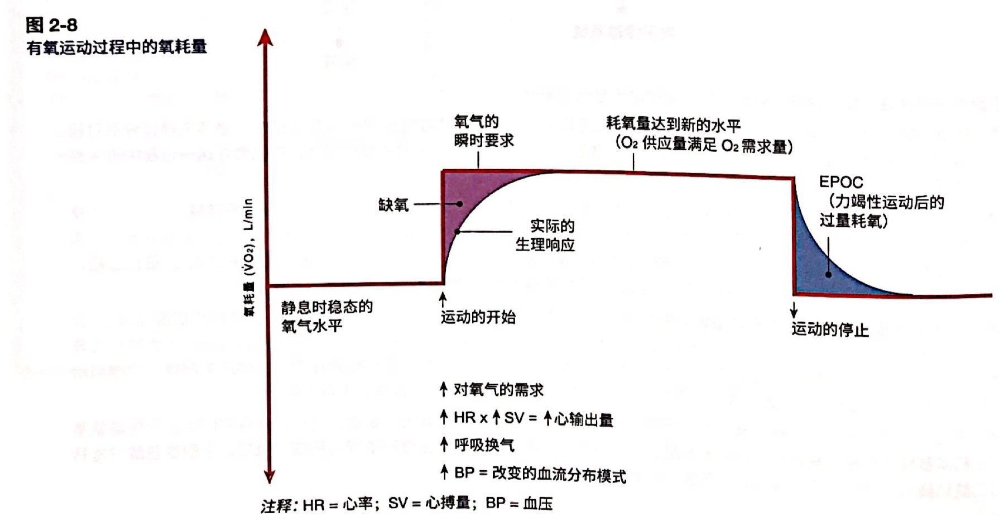

# 运动生理学

## 体能相关的一些定义

身体活动：任何由骨骼肌所产生的、并增加能量消耗的活动。

体能包含

- 肌肉适能：肌力和肌耐力。
- 心肺耐力=有氧活动能力=有氧适能
- 柔韧性：身体在其正常的最大活动范围（ROM）内活动关节的能力。
- 身体成分：瘦体重和体脂比

## 心肺系统的生理机能

心肺耐力：心脏和肺部在运动期间向活动肌输送血液和氧气的能力。

P69：心肺系统促进碳水和脂肪酸转化为 ATP。

分三个过程

- 肺泡交换获取氧气
- 血液运输氧气
- 氧气被利用

#### 携氧能力

ACE 第八章测试也有讲。

携氧能力主要由两个变量决定：（1）肺泡通气能力，指的是呼吸频率和潮气量；（2）血液里血红蛋白（Hb）的浓度

#### 氧输送能力

心输出量=心率×每搏输出量。$\dot{Q}=HR\times SV$。

运动中，心率会按线性增加到最高水平；心搏量会到最大的40-50%。心搏量增加的原因是（1）静脉回流增加（2）射血分数增加（心脏每次收缩泵出的血液更多）

#### 氧摄取

肌纤维种类不同。I型肌纤维就是有氧的，经过训练后 I型肌纤维里的线粒体数量只能多，用于生成 ATP 的氧化酶也增多。

### 运动中的生物能量学

氨基酸可以在肝脏转化为葡萄糖，称为糖异生。反之亦然，叫做异化。

[**重点**]：记住这个表格就好。

#### 磷酸原系统

磷酸肌酸（Creatine phosphate， CP）是除了 ATP 之外另外一种高能磷酸化合物。

如果不持续重新合成 ATP， **磷酸肌酸的能量只够全力运动10秒，适合短时高强的运动（短跑，举重，投球）。**

#### 糖的无氧/有氧酵解

一句话：**一个运动是否是无氧和有氧主要取决于它的供能系统，取决于它的运动强度，然后才是取决于时间。**

**乳酸盐会使肌肉pH 变酸性，酸度会是的肌肉疲劳。**

P75：有氧途径还可以分解脂肪酸生成ATP。

#### RER 换气比

换气比=产生的 CO2/消耗的 O2

因为葡萄糖比代谢所需要的氧气比脂肪酸所需的氧气少，因此运动中使用葡萄糖供能更多。

记住三个点：纯脂肪 RER=0.7，纯碳水 RER=1，一半一半 RER=0.85 。

P76：占比低并不代表在低强度下燃脂多，因为还要乘以消耗能量的总量kcal。

#### 有氧能力 VO2max 等

原理：一个人吸入、利用、传输的氧气量越大，他可以进行的体力活动量也就越大。所以最大摄氧量 VO2max 是一个好的指标来评估人的心肺适能。VO2max 的单位是mL/kg/min，是一种相对值；另外可以用 L/min 的绝对耗氧量。

**每消耗1L 氧气会释放约5kcal 的能量**。ACE 十一章也有。

### 有氧运动的短期反应

耗氧量的变化，紫色叫氧缺口（2-4分钟达到第二呼吸），蓝色是氧过剩。P78详解。

所以要热身，因为从静息到稳定状态的运动通常不舒适。

对于无氧阈，参见 ACE 第八章（8-1）。

短期内，心率按线性增加，心搏量增加到最大量的40-50%，收缩压线性增加，舒张压会因血管扩张而稍有下降，肺通气也会增加。

### 有氧运动的长期适应

常规有氧项目只需要8-12周就可以有显著成效。

长期适应：心搏量增加，心率降低，呼吸量增加， VO2max 增加。
