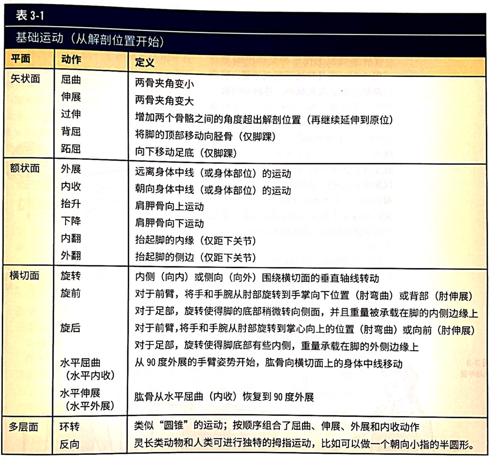

# 运动力学

## 关节动作名称

## 运动术语

肌肉充当动力时，他会在产生肌张力的时候缩短（做正功），这叫做**向心动作**；当肌力充当阻力时，这个叫做**离心动作**（做负功）。长度没有明显的变化，叫做**等长收缩**（不做功）。等长收缩常用在**本体感觉神经肌肉促进术（PNF）。**平衡性和稳定性训练里可以用等长收缩。

主动肌=原动肌，是完成动作所需要的肌肉。拮抗肌是和主动肌对抗的肌肉（提供稳定性）。**共同收缩**指的是**主动肌和拮抗肌**同时收缩。

协同肌是协助主动肌的肌肉。**协同肌主导效应**指的是系统级做的功更多了。

开闭链运动。闭链更刺激心肺，开链更刺激目标肌群。

这些都可以参照第九章（9-1）。

## 下肢的动力学

### 臀前肌：髋屈肌

最重要的原动肌：**髂腰肌、股直肌、缝匠肌、阔筋膜张肌**。

拉伸髋屈肌的动作

### 臀后肌：髋伸肌

主要的：**腘绳肌（股二头肌、半腱肌和半膜肌）和臀大肌**。

髋伸肌在深蹲的时候向下进行离心作用。

### 髋外侧肌：髋外展和外旋肌

位于髋关节后侧，原动肌包括**臀大中小肌**的上部纤维，协同肌有阔筋膜张肌。

见[人体肌群.pdf](人体肌群.pdf)。

### 髋内侧肌：髋内收肌和内旋肌

### 膝前肌：膝伸肌

**股四头**。

### 膝盖后肌：膝屈肌和膝转肌

膝屈肌：**腘绳肌（半腱肌、半膜肌和股二头肌）**。

膝盖弯曲的时候才能内外旋（扣锁机制，腘肌解锁）。内旋肌：**半膜肌、半腱肌**。外旋肌：**股二头肌**。

### 腿前肌：背屈肌

### 腿后肌：跖屈肌

### 腿外侧肌：外旋肌

### 腿内侧肌：内旋肌

## 脊椎和骨盆

### 中立位

颈椎、腰椎前凸，胸椎后凸。

胸椎从胎儿就有了。

畸形姿势见第七章（7-1）。

### 核心肌群

见第九章9-1。

补充：腹横肌带来腹肌收缩时候的“环向收缩”压力。

#### 躯干屈肌：腹直肌、腹外斜肌

练习腹直肌：仰卧收腹

练习腹外斜肌：侧平板

#### 躯干伸肌：竖脊肌

P134

鸟狗式，俯卧过伸，猫驼式，平板支撑。

## 人体上肢动力学

上肢部分包含

- 头颈
- 肩胛胸关节（ST关节）
- 肩部
- 肘关节
- 手腕
- 双手

主要看肩部

### 肩关节复合体、肩胛胸关节和盂肱关节（GH 关节）

**肩关节**=胸锁关节（ SC关节），肩锁关节（ AC关节），盂肱关节（GH关节）和肩胛胸关节（ST）。所以最大。

盂肱关节是身体中最灵活的关节。

**肩肱节律**：120的盂肱关节+60度的肩胛骨运动=180度肩外展。

#### 前肩带肌：胸小肌和前锯肌

作用是肩胛前引

#### 后肩带肌：斜方肌、菱形肌和肩胛提肌

肩胛上提

强化斜方肌：重物耸肩，哑铃侧平举。

菱形肌：俯身上拉

#### 盂肱关节肌：胸大肌、三角肌、肩袖、背阔肌、大圆肌

## 肥胖相关

一节课里用不同的运动方式交叉训练。

减少重力作用的器械有效：椭圆机、固定自行车等。

注意作为不要太小，腹部需要有一定活动空间。

## 老年人

椅子运动和水上运动来减缓对关节的压力。

## 青少年

