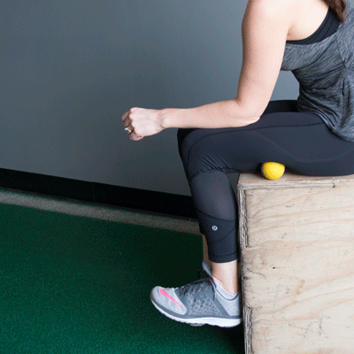
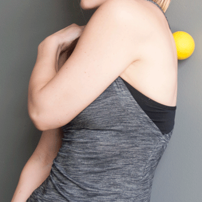
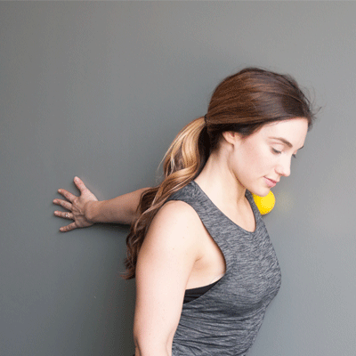
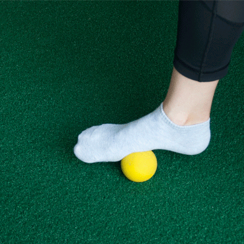

## 运动量

pulley， 配重。

resistance ratio，滑轮比。比如1：2就是1kg 的配重意味着负重2kg，4：1就是4kg 的配重给到人的负重只有1kg。

## 训练项目

leg extension，腿屈伸。

leg curl

## 器械

筋膜球，lacrosse ball。筋膜放松 lacrosse ball massage。

放松臀部gluteus

腘绳肌Hamstrings

上背部，upper back

胸

脚

## 肌肉名称

臀部，gluteus

腘绳肌，hamstring (tendon)

上背部，upper back

